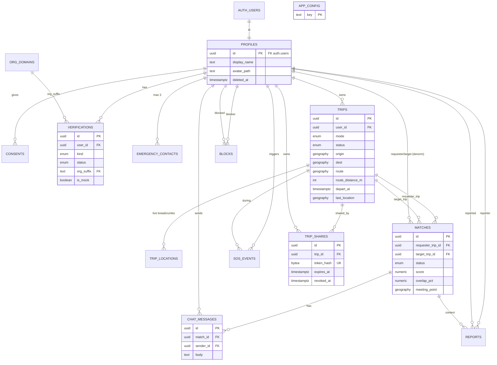

# Database Design: กลับด้วยกันมั้ย (GOWITHME) MVP 0.1

Target: Supabase Postgres (free tier) + PostGIS. Migration: `supabase/migrations/0001_init.sql` (idempotent-safe, ไม่แตะ remote project ใด ๆ; รันด้วย `supabase db reset` บน local หรือวางใน SQL Editor ของโปรเจกต์ใหม่ของตนเอง).
Source: `docs/requirements.md`. ข้อสมมติที่ใช้แทนการถามกลับอยู่ในหัวข้อ 9.

---

## 1. Requirements analysis (Step 1)

**Entities:** profile (1:1 auth.users), consent, verification, org_domain (ref), emergency_contact, trip, trip_location, match, chat_message, block, report, sos_event, trip_share, app_config.

**Cardinality**
- auth.users 1:1 profiles; profiles 1:N trips / consents / verifications (max 1 ต่อ kind) / emergency_contacts (max 3) / sos_events / trip_shares / blocks / reports
- trips M:N trips ผ่าน `matches` (junction ที่มี attribute: status, score, meeting_point); คู่ของ trip ที่ accepted ได้สูงสุด 3
- matches 1:N chat_messages; trips 1:N trip_locations (เฉพาะช่วง in_progress)

**Access patterns (ความถี่สูง -> ต่ำ)**
1. `trip_locations` insert ทุก 15-30 วินาทีต่อทริปที่กำลังเดินทาง; อ่านล่าสุดผ่าน `trips.last_location`
2. ดึงแชทของ match เรียงเวลา + Realtime subscribe (`match_id`, `created_at desc`)
3. `find_matches`: กรอง trips ที่ `status='scheduled'` ด้วย ST_DWithin (origin, dest) + ช่วงเวลา + overlap -> GiST partial index
4. รายการทริปของฉัน (ปัจจุบัน/ประวัติ) `(user_id, status, created_at desc)`
5. คำขอ match ที่เข้าหาฉัน `(target_id, status)`
6. เปิดลิงก์แชร์ (anon) ด้วย token hash (unique lookup)
7. งาน purge/expire ทุก 15 นาที (partial index ตาม ended_at / deleted_at)

---

## 2. ERD (Step 2)



---

## 3. Normalization audit (Step 3)

| Table | 1NF | 2NF | 3NF | BCNF | Notes |
|---|---|---|---|---|---|
| app_config | OK | OK (single PK) | OK | OK | key -> value; JSONB ใช้เป็นค่า config อะตอมมิก ไม่ใช่ repeating group |
| org_domains | OK | OK | OK | OK | reference table (suffix PK -> org_name) แยกจาก verifications เพื่อไม่ให้ org_name ซ้ำ (3NF) |
| profiles | OK | OK | OK | OK | ไม่เก็บ email/phone (อยู่ใน auth.users / verifications) |
| consents | OK | OK | OK | OK | append-only log; สถานะล่าสุด = แถวล่าสุดต่อ (user, kind) |
| verifications | OK | OK | OK | OK | candidate keys: id, (user_id, kind). `org_name` ไม่เก็บซ้ำ (join org_domains). phone_e164 เฉพาะ kind=phone (CHECK) |
| emergency_contacts | OK | OK | OK | OK | แก้ violation แบบ phone1/phone2 -> แยกแถว (1NF); limit 3 ด้วย trigger |
| trips | OK | OK | OK | OK | geometry เป็นค่าเดียว (atomic) ต่อ column. **Denorm ตั้งใจ:** `route_distance_m/duration_s` (คำนวณจาก route ได้ แต่ใช้ sort/ETA/overlap บ่อย), `last_location*` (สำเนาแถวล่าสุดของ trip_locations), `ended_at` (รวม completed/cancelled/expired เป็น timestamp เดียวแทน 3 คอลัมน์) |
| trip_locations | OK | OK | OK (denorm) | OK | **Denorm ตั้งใจ:** `user_id` (ได้จาก trips.user_id) เพื่อให้ RLS เป็น equality ตรงโดยไม่ join |
| matches | OK | OK | OK (denorm) | OK | junction trip-trip พร้อม attribute จึงใช้ surrogate PK + `unique(requester_trip_id,target_trip_id)` + unique คู่แบบไม่เรียงลำดับ. **Denorm ตั้งใจ:** `requester_id/target_id` (RLS + index), และ snapshot `score/overlap_pct/*_distance_m/time_diff_min` (ค่า ณ เวลาขอ ไม่เปลี่ยนตามทริปที่ถูกแก้ภายหลัง = ข้อมูลเชิงประวัติ ไม่ใช่ข้อมูลซ้ำ) |
| chat_messages | OK | OK | OK | OK | `sender_id` nullable สำหรับข้อความระบบ (CHECK kind<->sender); `body` ของข้อความระบบเป็น i18n key |
| blocks | OK | OK (composite PK, ไม่มี non-key ที่ขึ้นกับส่วนเดียว) | OK | OK | junction M:N self-reference PK (blocker_id, blocked_id) |
| reports | OK | OK | OK | OK | `match_id` เป็น context อ้างอิง (SET NULL เมื่อ match ถูกลบ) |
| sos_events | OK | OK | OK | OK | `client_created_at` vs `created_at` = คนละความหมาย (คิวออฟไลน์) ไม่ใช่ซ้ำ |
| trip_shares | OK | OK | OK | OK | เก็บ hash ของ token ไม่เก็บ token ดิบ |

**4NF:** ไม่มี multi-valued dependency อิสระในตารางเดียว (ผู้ติดต่อฉุกเฉิน, verifications, blocks แยกเป็นตารางของตนเอง). **Violations ที่พบและแก้:** phone1/phone2 -> emergency_contacts; org_name ซ้ำ -> org_domains; ป้าย verify หลายชนิด -> verifications แถวต่อชนิด.

---

## 4. DDL

ดูไฟล์ `supabase/migrations/0001_init.sql` (ตามลำดับ: extensions, enums, config, tables, indexes, triggers, functions/RPC, RLS, grants, realtime, storage, cron). มาตรฐานที่ใช้: PK `uuid default gen_random_uuid()`, `timestamptz` ทุก timestamp, `update_updated_at()` trigger, soft delete (`deleted_at`) บน profiles/trips, ENUM สำหรับค่าคงที่ขนาดเล็ก, reference table `org_domains`, composite PK บน junction `blocks`. ไม่มีคอลัมน์เงินใน MVP (ไม่มีการชำระเงิน).

### Config จุดเดียว (`public.app_config`)
| key | default | ใช้ที่ |
|---|---|---|
| match.origin_radius_m / dest_radius_m | 2000 | ระยะจุดเริ่ม/ปลายทาง (ST_DWithin) |
| match.time_window_min | 30 | ต่างเวลาออกเดินทาง |
| match.min_overlap_pct | 40 | สัดส่วนเส้นทางซ้อน |
| match.max_matches_per_trip | 3 | จำนวน match ที่ accepted ต่อทริป |
| match.route_buffer_m | 200 | buffer ของเส้นทางเมื่อวัด overlap |
| match.weights | 0.3/0.2/0.5 | น้ำหนักคะแนน distance/time/overlap |
| match.mode_compat | วิธีเดียวกัน | ตารางความเข้ากันได้ของวิธีเดินทาง |
| privacy.blur_cell_m | 1000 | ขนาดเซลล์ blur (คลาดเคลื่อน <= 500 ม./แกน) |
| trip.max_active, trip.min_distance_m, trip.depart_grace_min, trip.expire_after_min | 1, 200, 5, 120 | กติกาทริป |
| share.* / retention.* / emergency.max_contacts / phone.mock_* | ดู SQL | ลิงก์แชร์, retention 7 วัน, ลบบัญชี 30 วัน, OTP mock |

แก้ค่า: `update public.app_config set value='3000' where key='match.origin_radius_m';` (ทำผ่าน SQL Editor/service_role เท่านั้น; แถวที่ `is_public=false` เช่น `phone.mock_code` client อ่านไม่ได้).

### สูตรจับคู่ (deterministic, ฟังก์ชัน `match_candidates`)
```
eligible = ST_DWithin(origins, origin_radius) AND ST_DWithin(dests, dest_radius)
       AND |Δdepart| <= time_window AND overlap% >= min_overlap
       AND mode compatible AND ไม่ block กัน AND ไม่ใช่คู่ที่เคย declined/cancelled/accepted
       AND ทั้งสองทริป accepted < max_matches_per_trip AND ทั้งสอง status='scheduled'
overlap% = 100 * length(เส้นทางที่สั้นกว่า ∩ buffer(เส้นทางอีกเส้น, route_buffer_m)) / length(เส้นทางที่สั้นกว่า)   (สมมาตร)
score    = 100 * (wd*(1 - avg(d_o/r_o, d_d/r_d)) + wt*(1 - Δt/window) + wo*overlap/100) / (wd+wt+wo)
order    = score desc, trip_id asc
```
ฟังก์ชันภายในนี้ไม่เปิดให้ client; client เรียก `find_matches(trip_id)` ซึ่งคืนเฉพาะข้อมูล blur.

### RPC surface
| Function | Caller | หน้าที่ |
|---|---|---|
| `find_matches(trip_id, limit)` | authenticated | รายการจับคู่ + พิกัด blur + ระยะปัดเป็น 100 ม. |
| `get_trip_card(trip_id)` | authenticated | การ์ดทริป (blur) ของตน/คู่ที่มีคำขอหรือ match |
| `request_match(my_trip, target_trip)` | authenticated | ตรวจสิทธิ์ซ้ำฝั่ง server; ถ้าอีกฝ่ายขอมาก่อน = accept ให้ (race-safe) |
| `respond_match(id, accept, lng, lat, label)` | target | accept/decline (ไม่เก็บเหตุผล) + จุดนัดพบ |
| `set_meeting_point`, `cancel_match`, `get_partner_live_location` | participants | จุดนัดพบ, ยกเลิก, ตำแหน่งสดคู่ (accepted + in_progress) |
| `create_trip_share(trip, ttl)` / `revoke_trip_share(id)` | owner | token 64 hex เก็บเป็น sha256; คืน token ดิบครั้งเดียว |
| `get_shared_trip(token)` | **anon** | ข้อมูลจำกัดสำหรับผู้รับลิงก์ (ไม่มี email/เบอร์/แชท/จุดเริ่ม) |
| `verify_phone_mock`, `record_consent`, `export_my_data`, `request_account_deletion` | authenticated | OTP จำลอง, PDPA |
| `purge_expired_data()` | cron / service_role | expire ทริป, ลบ/ลดความละเอียดตำแหน่ง, hard delete |

---

## 5. Index strategy (Step 5)

| Index | เหตุผล |
|---|---|
| `trips_open_origin_gix`, `trips_open_dest_gix` (GiST, partial `status='scheduled' AND deleted_at IS NULL`) | ST_DWithin ของ find_matches; partial = ขนาดเล็กเพราะมีเฉพาะทริปที่รอออกเดินทาง |
| `trips_open_depart_idx` (partial) | กรองช่วงเวลา/ expire job |
| `trips_user_status_idx (user_id,status,created_at desc)` | รายการทริปของฉัน + นับ active trip |
| `trips_ended_retention_idx`, `trips_deleted_idx` (partial) | purge job หาทริปที่ต้องลดความละเอียด/ลบ |
| `trip_locations_trip_time_idx (trip_id, recorded_at desc)`; `trip_locations_user_idx` | อ่านล่าสุดต่อทริป; FK |
| `matches_pair_uq (least,greatest)` (UNIQUE) | คู่ทริปมี match ได้ 1 แถว = กัน race ขอพร้อมกัน + ห้ามส่งซ้ำ |
| `matches_req_trip_idx`, `matches_tgt_trip_idx`, `matches_req_user_idx`, `matches_tgt_user_idx (user,status)` | FK + inbox ของคำขอ |
| `matches_accepted_idx` (partial accepted) | นับ limit 3 ต่อทริป |
| `chat_messages_match_time_idx (match_id, created_at desc)` | โหลดประวัติ/แบ่งหน้าแชท |
| `chat_messages_client_uq (sender_id, client_msg_id)` partial | ส่งซ้ำแบบ idempotent เมื่อเครือข่ายหลุด |
| `chat_messages_sender_idx` | FK (partial: ข้ามข้อความระบบ) |
| `blocks_blocked_idx` | FK ฝั่ง blocked + ตรวจ block สองทาง (PK ครอบ blocker) |
| `reports_reporter_idx`, `reports_reported_idx`, `reports_match_idx` | FK + admin ดูรายงานต่อผู้ถูกรายงาน |
| `sos_events_user_time_idx`, `sos_events_trip_idx` | ประวัติ SOS ของผู้ใช้; FK |
| `trip_shares` unique(token_hash) (implicit), `_trip_idx`, `_user_idx`, `_active_idx` (partial revoked_at IS NULL) | lookup ลิงก์ anon; FK; purge |
| `consents_user_kind_idx (user_id,kind,created_at desc)` | หา consent ล่าสุด (has_location_consent) |
| `verifications_org_idx` (partial), unique(user_id,kind) | FK org_suffix; 1 ป้ายต่อชนิด |
| `emergency_contacts_user_idx` | FK |
| `profiles_deleted_idx` (partial) | purge บัญชีที่ขอลบ |

ไม่มี full-text search ใน MVP จึงไม่มี GIN. Performance note: overlap ใช้ ST_Buffer/ST_Intersection แพง จึงคำนวณเฉพาะผู้สมัครที่ผ่านตัวกรอง GiST/เวลาแล้ว; ถ้าโตขึ้นให้เก็บ `ST_Simplify(route)` แยกเพื่อคำนวณ.

---

## 6. Row Level Security

ทุกตารางเปิด RLS. หลักการ: **`trips` (พิกัดจริง) อ่านได้เฉพาะเจ้าของ** (ไม่มี partner/admin policy); คนอื่นได้ข้อมูล blur ผ่าน `SECURITY DEFINER` function เท่านั้น. Column-level GRANT จำกัดคอลัมน์ที่ client เขียนได้ (เช่น แก้ `last_location`, `started_at`, `ended_at` ไม่ได้).

| Table | SELECT | INSERT | UPDATE | DELETE |
|---|---|---|---|---|
| app_config | `is_public` (authenticated) | - | - (service_role) | - |
| org_domains | active | - | - | - |
| profiles | ตนเอง / คู่ที่ accepted / admin | trigger จาก auth.users | ตนเอง (เฉพาะ display_name, avatar_path, locale, adult_confirmed_at) | - (ใช้ `request_account_deletion`) |
| consents | ตนเอง | ตนเอง | - (append-only) | - |
| verifications | ตนเอง / คู่ accepted / admin | - (trigger จากอีเมลยืนยัน, RPC OTP mock) | - | - |
| emergency_contacts | ตนเอง | ตนเอง (max 3 trigger) | ตนเอง | ตนเอง |
| trips | **เจ้าของเท่านั้น** | เจ้าของ (trigger บังคับกติกา) | เจ้าของ (state machine trigger) | - (soft delete) |
| trip_locations | เจ้าของ | เจ้าของ + ทริป `in_progress` + ยินยอมตำแหน่ง | - | - |
| matches | ผู้เข้าร่วม | - (RPC) | - (RPC) | - |
| chat_messages | ผู้เข้าร่วม match | sender=ตนเอง + `is_chat_open(match_id)` (accepted, ทั้งสองทริป active, ไม่ block) | - | - |
| blocks | ผู้บล็อก | ผู้บล็อก | - | ผู้บล็อก |
| reports | ผู้รายงาน / admin | ผู้รายงาน | - | - |
| sos_events | เจ้าของ / admin | เจ้าของ (trip ต้องเป็นของตน) | - | - |
| trip_shares | เจ้าของ | - (RPC) | - (RPC revoke) | - |

**Admin** = JWT `app_metadata.role = 'admin'` (ตั้งด้วย service_role เท่านั้น; ผู้ใช้แก้ `user_metadata` เองได้ แต่แก้ `app_metadata` ไม่ได้).

**ตรวจว่า RLS/privacy ทำงาน** (รันใน SQL Editor ของโปรเจกต์ dev ด้วยผู้ใช้ทดสอบ 2 คน):
```sql
-- จำลองผู้ใช้ B
select set_config('request.jwt.claims', json_build_object('sub','<uid-B>','role','authenticated')::text, true);
set local role authenticated;
select count(*) from public.trips where user_id = '<uid-A>';          -- ต้องได้ 0 (เห็นทริปตนเองเท่านั้น)
select * from public.find_matches('<trip-of-B>');                       -- พิกัดต้องเป็นศูนย์กลางเซลล์ blur, ไม่ใช่พิกัดจริง
insert into public.chat_messages(match_id,sender_id,body) values ('<match-not-accepted>','<uid-B>','hi'); -- ต้อง fail (RLS)
```

---

## 7. Realtime, Storage, ความเป็นส่วนตัวข้อมูล

**Realtime:** publication `supabase_realtime` เพิ่ม `chat_messages` และ `matches` (แจ้งคำขอ/สถานะ) — Realtime ใช้ RLS กรอง event ตามผู้รับ จึงเห็นเฉพาะแชท/แมตช์ของตน. ตำแหน่งสดของคู่ใช้ polling `get_partner_live_location` (ไม่ publish `trips`/`trip_locations` เพื่อกันรั่วพิกัด; free tier จำกัดจำนวน connection). Client subscribe ด้วย `filter: match_id=eq.<id>`.

**Storage:** bucket `avatars` (private, 2 MB, jpeg/png/webp) path `<user_id>/<file>`. เขียน/ลบ/แก้ได้เฉพาะโฟลเดอร์ตนเอง; อ่านได้โดยเจ้าของหรือคู่ที่ accepted (รูปแสดงหลังจับคู่ตาม US-7). ใช้ signed URL ระยะสั้น. ไม่มี bucket สำหรับเอกสารยืนยันตัวตน (out of scope).

**Location privacy / PDPA**
- blur = snap ไปศูนย์กลางเซลล์ตาราง `privacy.blur_cell_m` (1 กม. -> คลาดเคลื่อนได้ถึง ~500 ม.) แบบ deterministic (ไม่ใช้ random jitter เพราะ query ซ้ำแล้วหาค่าเฉลี่ยได้); ระยะห่างปัดเป็น 100 ม.
- ตำแหน่งสดเก็บเฉพาะ `in_progress` และต้องมี consent `location` ล่าสุด = granted (ถอนได้: `record_consent('location', false, v)`)
- หลังทริปจบ > `retention.location_days` (7): ลบ trip_locations, ทำให้ origin/dest หยาบ (blur), route เหลือเส้นตรง, ล้างชื่อสถานที่ (`purge_expired_data`)
- ลบบัญชี: `request_account_deletion()` ยกเลิกทริป/ปิด match/เพิกถอนลิงก์/ลบผู้ติดต่อและตำแหน่ง/ทำให้ไม่ระบุตัวตนทันที แล้ว hard delete `auth.users` (cascade) หลัง 30 วัน
- share link: token 244-bit, เก็บ hash, หมดอายุตาม ttl (<=24 ชม.) หรือเมื่อทริปจบ (คงเห็นสถานะสุดท้ายอย่างเดียว 60 นาที ไม่มีตำแหน่ง), เพิกถอนได้; ปลายทางที่แสดงเป็นค่า blur

**Auth:** trigger `on_auth_user_created` สร้าง `profiles` (+ consent จาก `raw_user_meta_data.policy_version`); trigger เมื่ออีเมลยืนยันแล้วสร้าง verification `email` และ `organization` (ตรงกับ `org_domains` แบบ suffix/subdomain, gmail.com ไม่ได้ป้ายองค์กร). ส่ง metadata ตอน signUp: `display_name`, `adult_confirmed`, `policy_version`. ตั้ง `phone.mock_enabled=false` ใน production.

**Cron:** `pg_cron` ตั้ง `gwm-purge-expired-data` ทุก 15 นาที (ถ้า extension ไม่พร้อม migration แค่ NOTICE; ให้เรียก `purge_expired_data()` ผ่าน Edge Function schedule แทน).

---

## 8. Design decisions (Step 6.5)

| Decision | Tradeoff | Rationale |
|---|---|---|
| `trips` อ่านได้เฉพาะเจ้าของ; คนอื่นใช้ definer function | client query ตรงไม่ได้ ต้องใช้ RPC | privacy บังคับที่ชั้นข้อมูล; ไม่มีทางรั่วพิกัดจริงผ่าน REST/Realtime |
| Blur แบบ grid snap | ความแม่นยำหยาบคงที่ | deterministic, ทดสอบซ้ำได้, กันการหาค่าเฉลี่ย |
| Partner ไม่เห็นปลายทาง (บ้าน) จริง แม้ match แล้ว (เห็น blur + จุดนัดพบ + ตำแหน่งสดขณะเดินทาง) | UX ต้องพึ่งจุดนัดพบ | ลดความเสี่ยงเปิดเผยที่อยู่; ตรงกับ US-7 ที่ระบุจุดนัดพบ |
| Matching เป็น SQL/PostGIS ฝั่ง DB + config table | logic อยู่ใน DB (ทดสอบด้วย SQL) | ใช้ GiST, deterministic, ปรับ threshold จุดเดียว |
| overlap วัดบนเส้นทางที่สั้นกว่า | ไม่ใช่ metric มาตรฐาน | สมมาตรและตรงความหมาย "ไปทางเดียวกันกี่ %" |
| matches ไม่มี client INSERT/UPDATE (RPC เท่านั้น) | ต้องเขียน RPC | ตรวจ eligibility/limit 3/race ที่เดียว, กันปลอมสถานะ |
| unique คู่ trip แบบไม่เรียงลำดับ | ขอซ้ำหลัง decline ไม่ได้ | ตรง "ส่งซ้ำไม่ได้" + จับคู่ครั้งเดียวเมื่อขอพร้อมกัน |
| chat write policy ใช้ `is_chat_open` (คำนวณสถานะทริป/block) | policy รันฟังก์ชันทุก insert | ปิดแชทที่ระดับ backend เมื่อทริปจบ/บล็อก (read-only) |
| Denorm `requester_id/target_id`, `trip_locations.user_id`, `trips.last_location` | ต้องรักษาความสอดคล้อง (ผ่าน RPC/trigger) | RLS เร็วและเรียบง่าย, ไม่ต้อง join ต่อแถว |
| token แชร์เก็บ sha256 | เปิดลิงก์เดิมซ้ำจากฝั่ง DB ไม่ได้ | DB รั่วก็ใช้ลิงก์ไม่ได้ |
| soft delete `profiles/trips` + purge job | ข้อมูลอยู่ชั่วคราว | รองรับ grace 30 วัน/7 วันตาม PDPA assumption |
| Enum แทน lookup สำหรับ mode/status | เพิ่มค่าใหม่ต้อง `ALTER TYPE` | ค่าคงที่ขนาดเล็ก, เร็ว; `org_domains` เป็น reference table เพราะเปลี่ยนบ่อย |
| Phone mock แยกด้วย `is_mock` | - | ป้ายจำลองไม่ปนกับป้ายจริง และปิดได้ด้วย config |
| ไม่ enforce "อย่างน้อย 1 ผู้ติดต่อฉุกเฉิน" ใน DB | app ต้องเตือน | ห้ามขวางการลบ/การขอความช่วยเหลือ (US-10) |

## 9. Assumptions (แทนการถามกลับ)
- ใช้ `auth.users` ของ Supabase; ยืนยันอีเมลเปิดไว้ (ถ้าปิด `email_confirmed_at` จะถูกตั้งอัตโนมัติ และป้ายจะได้ทันที)
- PostGIS ติดตั้งใน schema `extensions` (ค่าเริ่มต้นของ Supabase)
- ผู้ดูแลระบบกำหนดผ่าน `app_metadata.role='admin'`; ไม่มี admin UI
- Route geometry มาจาก OSRM ฝั่ง client (จำกัดจำนวนจุดควรลดด้วย simplify ก่อนบันทึก)
- Realtime/Storage/cron ตั้งค่าใน Supabase project ของผู้พัฒนาเอง; migration นี้ยังไม่ถูกรันกับ Postgres จริงในขั้นตอนนี้ (ไม่มี DB ในเครื่อง) — ควรรันบน local `supabase start` ก่อนใช้งาน
- ข้อจำกัด: ไม่มี rate-limit ระดับ DB สำหรับ chat/location insert (ใช้ Supabase API rate limit/Edge Function เพิ่มภายหลัง); การสะกดข้อความ error เป็นรหัส `GWM_*` ให้ client แปลเป็นภาษาไทย

## 10. ORM / client hints
- **Flutter (`supabase_flutter`)**: ใช้ `.rpc('find_matches', params:{'p_trip_id':id})`; insert trip ส่งพิกัดเป็น EWKT string `'SRID=4326;POINT(lng lat)'` และ route เป็น `'SRID=4326;LINESTRING(lng lat, ...)'`; **lng ก่อน lat**. อ่านพิกัดจาก RPC ที่คืน `*_lat/_lng` (ไม่มี geography ดิบ). Realtime: `channel.onPostgresChanges(table:'chat_messages', filter: match_id eq ...)`.
- **Prisma**: geography เป็น `Unsupported("geography(Point,4326)")`; query เชิงพื้นที่ใช้ `$queryRaw`; ระบุ `@@schema("auth")` สำหรับ auth.users ถ้า multiSchema; enum map ด้วย `@@map`.
- **Drizzle**: ใช้ `customType` หรือ `geometry`/`geography` helper ของ drizzle-orm/pg-core (`geometry('origin',{type:'point',mode:'xy',srid:4326})` เป็น geometry ไม่ใช่ geography — ใช้ `sql` raw สำหรับ ST_DWithin); `pgEnum` ให้ตรงกับ type; RLS: `pgPolicy` ได้แต่ policy หลักอยู่ใน migration นี้.
- **SQLAlchemy/GeoAlchemy2**: `Geography('POINT', srid=4326)`, `Geography('LINESTRING', srid=4326)`; `func.ST_DWithin`; ปิดการ autogenerate ของ enum/trigger/policy (คงไว้ใน SQL migration).
- ทุกแบบ: ห้ามใช้ service_role key ในแอป; ต้องเรียกผ่าน anon key + JWT ผู้ใช้เพื่อให้ RLS ทำงาน.

## Quality gate
- [x] junction ทุก M:N (matches, blocks) - [x] ไม่มีคอลัมน์หลายค่า - [x] denorm ทุกจุดมี note
- [x] ทุก FK มี index (ผ่าน PK/unique หรือ index เฉพาะ) - [x] string ซ้ำเป็น ENUM/reference - [x] timestamp เป็น TIMESTAMPTZ ทั้งหมด
