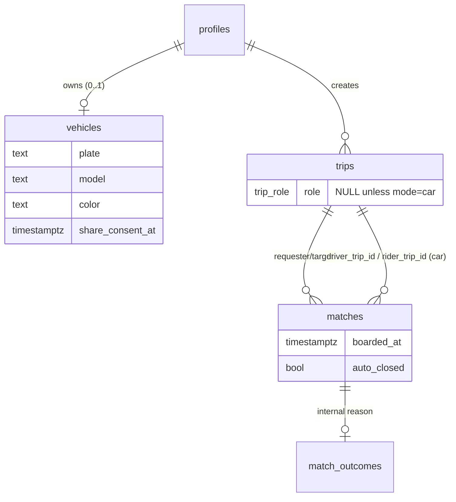
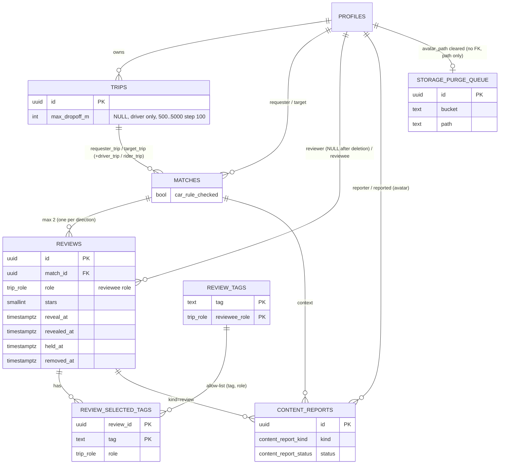
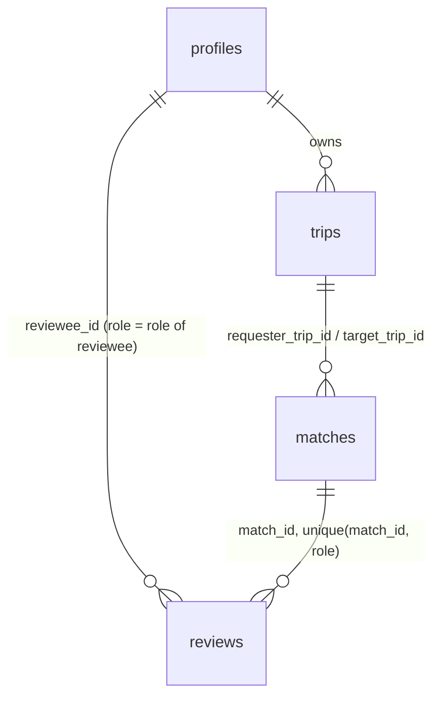
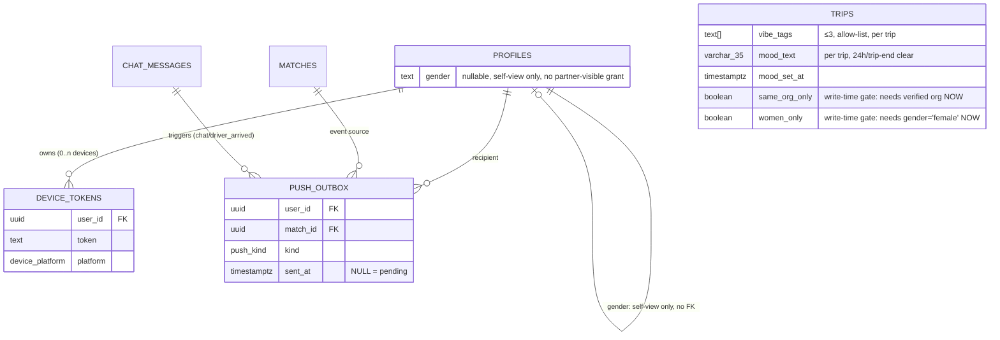
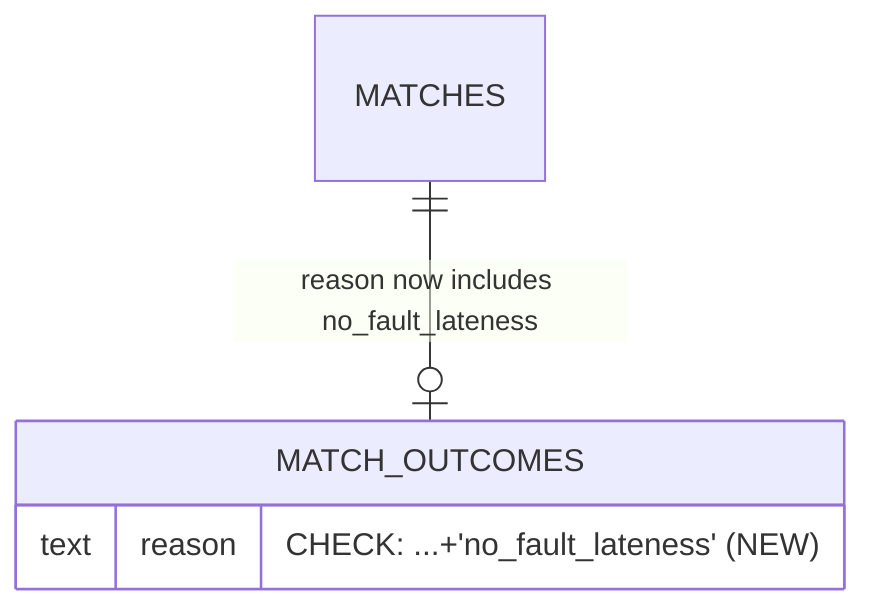
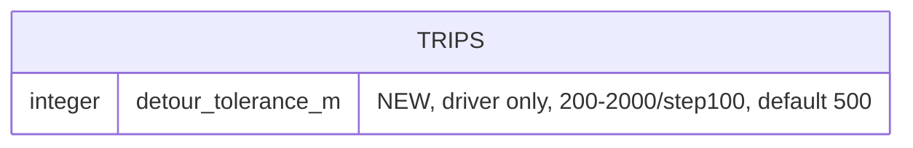

# Design Delta: Driver/Rider roles (รอบ 3) — DB + API + Security

> ขอบเขต: เฉพาะส่วนต่างของ US-16/17/18 (mode = car) ต่อจาก `design-db.md`, `design-api.md`, `design-security.md` และ migration 0001–0005
> ไฟล์ที่เกี่ยวข้อง: `supabase/migrations/0006_driver_rider_roles.sql` (DRAFT, ยังไม่ apply กับ remote), `supabase/tests/roles.sql`
> คำตัดสินที่ใช้: R3-1 (share/SOS = ทะเบียนอย่างเดียว + สวิตช์ยินยอม default OFF), R3-2 (เบี่ยงจุดรับ 500 ม. เตือนเท่านั้น, key `match.pickup_max_deviation_m`), R3-3 (no-show เฉพาะ Driver รายงาน Rider ก่อนขึ้นรถ, ไม่มี timer/โทษ, เหตุผลภายใน), R3-4 (ส่งคำขอได้ทั้งสองฝ่าย, ตอบรับเฉพาะผู้รับ, ต้อง role ตรงข้าม), ที่นั่งคงที่ = 1

## 1. Schema delta

| Object | Change | หมายเหตุ |
|---|---|---|
| `enum trip_role` | `('driver','rider')` | enum เล็กคงที่ |
| `trips.role` | `trip_role NULL`; `CHECK (role IS NULL OR mode='car')` | กำหนดตอน INSERT เท่านั้น (column grant INSERT ไม่ให้ UPDATE) |
| ที่นั่ง Driver | **ไม่มีคอลัมน์**; ค่าคงที่ `car_seats() = 1` (immutable fn) | ตามคำตัดสิน "ที่นั่ง = 1"; ไม่ใส่ config เพื่อไม่ให้ปรับได้ |
| `vehicles` | `id, user_id(UNIQUE), plate, model, color, share_consent_at NULL, verified_at NULL, created_at, updated_at` | 1 คัน/ผู้ใช้ (unique index ชื่อ `vehicles_user_uq` ปลดได้ภายหลัง); `share_consent_at NULL` = สวิตช์ปิด (default); `verified_at` = จุดขยาย license verification P1 |
| `matches.boarded_at` | `timestamptz NULL` | Rider กด "ขึ้นรถแล้ว" |
| `matches.auto_closed` | `boolean NOT NULL DEFAULT false` | pending ที่ถูกปิดอัตโนมัติตอน accept (ต่างจาก cancel/decline ที่ยกเลิกแล้วส่งซ้ำไม่ได้) |
| `matches.driver_trip_id / rider_trip_id` | `uuid NULL` FK trips (cascade), เติมโดย trigger `matches_set_car_roles` | ใช้ทำ **partial unique index** `matches_one_accepted_per_driver_trip` / `..._rider_trip` `WHERE status='accepted'` = ด่านสุดท้ายกัน race |
| `match_outcomes` | `match_id PK→matches, reason CHECK(cancelled_by_driver/cancelled_by_rider/rider_no_show/trip_ended/trip_expired), actor_id, created_at` | RLS on, **ไม่มี grant/policy** = client อ่านไม่ได้ (ข้อมูลภายใน R3-3) |
| `sos_events.vehicle_snapshot` | `text NULL` | ทะเบียนอย่างเดียว เติมโดย trigger ฝั่ง server เมื่อ Driver ยินยอม ณ เวลากด; client เขียนไม่ได้ (ไม่อยู่ใน column grant) |
| `app_config` (ใหม่) | `match.pickup_max_deviation_m`=500 (public), `roles.pickup_proposals_per_hour`=10, `throttle.vehicle_write_per_hour`=10, `throttle.match_state_per_min`=20 | ทุกค่า `ON CONFLICT DO NOTHING`; เกณฑ์ระยะ/เวลา/overlap เดิมใช้ต่อ ไม่เพิ่มค่าใหม่สำหรับ car |



Normalization: `vehicles` แยกจาก `profiles` (คุณสมบัติของรถ ไม่ใช่ของ user; 3NF, BCNF: determinant = `id`/`user_id` ทั้งคู่ candidate key). `driver_trip_id/rider_trip_id` เป็น **intentional denormalization** (derive ได้จาก role ของสองทริป) เพื่อ unique index และ join ตรง; ผูกด้วย trigger ไม่ให้เพี้ยน. `match_outcomes` แยกเพื่อไม่ให้เหตุผลอยู่ในตารางที่ participant SELECT ได้ (`matches` อ่านได้ทั้งสองฝ่าย).

Index ใหม่: `matches_one_accepted_per_*` (unique, partial), `matches_driver_trip_idx`, `matches_rider_trip_idx` (FK), `match_outcomes_actor_idx` (FK), `vehicles_user_uq`. ไม่เพิ่ม index บน `trips.role` (selectivity ต่ำ; gist/depart partial เดิมกรองก่อน).

## 2. กติกาที่เปลี่ยน

**trips (trigger `trg_trips_role_guard`, ทำงานหลัง `trg_trips_guard`)**: INSERT: car ต้องมี role (`GWM_ROLE_REQUIRED`), non-car ห้ามมี role (`GWM_ROLE_NOT_ALLOWED`), driver ต้องมี vehicle (`GWM_VEHICLE_REQUIRED`); UPDATE โดย client: role เปลี่ยนไม่ได้ และ mode เข้า/ออกจาก car ไม่ได้ (`GWM_ROLE_IMMUTABLE`). "car ⇒ role NOT NULL" **ไม่ทำเป็น CHECK** เพื่อให้แถว legacy (car, role null) ยังยกเลิก/จบได้ แต่ไม่ถูกจับคู่.

**match_candidates** (signature/return เดิมจาก 0005):
- car: `o.mode='car' AND o.role IS NOT NULL AND o.role <> v_t.role` (Driver↔Rider เท่านั้น; ทริป car ไม่มี role => ว่าง); non-car: `o.mode<>'car'` + `match.mode_compat` เดิม
- overlap ของ car = `route_coverage_pct(rider_route, driver_route, buffer)` (สัดส่วนเส้นทาง **Rider** ที่อยู่ในบัฟเฟอร์ของเส้นทาง Driver); non-car ใช้ `route_overlap_pct` เดิม
- accepted limit: car = `car_seats()` = 1 ต่อทริป (ทั้ง Driver และ Rider) => ทริปที่มี accepted หายจากผลค้นหาของทุกคน; non-car ใช้ `match.max_matches_per_trip` เดิม
- คู่ที่มี match ไม่ใช่ pending ถูกซ่อน (=> ยกเลิก/ปฏิเสธแล้วส่งซ้ำไม่ได้) **ยกเว้น** `cancelled AND auto_closed`
- ทริปกลับเข้าค้นหาหลังยกเลิกการจับคู่โดย derive จาก "ไม่มี accepted" ไม่มี job

**`_accept_match`** (ใช้ทั้ง `respond_match` และ mutual-request ใน `request_match`): ลำดับ lock = trips (เรียง id) แล้วค่อย match row (respond_match ไม่ lock match ก่อนแล้ว เพื่อไม่ deadlock กับ auto-close ของ sibling); car: ตรวจ role ตรงข้ามซ้ำ (`GWM_NOT_ELIGIBLE`), limit 1 (`GWM_MATCH_LIMIT`), แล้วปิด pending อื่นทั้งหมดของสองทริปในธุรกรรมเดียว (`status='cancelled', auto_closed=true`, ไม่บอกเหตุผล/ตัวตน). non-car ไม่ปิดอะไรเพิ่ม.

**request_match**: redefine เพื่อเพิ่มบรรทัดเดียว: ลบแถว `cancelled AND auto_closed` ของคู่นั้นก่อน แล้วส่งใหม่ได้ (US-18: "Rider ส่งใหม่เองได้"). ที่เหลือเหมือน 0002: ทั้งสองฝ่ายส่งได้ (เพราะ eligibility อยู่ที่ candidates), เพดาน `match.max_pending_per_trip` นับ pending ที่ทริปตัวเองเป็นผู้ส่ง (ครอบคลุมทั้ง Rider→Driver และ Driver→Rider), request ซ้อนกันสองทิศ = accept อัตโนมัติ, `GWM_NOT_ELIGIBLE` เป็นรหัสเดียวสำหรับทุกสาเหตุ (ไม่รั่วว่า role/mode ของทริปเป้าหมายคืออะไร).

**respond_match**: ตอบได้เฉพาะ target (R3-4); decline = update ตรง ๆ; จุดรับที่ส่งมาตอนตอบรับ: car -> นับเฉพาะเมื่อผู้ตอบเป็น Driver (Rider ที่ตอบรับส่งจุดมาจะถูกละเลย), ไม่ปฏิเสธด้วยระยะ.

**Match state เพิ่ม**: `boarded_at`; `cancel_match` (car): หลัง boarded ห้าม (`GWM_ALREADY_BOARDED`), บันทึก `match_outcomes` (cancelled_by_driver/rider), chat system message เป็นกลาง (`system.match_cancelled`, หรือ `system.match_cancelled_in_trip` ถ้าอีกฝั่งกำลังเดินทาง); ทริป car ถูก cancel/expire => trigger `trips_after_status_roles` ปิด accepted match (outcome + ต่อจากข้อความ `system.trip_cancelled` เดิม), ทริปอีกฝั่ง **ไม่** ถูกยกเลิก; `report_rider_no_show` (Driver เท่านั้น: ทริป Driver in_progress + accepted + ยังไม่ boarded) => match cancelled + outcome `rider_no_show` + ข้อความกลาง; Driver no-show = Rider กด `cancel_match` เอง.

**จุดรับ**: `propose_meeting_point` (return type void→boolean; drop+create): car ห้ามหลัง boarded; Rider เปิด proposal คนแรกไม่ได้ (`GWM_PICKUP_DRIVER_FIRST`) แต่ counter-propose ได้; คืน `true` = ไกลจากเส้นทาง Driver เกิน `match.pickup_max_deviation_m` (**เตือนเท่านั้น จุดถูกบันทึกเสมอ**); คืน boolean ไม่ใช่ระยะ และจำกัด 10 ครั้ง/ชม./match/ผู้ใช้ เพราะเป็น oracle ของเส้นทาง Driver (ดู 5). `confirm_meeting_point` เดิมใช้ต่อ (ผู้เสนอยืนยันเองไม่ได้).

**Live location**: `get_partner_live_location` ไม่คืนตำแหน่ง Rider ให้ Driver เมื่อ `boarded_at IS NOT NULL` (ตำแหน่ง Driver ให้ Rider คงเดิม); กติกาเดิม (both in_progress, 500 ม. ก่อนปลายทาง, block) ไม่เปลี่ยน. Rider ยังส่ง `trip_locations` ของตัวเองได้ (ใช้กับ share/SOS ของตนเอง).

## 3. RPC / API contract (delta)

Base เดิม: PostgREST `POST /rest/v1/rpc/<fn>`; ผิดพลาดเป็น `P0001`/`42501` + message `GWM_*` ตาม design-api §6.

| RPC / resource | Args -> Returns | Auth / role | Idempotent / retry | Throttle | Errors (ใหม่ = ★) |
|---|---|---|---|---|---|
| `INSERT trips` (+ `role`) | เพิ่มคอลัมน์ `role` ใน column grant INSERT | owner; car ต้องมี role | id client-gen (เดิม) | `trip.max_per_day` เดิม | ★`GWM_ROLE_REQUIRED`, ★`GWM_ROLE_NOT_ALLOWED`, ★`GWM_VEHICLE_REQUIRED` |
| `UPDATE trips` | `role` ไม่อยู่ใน grant | owner | — | — | ★`GWM_ROLE_IMMUTABLE` (mode เข้า/ออก car), `permission denied` เมื่อแตะ role |
| `upsert_my_vehicle(plate,model,color) -> uuid` | ตรวจ/normalise ฝั่ง server (ความยาว 1–25/60/30, ไม่มี control char); ไม่แตะสวิตช์; แก้ไข => ล้าง `verified_at` + ข้อความระบบ `system.vehicle_updated` ให้ Rider ที่จับคู่อยู่ | authenticated | Yes (upsert, retry ได้) | `throttle.vehicle_write_per_hour` 10/ชม. | ★`GWM_VEHICLE_INVALID`, `GWM_RATE_LIMITED`, `GWM_PROFILE_UNAVAILABLE` |
| `set_vehicle_share_consent(p_on bool) -> timestamptz` | เวลา server (NULL = ปิด); มีผลกับลิงก์แชร์ที่ active ทันที | authenticated (เจ้าของ) | Yes | เท่ากับข้างบน (bucket เดียวกัน) | ★`GWM_VEHICLE_REQUIRED` |
| `delete_my_vehicle() -> void` | ลบไม่ได้ขณะมีทริป Driver scheduled/in_progress | authenticated | Yes (ไม่มีแถว = สำเร็จ) | เท่ากับข้างบน | ★`GWM_VEHICLE_IN_USE` |
| `SELECT vehicles` | RLS: เจ้าของ หรือ Rider ของ accepted car match (ทริปทั้งคู่ active หรือจบ <24 ชม., ไม่มี block) | authenticated | GET | — | (แถวว่าง) |
| `get_match_vehicle(match_id) -> (plate, model, color, verified, share_allowed)` | กฎเดียวกับ RLS; `share_allowed` = ที่ Driver ยินยอมส่งทะเบียนไปกับแชร์/SOS | Rider ของ match | GET-like (STABLE) | — | (ว่างเมื่อไม่มีสิทธิ์) |
| `find_matches(trip,limit)` | **+ คอลัมน์ `role`**; ไม่มีข้อมูลรถ | owner ทริป | เดิม | 30/นาที เดิม | เดิม |
| `get_trip_card(trip)` | **+ `role`** | owner/คู่ pending-accepted | เดิม | — | เดิม |
| `request_match(my, target)` | ทุกทิศทาง; auto-closed pair ส่งใหม่ได้ | authenticated | Yes (คืน id เดิม) | 10/นาที เดิม | เดิม: `GWM_NOT_ELIGIBLE` (role/mode ผิด, ทริปมี accepted แล้ว, คู่เคยจบ), `GWM_ALREADY_REQUESTED`, `GWM_PENDING_LIMIT` |
| `respond_match(id, accept, meet…)` | ผู้รับเท่านั้น | target | คืนสถานะเดิมไม่ได้ซ้ำ (verify-then-success 7.2) | — | `GWM_MATCH_NOT_FOUND`, `GWM_MATCH_LIMIT` (car: มี accepted แล้ว), `GWM_TRIP_UNAVAILABLE`, `GWM_NOT_ELIGIBLE` |
| `cancel_match(id)` | car: บันทึก outcome; หลัง boarded ห้าม | participant | ซ้ำ => `GWM_MATCH_NOT_FOUND` (client ตรวจสถานะแล้วถือว่าสำเร็จ) | ★`throttle.match_state_per_min` 20/นาที | ★`GWM_ALREADY_BOARDED` |
| `mark_boarded(id) -> timestamptz` | Rider เท่านั้น; ทั้งสองทริป in_progress; ข้อความระบบ `system.boarded` | Rider | Yes (คืน `boarded_at` เดิม) | match_state | ★`GWM_NOT_RIDER`, ★`GWM_TRIP_NOT_STARTED`, `GWM_MATCH_NOT_FOUND` |
| `report_rider_no_show(id)` | Driver เท่านั้น (R3-3) | Driver | ซ้ำ => `GWM_MATCH_NOT_FOUND` | match_state | ★`GWM_NO_SHOW_NOT_ALLOWED`, ★`GWM_ALREADY_BOARDED` |
| `propose_meeting_point(id,lng,lat,label) -> boolean` | true = เกิน `match.pickup_max_deviation_m` (เตือน) | participant | proposal ล่าสุดแทนที่ (idempotent) | meeting 20/นาที + ★pickup 10/ชม./match | ★`GWM_PICKUP_DRIVER_FIRST`, ★`GWM_ALREADY_BOARDED`, `GWM_RATE_LIMITED`, `GWM_MATCH_CLOSED`, `GWM_INVALID_POINT` |
| `get_partner_live_location(match)` | ไม่คืน Rider ให้ Driver หลัง boarded | participant | GET | poll เดิม | — |
| `get_shared_trip(token)` (anon) | **+ `driver_name`, `vehicle_plate`** (ดู 5) | token | เดิม | Edge Function เดิม | — |
| `export_my_data()` | **+ `vehicle`** | owner | GET | — | — |
| `purge_expired_data()` (cron) | + ล้าง `sos_events.vehicle_snapshot` >90 วัน | service_role | — | — | — |

**GWM_* ใหม่ 11 ตัว**: `GWM_ROLE_REQUIRED, GWM_ROLE_NOT_ALLOWED, GWM_ROLE_IMMUTABLE, GWM_VEHICLE_REQUIRED, GWM_VEHICLE_INVALID, GWM_VEHICLE_IN_USE, GWM_NOT_RIDER, GWM_TRIP_NOT_STARTED, GWM_ALREADY_BOARDED, GWM_NO_SHOW_NOT_ALLOWED, GWM_PICKUP_DRIVER_FIRST` (11 ตัว P0001) + reuse ที่ความหมายขยาย: `GWM_MATCH_LIMIT` (car = 1), `GWM_NOT_ELIGIBLE`. ต้องเพิ่ม i18n `error.<code>` ใน `failure_messages.dart`; ห้ามแสดง `message` ดิบ. ไม่มี code แยกสำหรับ "เคยส่งแล้วถูกปิด" เพื่อไม่รั่วเหตุผล.

**Rate limits ที่เพิ่ม**: vehicle 10/ชม./ผู้ใช้ (bucket `vehicle`), match_state 20/นาที/ผู้ใช้ (cancel/boarded/no-show), pickup 10/ชม./ผู้ใช้/match (bucket `pickup:<match>`); เดิมไม่เปลี่ยน (find 30/นาที, request 10/นาที, meeting 20/นาที). Client budget: ไม่ retry อัตโนมัติสำหรับ RPC สถานะ (`cancel/boarded/no_show`) เกิน 1 ครั้ง; `upsert_my_vehicle` และ `set_vehicle_share_consent` retry ได้ (idempotent).

## 4. RLS / grants (delta)

| Table | SELECT | INSERT/UPDATE/DELETE |
|---|---|---|
| `vehicles` | `user_id = auth.uid()` OR `can_view_vehicle(user_id)` | ไม่มี grant/policy (เขียนผ่าน RPC definer เท่านั้น) |
| `match_outcomes` | ไม่มี | ไม่มี (RLS on, revoke all) |
| `matches` | เดิม (participant) + คอลัมน์ใหม่ `boarded_at`, `auto_closed`, `driver_trip_id`, `rider_trip_id` (ไม่ sensitive) | RPC เท่านั้น (เดิม) |
| `trips` | เดิม (owner only) | `grant insert (role)` เท่านั้น |

`can_view_vehicle(owner)`: exists match `accepted` ระหว่าง auth.uid() (ทริป role=rider) และ owner (ทริป role=driver), ทั้งสองทริป `scheduled/in_progress` หรือ `ended_at > now()-24h` (หน้าต่างเดียวกับ `are_matched`), และไม่มี block ทั้งสองทิศ. ยกเลิก/no-show/ทริปถูก cancel => match ไม่ใช่ accepted => เสียสิทธิ์ทันที. เพิ่ม: ลบบัญชี (soft) => trigger ลบ vehicle ทันที; hard delete cascade.

## 5. Privacy / blur review (security)

1. **ทะเบียน/รุ่น/สี**: ไม่ปรากฏใน `find_matches`, `get_trip_card`, ผลค้นหา, คำขอ pending/declined/closed (ยืนยันด้วยการตรวจ `pg_get_function_result` + RLS test). แสดงเฉพาะ Rider ที่ accepted (แอป) และเจ้าของ. **ตำแหน่ง** ยัง blur ด้วย `blur_point` (grid 1 กม., snap แบบ deterministic) เดิมทุกที่; ไม่มี field พิกัดจริงในผล car.
2. **ออกนอกแอป (R3-1)**: เฉพาะ *ทะเบียน* + ชื่อ Driver, เฉพาะเมื่อ `share_consent_at IS NOT NULL` ณ เวลาที่สร้าง payload — บังคับที่ `get_shared_trip` (backend, anon-callable) และ trigger `sos_vehicle_snapshot` (SOS) ไม่ใช่ UI. รุ่น/สีไม่มีคอลัมน์ในผลลัพธ์ของทั้งสองฟังก์ชัน (test ตรวจ signature). ถอนความยินยอม => ลิงก์ backend ที่ active ตัดทะเบียนทันที; snapshot SOS เก่าอยู่ตามกฎ 90 วันแล้ว `purge_expired_data` ล้าง; ข้อความที่ส่งไปแล้วเรียกคืนไม่ได้ (แจ้งใน UI).
3. **Oracle เส้นทาง Driver (ความเสี่ยงใหม่)**: การตรวจจุดรับเทียบ `trips.route` (เจ้าของเท่านั้นอ่านได้) เมื่อคืน "ระยะ" จะให้ Rider คลำเส้นทางและบ้าน Driver ได้ (trilateration แบบเดียวกับ finding เดิม F-5) => คืนเพียง boolean, จำกัด 10 ครั้ง/ชม./match/ผู้ใช้ + `meeting` 20/นาที, ไม่คืน `deviation_m` (ขัดกับข้อความ T6.6 ที่ให้คืนระยะ — **เสนอให้แก้ T6.6 เป็น boolean**). ระยะเบี่ยงคำนวณ/แสดงฝั่ง Driver ในแอปได้เองเพราะ Driver รู้เส้นทางตนอยู่แล้ว.
4. **Live location**: หลัง boarded Rider ไม่ถูกส่งให้ Driver (อยู่ในรถเดียวกัน ลดการติดตามซ้ำซ้อน); ไม่ลดความสามารถ SOS/แชร์ของ Rider. กฎ 500 ม. ก่อนปลายทาง (ป้องกันบ้าน) ยังมีผลกับตำแหน่ง Driver.
5. **No-show/เหตุผลภายใน**: `match_outcomes` client อ่านไม่ได้ (test: `permission denied`); ข้อความในแชทเป็นกลางเท่านั้น. ข้อควรระวัง: `matches.status/responded_at` ยังบอกอีกฝ่ายว่า "จบแล้ว" (จำเป็น), แต่ไม่บอกใครเป็นผู้ยกเลิกหรือเหตุผล.
6. **Auto-close**: สถานะ `cancelled + auto_closed` ไม่ระบุผู้ที่ทำให้ปิด; อีกฝ่ายเห็นแค่ "คำขอถูกปิดแล้ว". ข้อจำกัด: ผู้ส่งอาจอนุมานได้ว่า Driver จับคู่กับคนอื่นแล้ว (ยอมรับ ไม่ระบุตัวคู่).
7. **Enumeration**: `request_match` ไม่แยก error ของ role/mode/ทริปที่ไม่มี (ทั้งหมด `GWM_NOT_ELIGIBLE`); ทริป UUID เดา ไม่ได้อยู่แล้ว.
8. **Log hygiene**: อาร์กิวเมนต์ `upsert_my_vehicle` มีทะเบียน — ห้ามเปิด `log_statement`/pgaudit parameter logging บน RPC นี้, ห้ามใส่ใน Sentry/crash breadcrumbs (US-17 AC); cache ทะเบียนใน SOS offline ต้องล้างเมื่อ match สิ้นสุด.
9. **Grants**: ฟังก์ชันภายใน (`_accept_match`, `_pickup_beyond_limit`, `car_seats`, `route_coverage_pct`, trigger fn) ไม่มี EXECUTE ให้ client; RPC ใหม่ revoke จาก `public, anon` (มีแค่ `get_shared_trip` ที่ anon เรียกได้).
10. ความเสี่ยงคงเหลือ: ทะเบียนที่ถูกแชร์ออกไปแล้วรั่วต่อได้ (ข้อจำกัดของทุกลิงก์แชร์); self-declared plate ปลอมได้ (มีป้าย "ยังไม่ตรวจสอบ", จุดขยาย `verified_at`); `request_match` mutual path ล็อกทริปตัวเองก่อนแล้วค่อยล็อกคู่ (ลำดับอาจกลับกับ `_accept_match`) — deadlock ที่เป็นไปได้ทางทฤษฎีจาก 0002 ยังไม่แก้ (Postgres จะฆ่าหนึ่งธุรกรรม client retry ได้); `match_outcomes` ยังไม่มี retention job (เสนอ 12 เดือน).

## 6. Dart repository changes (สอดคล้อง `docs/design-api.md` §12)

| ส่วน | เปลี่ยน |
|---|---|
| `trip/domain/trip.dart` | `enum TripRole {driver, rider}`; `TripDraft.role` (บังคับเมื่อ `mode == car`), `Trip.role`; validation ใน `trip_form.dart` (car ต้องเลือก role, driver ต้องมีรถ -> พาไปหน้ากรอกแล้วกลับมาโดยไม่เสียฟอร์ม) |
| `SupabaseTripRepository.createTrip` | เพิ่ม `role` ใน insert payload (`role: draft.role?.name`) |
| `matching/domain/match_models.dart` | `MatchCandidate.role`; `MatchSummary.boardedAt`, `MatchSummary.partnerRole`, `autoClosed` (แสดง "คำขอถูกปิดแล้ว") |
| `MatchRepository` | เพิ่ม `Future<Result<DateTime>> markBoarded(matchId)`, `Future<Result<void>> reportRiderNoShow(matchId)`; `proposeMeetingPoint` คืน `Result<bool>` (beyondLimit -> แสดงเตือน); `cancel` map `GWM_ALREADY_BOARDED`; `respond`/`request` ไม่เปลี่ยน signature |
| **ใหม่** `VehicleRepository` (feature `vehicle`) | `Future<Result<Vehicle?>> mine()` (`from('vehicles').eq('user_id', uid)`); `save(VehicleInput)` -> rpc `upsert_my_vehicle`; `setShareConsent(bool)` -> rpc `set_vehicle_share_consent`; `deleteMine()`; `forMatch(matchId)` -> rpc `get_match_vehicle` (`VehicleView{plate,model,color,verified,shareAllowed}`) |
| `sharing` | `ShareRepository`/`buildShareText`: ใช้ `driver_name`/`vehicle_plate` จาก `get_shared_trip`/ข้อมูล match; ข้อความมีทะเบียนเมื่อ `shareAllowed`; แสดงก่อนส่งว่ามี/ไม่มีทะเบียน |
| `safety` (SOS) | ประกอบข้อความ SOS ด้วยชื่อ Driver + ทะเบียน (เมื่อ `shareAllowed`); **ไม่ส่ง `vehicle_snapshot` จาก client** (server เติมเอง); ไม่ block SOS เมื่อไม่มีข้อมูล; ล้าง cache ทะเบียนเมื่อ match ended |
| `LocationTrackingRepository` | ไม่เปลี่ยน push; UI ฝั่ง Driver ซ่อนตำแหน่ง Rider เมื่อ `partnerLocation` ว่างหลัง `boardedAt != null` ("ผู้โดยสารอยู่ในรถแล้ว") |
| `core/error` | เพิ่ม 11 `GWM_*` ใน `failure_messages.dart` (ภาษาไทย ไม่มีคำเชิงพาณิชย์) |
| Realtime | `matches` (publication เดิม) ส่ง `boarded_at`/`status`; ไม่ publish `vehicles`/`match_outcomes` |
| Test seam | เพิ่ม fake ใน `demo_fakes*.dart` ให้ `MatchFinderRepository` ส่ง role, และ `VehicleRepository` in-memory |

## 7. Migration plan 0006 + idempotency

ลำดับ (ธุรกรรมเดียวของ migration): enum -> `trips.role` + CHECK -> config -> `car_seats` -> `matches` columns/indexes/trigger -> `match_outcomes` -> `vehicles` (+RLS, `can_view_vehicle`) -> triggers (role guard, after-status, vehicle delete guard, profile soft-delete) -> geometry helpers -> `match_candidates` -> `find_matches`/`get_trip_card` (drop+create) -> `_accept_match`, `respond_match`, `request_match`, `cancel_match`, `mark_boarded`, `report_rider_no_show`, `propose_meeting_point` (drop+create), `get_partner_live_location` -> vehicle RPC -> `get_shared_trip` (drop+create), SOS trigger, `purge_expired_data` -> `export_my_data` -> grants/revokes -> `notify pgrst`.

| เทคนิค idempotent | ที่ใช้ |
|---|---|
| `DO $$ … EXCEPTION WHEN duplicate_object` | `create type`, `add constraint` |
| `ADD COLUMN IF NOT EXISTS`, `CREATE TABLE/INDEX IF NOT EXISTS` | ทุกตาราง/คอลัมน์/index |
| `CREATE OR REPLACE FUNCTION` | ฟังก์ชันที่ signature/return ไม่เปลี่ยน |
| `DROP FUNCTION IF EXISTS` + `CREATE` | `find_matches`, `get_trip_card`, `get_shared_trip`, `propose_meeting_point` (return type เปลี่ยน — ACL หายจึง `GRANT` ซ้ำท้ายไฟล์) |
| `DROP TRIGGER IF EXISTS` + `CREATE TRIGGER`, `DROP POLICY IF EXISTS` | ทุก trigger/policy |
| `INSERT … ON CONFLICT DO NOTHING` | config keys |

ข้อมูลเดิม: ไม่มี backfill; ทริป car เก่า role NULL คงอยู่ ไม่ถูกจับคู่ (ยกเลิก/จบได้). `matches` เก่าได้ `driver_trip_id/rider_trip_id = NULL` (non-car/legacy) จึงไม่ชน unique index. Client ที่เก่ากว่า: `find_matches`/`get_trip_card`/`get_shared_trip` มีคอลัมน์เพิ่ม (DTO ที่ ignore unknown key ใช้ได้); `propose_meeting_point` เปลี่ยนเป็นคืน boolean (แอปเก่า ignore ค่าได้).

Rollback (ถ้าจำเป็น): เพราะไม่ทำลายข้อมูลเดิม การถอยคือ restore ฟังก์ชันจาก 0002/0003/0005 + `drop table vehicles, match_outcomes` + drop คอลัมน์ใหม่ (ทำเป็น 0007 แบบ forward-only แทนแก้ 0006). ห้าม apply กับ remote ก่อนผ่าน `supabase/tests/roles.sql` + `qa_round1.sql` + `rls_checklist.sql` บน DB local.

## 8. Test coverage (`supabase/tests/roles.sql`, ~130 checks)

A rules/constants/vehicle RPC/consent; B compat table + rider-route overlap + legacy + find_matches role/no vehicle fields; C request/accept/auto-close/unique-index guard/simulated race loser (`GWM_MATCH_LIMIT`)/vehicle RLS (owner, accepted, pending, auto-closed, stranger, other driver)/pickup soft warning + driver-first + 10/ชม. cap/cancel + re-request (manual = ห้าม, auto-closed = ได้)/mutual request/non-car ไม่ auto-close; D boarding + live location rule + no-show + trip-cancel-after-start + SOS/แชร์ plate-only + consent toggle live + 24 ชม. + block + ลบบัญชี; E grants. หมายเหตุ: race แบบขนานจริงต้องทดสอบด้วย 2 connections (นอกไฟล์นี้).

## 9. Assumptions / คำถามที่ยังเปิด

1. `get_shared_trip` ของ Driver เอง: ใส่ทะเบียนของตนเอง (ไม่ผูกสวิตช์) แต่ **ไม่** ใส่รุ่น/สี — requirements บอก "ข้อมูลรถตนเอง" กำกวม (ต้องการ plate อย่างเดียวหรือครบชุด?).
2. หลัง boarded ห้ามยกเลิกการจับคู่ (R3-3) — Rider ที่ต้องการลงกลางทางใช้ "ถึงแล้ว"/SOS; ยืนยันว่าไม่ต้องมี "ลงรถแล้ว" แยก.
3. เสนอเปลี่ยน T6.6 จาก "คืน deviation_m" เป็น boolean (ข้อ 5.3 เหตุผลด้านความเป็นส่วนตัว).
4. `match_outcomes` retention (เสนอ 12 เดือน) และผู้ดูแล (admin) จะอ่านผ่าน service_role/SQL เท่านั้นหรือมีหน้า admin.
5. ตอบรับจาก Driver ที่ส่งจุดรับมาพร้อม accept: ตอนนี้เป็น proposal (ต้องให้ Rider ยืนยัน) ตรง US-18; Rider ที่ตอบรับพร้อมจุดถูกละเลย — ยืนยันพฤติกรรม.
6. ชื่อ RPC/คอลัมน์ในเอกสารนี้ใช้ `mark_boarded`/`boarded_at` ตาม `docs/tasks.md`; `propose_pickup/confirm_pickup` ใน tasks = `propose_meeting_point/confirm_meeting_point` เดิม (ไม่สร้าง RPC ซ้ำ).
7. ยังต้องรันจริงบน DB local (ไม่มี psql/Docker DB ในเครื่องนี้): ไฟล์ migration/test ผ่าน pglast parse เท่านั้น (trigger function และตัวแปร enum ตรวจ plpgsql ด้วย pglast ไม่ได้).

## 10. ผลคำตัดสิน PM Q-1..Q-11 ที่เข้า 0006 (backend) + สถานะ apply

- **Q-1**: trigger `trg_trips_role_guard` (UPDATE โดย client) ปฏิเสธ Driver ยกเลิกทริปด้วย `GWM_ALREADY_BOARDED` เมื่อมี accepted match ของทริป Driver ที่ `boarded_at` ไม่ว่าง (จบทริปด้วย "ถึงแล้ว" ได้เสมอ; ก่อน boarded ยกเลิกได้ -> match สิ้นสุด ทริป Rider ไม่ถูกยกเลิก). ข้อควรทราบ: `request_account_deletion` ของ Driver ระหว่างมี Rider boarded จะถูกปฏิเสธด้วยรหัสเดียวกัน (ตั้งใจ: ต้องจบทริปก่อน)
- **Q-2**: `can_view_vehicle` ให้ Rider ที่ boarded เห็นรถต่อแม้ match สิ้นสุด/ทริป Driver จบ จนทริป Rider จบ + 24 ชม.; match ที่จบก่อน boarded ยังซ่อนทันที; ไม่ขยายการส่งออกนอกแอป (share/SOS ยังผูกสวิตช์)
- **Q-4**: ทริปทั้งสองฝ่ายกลับเข้าค้นหา (derive จาก "ไม่มี accepted") -- ยืนยันด้วยเทสต์ C9/C11
- **Q-6**: `vehicles_delete_guard` = `GWM_VEHICLE_IN_USE` ขณะมีทริป Driver scheduled/in_progress
- **Q-8/ข้อ 8**: expiry/purge ไม่ปิด match ที่ boarded (ยกเว้นใน `trips_after_status_roles`) และไม่แตะทริป in_progress
- **retention**: `purge_expired_data` ลบ `match_outcomes` เก่ากว่า `retention.match_outcome_months` (=12)
- **SOS/แชร์ของ Driver**: แชร์ = ทะเบียนตนเองอย่างเดียว (ไม่มีรุ่น/สี, ไม่ผูกสวิตช์). ชื่อ Rider ในข้อความ SOS ของ Driver ประกอบฝั่ง client จากโปรไฟล์คู่ที่ accepted (Driver อ่าน `profiles.display_name` ของ Rider ที่จับคู่ได้อยู่แล้ว ทดสอบ D12) จึงไม่ต้องเพิ่มคอลัมน์ใน `get_shared_trip`; ลิงก์แชร์ของ Driver ไม่มีชื่อ Rider ตามคำตัดสินข้อ 5
- **สถานะ**: 0006 ผ่าน roles.sql (143), qa_round1.sql (65), rls_checklist.sql (107) แล้ว apply กับ remote (ธุรกรรมทดสอบแบบ rollback); 0007 revoke EXECUTE ของ trigger function ทั้ง 6 ตัว (advisor 0028/0029). เทสต์ที่ปรับเพราะพฤติกรรมใหม่: roles.sql B3 (ข้อมูลทดสอบ: buffer ปลายทาง 200 ม. ทำให้ 0.8 กม. ครอบคลุม 40% ไม่ใช่ 32%), D6 (Q-2: Rider ที่ boarded ยังเห็นรถหลัง match สิ้นสุด)


## 11. Dual role (รอบ 4) — ลงทะเบียนคนขับ + สลับบทบาท (US-19, US-20, ปรับ US-5/16/17)

> ขอบเขต: เฉพาะส่วนต่างจาก §1–10. ไฟล์: `supabase/migrations/0008_driver_registration.sql` (DRAFT, **ยังไม่ apply**), `supabase/tests/dual_role.sql` (~110 checks; ยังไม่ได้รันกับ DB จริง ผ่าน pglast parse เท่านั้น). คำตัดสินรอบ 4: ทุกบัญชีเริ่มเป็น Rider; ลงทะเบียน = ข้อมูลรถ + รับรองตนเอง (ไม่เก็บเลข/รูปใบขับขี่); ยกเลิกได้เมื่อไม่มีทริปคนขับ/accepted match, ข้อมูลรถคงไว้; คนขับรับ 1 คนเสมอ (`car_seats()` ไม่เปลี่ยน).

### 11.1 Schema delta

| Object | Change | หมายเหตุ |
|---|---|---|
| `profiles.driver_registered_at` | `timestamptz NULL` | NULL = Rider เท่านั้น |
| `profiles.licence_declared_at` / `licence_declaration_version` | `timestamptz NULL` / `text NULL` (1-32 ตัวอักษร) | การรับรองตนเอง; **ไม่มีเลข/รูปใบขับขี่** (test A3) |
| `profiles.active_role` | `trip_role NOT NULL DEFAULT 'rider'` | reuse enum เดิม; เป็นค่าเริ่มต้น/โทนเท่านั้น ไม่ตัดสินสิทธิ์ |
| `profiles.driver_registered` | `boolean GENERATED ALWAYS AS (driver_registered_at IS NOT NULL) STORED` | flag ที่ขอ แต่ derive เพื่อไม่ให้ drift (3NF: ไม่มี 2 คอลัมน์ที่ผูกกันเอง) |
| CHECK `profiles_driver_state_chk` | (registered_at NULL) = (declared_at NULL) = (version NULL); `active_role='driver'` implies registered | ไม่มีสถานะ "ลงทะเบียนแต่ไม่มีการรับรอง" และ "โหมดคนขับแต่ไม่ได้ลงทะเบียน" |
| config | `driver.declaration_version` (public, `"d1-draft"`), `throttle.driver_registration_per_hour`=10, `throttle.role_switch_per_min`=20 | ฝ่ายกฎหมายแก้ข้อความ = เปลี่ยน key เดียว; แอปเก่าที่ส่งเวอร์ชันเก่าถูกปฏิเสธ |

Normalization: 3NF/BCNF ผ่าน (ทุกคอลัมน์ขึ้นกับ `profiles.id`, 1:1 กับบัญชี). ทางเลือกที่ไม่เลือก: ตาราง `driver_registrations` แยก (คุ้มเมื่อต้องเก็บ history การรับรองหลายรอบ, ดู Q11-3).

Privileges (client เขียน/อ่านตรง ๆ ไม่ได้):
- เขียน: `REVOKE INSERT, UPDATE ON profiles` แล้ว `GRANT UPDATE (display_name, avatar_path, locale)` เท่านั้น (`adult_confirmed_at` ยัง revoke ตาม 0003). ทดสอบ B1-B6, B11.
- อ่าน: policy `profiles_select` ให้คู่ที่ match อ่านทั้งแถวได้ ทำให้การรับรองใบขับขี่รั่วถึงคู่ จึงเปลี่ยน `GRANT SELECT` ระดับตารางเป็นรายคอลัมน์ (`id, display_name, avatar_path, locale, adult_confirmed_at, created_at, updated_at, deleted_at`); คอลัมน์ใหม่อ่านได้ผ่าน `get_my_role_state()` (เจ้าของเท่านั้น) และ `export_my_data()`. ผลกระทบ: client ที่ `select('*')` บน profiles จะพัง (repo ปัจจุบันระบุคอลัมน์อยู่แล้ว: `lib/features/profile/data/supabase_profile_repository.dart:14`).

### 11.2 RPC contract (SECURITY DEFINER, `search_path = public, pg_temp`, EXECUTE เฉพาะ `authenticated`)

| RPC | Args -> Returns | พฤติกรรม | Idempotent | Errors (ใหม่ = ★) |
|---|---|---|---|---|
| `register_driver(p_plate, p_model, p_colour, p_declaration_version)` | -> `jsonb` role state | ธุรกรรมเดียว: lock profile `FOR UPDATE` -> ตรวจเวอร์ชัน = `cfg('driver.declaration_version')` -> normalise/ตรวจรถ (กฎเดียวกับ `upsert_my_vehicle`) -> upsert vehicle -> ตั้ง `registered_at = licence_declared_at = now()` + version. ไม่รับเวลาจาก client; ไม่แตะ `active_role`/`share_consent_at` | ลงทะเบียนอยู่แล้ว = อัปเดตรถอย่างเดียว, เวลา/เวอร์ชันเดิมคงอยู่; รถเท่าเดิมไม่แก้/ไม่ส่งข้อความระบบ | `GWM_UNAUTHENTICATED`, `GWM_PROFILE_UNAVAILABLE`, ★`GWM_DECLARATION_REQUIRED` (null/ว่าง = ไม่ได้ติ๊ก), ★`GWM_DECLARATION_VERSION_STALE`, `GWM_VEHICLE_INVALID`, `GWM_RATE_LIMITED` |
| `unregister_driver()` | -> `jsonb` | lock profile ก่อน แล้วตรวจ (1) ทริป role=driver `scheduled/in_progress` (2) accepted match ที่ตนเป็น Driver และทริป Driver ยัง active หรือจบ < 24 ชม. -> ปฏิเสธ; ผ่านแล้ว: ล้าง 3 คอลัมน์, `active_role='rider'`, `share_consent_at=NULL`, ข้อมูลรถคงไว้ (เจ้าของเห็นคนเดียว). ทริป Rider ที่ active ไม่บล็อก | ไม่ได้ลงทะเบียน = no-op สำเร็จ | ★`GWM_DRIVER_ACTIVE_TRIP`, ★`GWM_DRIVER_ACTIVE_MATCH` |
| `set_active_role(p_role trip_role)` | -> `jsonb` | driver ต้องลงทะเบียน; ไม่แตะทริปที่มีอยู่ (role ผูกกับทริป, E6/E8) | ค่าเดิม = สำเร็จ | ★`GWM_NOT_A_DRIVER`, ★`GWM_INVALID_ROLE` (null), `22P02` (enum ผิด จาก PostgREST) |
| `get_my_role_state()` | -> `jsonb` {driver_registered, driver_registered_at, licence_declared_at, licence_declaration_version, active_role, roles[], has_vehicle, current_declaration_version} | ทางเดียวที่ client อ่านสถานะ | STABLE | `GWM_UNAUTHENTICATED`, `GWM_PROFILE_UNAVAILABLE` |

Throttle: register/unregister bucket `driver_reg` 10/ชม. (นับก่อน validate), `set_active_role` bucket `role_switch` 20/นาที. Client: ปิดปุ่มระหว่างรอ; retry ได้ทุก RPC.

GWM_* ใหม่ 7 ตัว (P0001): `GWM_NOT_A_DRIVER` (สร้างทริป driver / set_active_role driver / เปิด share consent โดยไม่ลงทะเบียน), `GWM_DRIVER_ACTIVE_TRIP`, `GWM_DRIVER_ACTIVE_MATCH`, `GWM_DRIVER_REGISTERED` (ลบรถขณะลงทะเบียนอยู่), `GWM_DECLARATION_REQUIRED`, `GWM_DECLARATION_VERSION_STALE`, `GWM_INVALID_ROLE`. ต้องเพิ่ม i18n `error.<code>` ใน `failure_messages.dart`. Reuse: `GWM_VEHICLE_INVALID/IN_USE/REQUIRED`, `GWM_ACTIVE_TRIP_LIMIT`, `GWM_PROFILE_UNAVAILABLE`, `GWM_RATE_LIMITED`, `GWM_UNAUTHENTICATED`.

### 11.3 Guard และ race

- `trips_role_guard` (redefine): INSERT role=driver ต้อง `driver_registered_at IS NOT NULL` ไม่งั้น `GWM_NOT_A_DRIVER` (ก่อนเช็ค `GWM_VEHICLE_REQUIRED` ที่เหลือเป็น defensive) ใช้กับทุกทางเรียกรวมเรียก API ตรง/superuser (E1, E4). max 1 active trip เป็นของ `trips_guard` เดิม (E7).
- Race create-trip vs unregister: ลำดับ lock เดียวกันทั้งสองฝั่ง = แถว profile ก่อน แล้วค่อยดู/เพิ่ม trips. `trips_guard` (0002) ล็อก profile `FOR UPDATE` ตอน INSERT อยู่แล้ว; `trips_role_guard` ยัง `SELECT ... FOR SHARE` ซ้ำเพื่อไม่พึ่งลำดับนั้น; `unregister_driver` ล็อก `FOR UPDATE` ก่อนอ่าน trips. ผล: (ก) create commit ก่อน -> unregister เห็นทริปแล้วปฏิเสธ; (ข) unregister commit ก่อน -> create เห็น registered=false แล้วปฏิเสธ (READ COMMITTED อ่านแถวใหม่หลังรอ lock); ไม่มี deadlock. ทดสอบต่อกันทั้งสองทิศ (F1, F13) + ตรวจ static `for share`/`for update` (E9).
- vehicles: `vehicles_delete_guard` (redefine) -> `GWM_VEHICLE_IN_USE` (ทริป driver active) ก่อน แล้ว `GWM_DRIVER_REGISTERED`; unregistered ลบได้ (F20). `set_vehicle_share_consent(true)` ต้องลงทะเบียน, ปิดได้เสมอ. `can_view_vehicle` เพิ่ม "เจ้าของลงทะเบียนอยู่" -> รถที่คงไว้ของคนที่ยกเลิกแล้วไม่แสดงให้ใครนอกจากเจ้าของ (H7); แชร์/SOS ปิดด้วย `share_consent_at=NULL` ตอน unregister จึงไม่ต้อง redefine `get_shared_trip`/`sos_vehicle_snapshot`.

### 11.4 PDPA: export / ลบบัญชี

- `export_my_data`: เพิ่มหัวข้อ `driver_registration {registered, registered_at, licence_declared_at, licence_declaration_version, active_role}` และตัดคอลัมน์เดียวกันออกจาก `profile` (I2-I4).
- `request_account_deletion` (base 0003): `UPDATE profiles` ชุดเดียวกับ `deleted_at` ตั้ง registered_at/declared_at/version = NULL, `active_role='rider'` -> trigger 0006 ลบแถว vehicle ต่อ; เคลียร์ registration ก่อนทำให้ `vehicles_delete_guard` ไม่บล็อก (I6-I7). ลบจริงหลัง 30 วันโดย `purge_expired_data` (cascade) ไม่ต้องแก้.

### 11.5 Legacy dev data

ตอน apply 0008 ไม่มีใครลงทะเบียน จึง (1) `UPDATE trips SET status='cancelled'` ทริป role=driver ที่ `scheduled/in_progress` ของบัญชีที่ไม่ได้ลงทะเบียน (system update -> trigger 0006 ปิด accepted match เป็น `cancelled_by_driver`) เพื่อไม่ให้โผล่ใน `match_candidates` (US-6) โดยไม่ต้อง redefine ฟังก์ชันจับคู่; ทริปใหม่กันที่ INSERT แล้ว (2) ล้าง `share_consent_at` ของรถบัญชีที่ไม่ได้ลงทะเบียน; แถว vehicle/ทริปเก่าอื่นคงไว้ (เจ้าของเห็นเอง). ทดสอบ H1-H8. ขั้น (1) ปลอดภัยเฉพาะ dev/ก่อน production (Q11-1).

### 11.6 Test map (`dual_role.sql`)

A defaults + ไม่มีคอลัมน์ใบขับขี่ / B privileges + CHECK / C register (validation, atomic rollback, server time, idempotent) / D set_active_role / E trips guard, 1 active trip, role คงที่ / F unregister (trip, match, rider-only, retained vehicle, re-register, delete vehicle, race ทั้งสองทิศ) / G throttle / H legacy / I export + ลบบัญชี. ต้องรัน roles.sql/qa_round1.sql/rls_checklist.sql ซ้ำหลัง 0008: fixture เดิมที่สร้างทริป driver แบบ superuser + `gwm_test.veh()` จะล้มด้วย `GWM_NOT_A_DRIVER` จนกว่าจะปรับ helper ให้ตั้ง 3 คอลัมน์ registration (แก้ใน roles.sql ไม่ได้อยู่ในขอบเขตงานนี้).

### 11.7 คำตัดสิน Q11 (orchestrator) + สถานะ

- Q11-1 OK: 0008 cancel ทริป driver เก่าของบัญชีที่ไม่ได้ลงทะเบียน (เฉพาะข้อมูล dev). Q11-2 (แก้แล้ว): `GWM_DRIVER_ACTIVE_MATCH` พิจารณาเฉพาะ accepted match ที่ทริป Driver ยัง `scheduled/in_progress` (ไม่มีหน้าต่าง 24 ชม.; ทดสอบ F28 ด้วยทริป soft-deleted ที่ยัง scheduled, F30 จบทริปแล้วยกเลิกได้). Q11-3: MVP ไม่มี audit log (ข้อสังเกตส่งฝ่ายกฎหมายทบทวน). Q11-4 OK: column-level SELECT บน profiles; ตรวจแล้วไม่มี `select('*')` ใน `lib/` (ทุกจุดระบุคอลัมน์: `supabase_auth_repository.dart:73`, `supabase_profile_repository.dart:22,36`, `supabase_safety_repositories.dart:64`) และไม่มีใน `supabase/*.ts` -> ไม่ต้องแก้ Dart; ต้องเพิ่ม repository ใหม่เรียก `get_my_role_state/register_driver/unregister_driver/set_active_role` เท่านั้น. Q11-5 (แก้แล้ว): `can_view_vehicle` ไม่ต้องการลงทะเบียนสำหรับ Rider ที่ boarded (Q-2 คงเดิม, ทดสอบ H9). Q11-6 ข้าม (trips_guard เป็นด่านเดียว). Q11-7 OK.
- Fixture: `gwm_test.veh()` ใน roles.sql ตั้ง 3 คอลัมน์ registration เมื่อมี 0008 (ตรวจจาก information_schema; qa_round1/rls_checklist ไม่สร้าง driver/vehicle จึงไม่ต้องแก้).
- สถานะ: ยังไม่ได้ verify บน DB จริง (การรันบน Supabase ถูกปฏิเสธโดยระบบ permission) ผ่าน pglast parse เท่านั้น.

## 12. รอบ 5 — จับคู่ car แบบ neighbourhood (US-21), รูปโปรไฟล์ (US-22), รีวิว (US-26), แนวออกแบบรูปรถ (US-25)

Migration: `supabase/migrations/0009_corridor_matching_avatars_ratings.sql` (ร่าง — ยังไม่ apply ที่ใด; parse ผ่าน pglast). Tests: `supabase/tests/round5.sql` (+ ปรับป้าย B3 ใน `roles.sql`). ต้อง apply หลัง 0008 และรัน round5.sql + ชุดเดิมทั้งหมดก่อน merge

### 12.1 กฎจับคู่ car Driver↔Rider (US-21 ฉบับ "neighbourhood" — แทนที่ corridor เป็นค่าเริ่มต้น)

Predicate เดียว `_car_rule_eval(driver origin/dest/route/max_dropoff_m, rider origin/dest/route)` (internal ไม่ grant) ใช้ใน `match_candidates` (ค้นหาทั้งสองฝั่ง และ `request_match` ที่เรียก `match_candidates(p_my_trip, 1, p_target)`), `_accept_match` (ใช้โดย `respond_match` และเส้นทาง reverse-request) และ `get_match_hint` — ไม่มีสำเนาอื่น (กัน drift). Role กำหนดว่าใครเป็น driver/rider (ไม่ใช่ผู้ค้นหา) จึงสมมาตรโดยโครงสร้าง. Config `match.car_rule`: `'corridor'` → กฎ corridor; ค่าอื่นทุกค่า (รวมค่าไม่รู้จัก) → `neighbourhood`.

| ขั้น (stage) | เงื่อนไข neighbourhood (ค่าเริ่มต้น) | config |
|---|---|---|
| 1 far_origin | `ST_Distance(driver origin, rider origin)` ≤ radius | `match.car_origin_radius_m` = 2000 |
| 2 far_destination | `ST_Distance(driver dest, rider dest)` ≤ limit ของทริป Driver = `least(coalesce(trips.max_dropoff_m, 2000), match.car_dest_radius_max_m)` | `match.car_dest_radius_max_m` = 5000 |
| 3 overlap | `route_overlap_pct(driver route, rider route, match.route_buffer_m)` ≥ min | `match.min_overlap_pct` = 40 |
| เวลา | ต่างกัน ≤ window (ใน `match_candidates`) | `match.time_window_min` = 30 |

- ระยะเป็น straight-line `ST_Distance(geography)`, เกณฑ์ **inclusive** (≤ / ≥) เทียบหลังปัด 0.1 ม. (overlap ปัด 0.1%) เพื่อให้ "เท่ากับ threshold ผ่าน / +0.1 ม. ไม่ผ่าน" คงที่ใน float. Stage = ขั้นแรกที่ไม่ผ่าน (0 = ผ่าน); metric ขั้นหลังเป็น NULL. `match.dest_radius_m` ไม่ถูกใช้กับ car; Peer ไม่เปลี่ยน (สูตร/เรียง/เกณฑ์เดิม)
- Pre-filter (GiST, เงื่อนไขจำเป็น): `ST_DWithin(origin, origin, car_origin_radius_m)` และ `ST_DWithin(dest, dest, car_dest_radius_max_m)`
- คะแนน car (neighbourhood) = `match.weights` (distance/time/overlap) โดย distance term = `1 − min(1, (d_origin/car_origin_radius + d_dest/driver_limit)/2)`; เรียง score desc → `trips.created_at` asc → trip id asc (deterministic; เฉพาะ car ใช้ created_at เพื่อไม่เปลี่ยนลำดับ Peer)
- **กฎ corridor (ปิดเป็นค่าเริ่มต้น, backend เท่านั้น, ไม่มี UI)**: เปิดด้วย `match.car_rule='corridor'`; ใช้ `_car_corridor_eval` (ระยะ ≤ `match.car_corridor_m` 1000 ทั้งจุดขึ้น/ลงถึงเส้นทาง Driver → ลำดับ `ST_LineLocatePoint` + ≥ 200 ม. → ครอบคลุมเส้นทาง Rider ≥ `match.car_min_rider_coverage` 0.80 → ระยะเบี่ยง `2·(d_o+d_d)` ≤ `match.car_max_detour_m` 3000) ไม่ใช้ `max_dropoff_m`; คะแนนใช้ `match.car_weights`. ค่าประมาณ detour ไม่ได้จูน
- `trips.max_dropoff_m integer NULL` (§12.1a). `matches.car_rule_checked boolean` = แถวที่ `request_match` (0009) สร้างและตรวจด้วย predicate; `_accept_match` ตรวจซ้ำด้วยค่าปัจจุบันเมื่อ true (ไม่ผ่าน → `GWM_NOT_ELIGIBLE`); แถว pending ก่อน 0009 ไม่ตรวจซ้ำ (PM ยืนยัน)
- **ความเป็นส่วนตัว**: Driver ไม่ได้รับพิกัดปลายทางของ Rider: `find_matches` คืน `approx_dest_lat/lng = NULL` เมื่อผู้สมัครเป็น car Rider; `get_trip_card` คืน dest = NULL เมื่อการ์ดเป็นทริป Rider ของคนอื่น; `matches.dest_distance_m` ไม่เก็บสำหรับ car (ระยะจริงไม่หลุด). คำนวณระยะปลายทางที่ server เท่านั้น. Rider เห็นพิกัดปลายทาง blur ของ Driver ตามเดิม + `max_dropoff_m` (ค่า effective)

#### 12.1a `trips.max_dropoff_m`

- คอลัมน์ `integer` NULL; CHECK: `NULL หรือ (role='driver' และ 500..5000 และ %100=0)`. Trigger `trips_max_dropoff_guard` (before insert/update of max_dropoff_m; ทำงานหลัง `trips_guard`): INSERT — Rider/peer ส่งค่า → `GWM_DROPOFF_NOT_ALLOWED`; Driver ไม่ส่ง → เก็บ 2000; ค่านอก 500..`match.car_dest_radius_max_m` หรือไม่ใช่พหุคูณ 100 → `GWM_DROPOFF_INVALID` (**ไม่ปัด**; ชนิด integer ทำให้ non-integer/ไม่ใช่ตัวเลขถูก PostgREST ปฏิเสธก่อนถึง DB). UPDATE — (ไม่ใช่ system) ต้องเป็นทริป driver, ห้าม NULL (`GWM_DROPOFF_INVALID`), ทริปต้อง `scheduled` (`GWM_TRIP_STARTED`), และ **ล็อกเดียวกับ origin/dest**: มี match `pending/accepted` → `GWM_TRIP_HAS_MATCHES` (ปลดล็อกเมื่อคำขอถูกปฏิเสธ/ยกเลิก/จบ). แถว Driver เดิมที่เป็น NULL ถือ 2000 ทุกจุดที่ตรวจ (`_car_dropoff_limit`). Grant: `insert (max_dropoff_m), update (max_dropoff_m)` ให้ `authenticated` (client ส่งตอนสร้างทริปผ่านทาง insert เดิม)
- เพดาน config ปรับลดได้โดยไม่แก้ schema (limit ที่ใช้จริง = `least(value, ceiling)`)

### 12.2 `find_matches` — คอลัมน์สุดท้าย (Dart ต้องตรงกัน)

`trip_id uuid, display_name text, badges jsonb, mode travel_mode, depart_at timestamptz, time_diff_min int, overlap_pct int, approx_distance_m int, score numeric, approx_origin_lat, approx_origin_lng, approx_dest_lat, approx_dest_lng (double; dest = NULL เมื่อผู้สมัครเป็น car Rider), request_status match_status, role trip_role, max_dropoff_m int` — **ลบ `approx_detour_m`**. `max_dropoff_m` = limit effective ของ Driver (มีค่าเมื่อผู้สมัครเป็น car Driver คือเมื่อ Rider ค้นหา; ไม่งั้น NULL). `overlap_pct` ของ car ปัดทีละ 5%. การ์ดแสดง "คนขับรับส่งได้ไม่เกิน X" (X เมตรถ้า < 1000 ไม่งั้น กม. ทศนิยม 1 ตำแหน่ง) ฝั่ง client

### 12.2b No-match hint (P1)

`get_match_hint(p_trip_id) → text` (definer, volatile เพราะนับ rate limit; ไม่แก้ข้อมูลอื่น). ค่า: `has_results | none_found | far_destination | far_origin` (ลำดับ far_destination > far_origin > none_found; ไม่มีตัวเลข). พิจารณาเฉพาะทริปฝั่งตรงข้าม/โหมดเข้ากันที่ **อยู่ใน time window** ไม่ถูกบล็อก จุดเริ่มอยู่ภายใน `match.hint_radius_m` (20 กม.): `far_destination` = มีทริปที่จุดเริ่มผ่านแต่ปลายทางเกิน limit (car: limit ของทริป Driver ไม่ว่าใครค้นหา; peer: `match.dest_radius_m`), `far_origin` = มีทริปที่จุดเริ่มเกิน radius, มิฉะนั้น `none_found`. ไม่พิจารณาทริปนอก window (ไม่รั่วการมีอยู่). โหมด `corridor` → `none_found`. Rate limit `throttle.match_hint_per_min` = 6

### 12.3 รูปโปรไฟล์ (US-22)

- `profiles.avatar_path` เดิม; CHECK ของ 0001 (โฟลเดอร์ตนเอง) คงไว้; trigger ใหม่ `profiles_avatar_guard` (before update of avatar_path): path ต้องเป็น `<uid>/avatar.jpg` เท่านั้น (1 บัญชี 1 ไฟล์ ชื่อคงที่ → อัปโหลดใหม่ = overwrite ไม่ทิ้งไฟล์ค้าง); ถ้ามี `storage.objects` ตรวจว่าวัตถุมีอยู่ (mimetype `image/jpeg` และ size ≤ `avatar.max_bytes` 524288 เมื่อ metadata มี). ล้างค่า → เข้าคิวลบไฟล์. `set_my_avatar(p_path text default null)` (rate limit `throttle.avatar_write_per_hour`) เป็น RPC ห่อ; client ยังอัปเดตคอลัมน์ตรงได้ (grant เดิม) และ trigger คุมเหมือนกัน
- Bucket `avatars` (private): `file_size_limit = 524288`, `allowed_mime_types = {image/jpeg}` (แทน 2 MB / png / webp ของ 0001; ไฟล์เก่าที่ไม่ตรงชนิดไม่ถูกแตะ). Policies: insert/update = เฉพาะ `<auth.uid()>/avatar.jpg` + ตรวจ `metadata.size ≤ 524288` เมื่อมี (ขีดจริงคือ bucket limit ที่ Storage API บังคับ); delete = โฟลเดอร์ตนเอง; select = เจ้าของ หรือ `_avatar_object_visible(name)`
- ใครเห็น: `can_view_avatar(owner)` = `are_matched(auth.uid(), owner)` (accepted + ทริปใช้งาน/จบ ≤ 24 ชม. เหมือนเดิม) ∧ ไม่มี block ∧ เจ้าของไม่ได้ลบบัญชีและมีรูป ∧ viewer ไม่เคยรายงานรูปนี้. ผลค้นหา/คำขอที่รอ/ปฏิเสธ/ยกเลิกก่อนขึ้นรถ ไม่เข้า are_matched จึงไม่เห็น. Storage select ต้องตรงกับ `profiles.avatar_path` ปัจจุบันของเจ้าของ (ไฟล์เก่าที่ค้างอ่านไม่ได้แม้รู้ path)
- `get_partner_avatar_path(p_match_id) → text` คืน path เมื่อ `can_view_avatar(partner)` มิฉะนั้น NULL (fallback ตัวอักษรย่อ) แล้ว client เรียก Storage `createSignedUrl(path, ≤ 300)`. ข้อควรรู้: policy `profiles_select` (0001) ให้คู่ที่จับคู่อ่านคอลัมน์ `avatar_path` ตรงได้อยู่แล้ว (เป็นแค่ชื่อไฟล์ ไม่ใช่สิทธิ์เปิดไฟล์)
- รายงาน: ตารางใหม่ `content_reports` (kind `avatar|review`, reporter, reported_user (avatar), match, review_id, reason `report_reason`, status, เวลา; RLS: อ่านเฉพาะผู้รายงานของตน/admin; เขียนผ่าน RPC เท่านั้น). `report_avatar(p_match_id, p_reason)` ต้องเป็นคู่ที่ `can_view_avatar` อยู่ → รูปหายจากผู้รายงานทันที (idempotent). `admin_remove_avatar(p_user)` (JWT `app_metadata.role=admin`) ล้างรูป + ปิดรายงานเป็น `upheld`
- ลบไฟล์จริง: DB ห้ามลบ `storage.objects` เอง (Supabase บล็อก/ไฟล์กำพร้า) จึงใช้คิว `storage_purge_queue` (ไม่มีสิทธิ์ client). งานฝั่ง service_role (Edge Function/cron — สร้างนอก migration) เรียก `claim_storage_purge(n)` → ลบผ่าน Storage API → `complete_storage_purge(ids)`; claim ข้ามแถวที่ path ถูกอ้างอิงอีกครั้ง (กันลบรูปใหม่หลังอัปโหลดซ้ำ path เดิม). ลบบัญชี: `request_account_deletion` ตั้ง `avatar_path = NULL` → trigger เข้าคิว + ลบรายงานรูปของผู้ใช้; รายงานที่ผู้ใช้ยื่นตัดลิงก์ผู้รายงาน (`reporter_id = NULL`)

### 12.4 รีวิว (US-26)

- `reviews`: `match_id`, `reviewer_id` (NULL หลังผู้เขียนลบบัญชี), `reviewee_id`, `role` (บทบาทของผู้ถูกรีวิว = ทิศทาง), `stars 1..5`, `comment` (≤ 200, ไม่มี control char), `reveal_at`, `revealed_at`, `held_at`, `removed_at`, `created_at`; `UNIQUE(match_id, role)` = 1 รีวิวต่อการจับคู่ต่อทิศ. ไม่มี grant/policy ให้ client (RLS เปิด, policy เดียว = admin select) — อ่าน/เขียนผ่าน RPC เท่านั้น จึงไม่มี reviewer id หลุด. แก้ไม่ได้ (ไม่มี UPDATE grant / ไม่มี RPC แก้)
- `review_selected_tags(review_id, role, tag)` (PK `(review_id, tag)`; composite FK `(review_id, role)→reviews(id, role)` และ `(tag, role)→review_tags(tag, reviewee_role)` ให้ DB บังคับ allow-list ตาม role ของผู้ถูกรีวิว; จำนวน ≤ `review.max_tags` และไม่ซ้ำตรวจใน `submit_review`). `review_tags(tag, reviewee_role, sort)` seed: driver = `on_time, polite, safe_driving, vehicle_matches, late, not_as_agreed`; rider = `on_time, polite, late, not_as_agreed` (client แปลงเป็นไทย; ทีมผลิตภัณฑ์เพิ่ม/ปิดแถวได้โดยไม่แก้ schema)
- สิทธิ์ (`_review_check`, ใช้ร่วม submit/state): เป็นคู่ของ match car ที่ `accepted` และ `boarded_at` ไม่ว่าง และทริปของผู้รีวิว `completed` และผู้ถูกรีวิวไม่ได้ลบบัญชี และยังไม่ส่งทิศนี้ และยังไม่เกินหน้าต่าง. หน้าต่าง = `least(ended_at ของทริปที่ completed) + review.window_days (7)` (เก็บเป็น `reviews.reveal_at` ด้วย). ไม่ผ่าน → `GWM_REVIEW_NOT_ELIGIBLE` / `GWM_REVIEW_WINDOW_CLOSED` / `GWM_REVIEW_DUPLICATE`
- Blind reveal: แถวมองไม่เห็นจนกว่า `revealed_at` (ตั้งเมื่อส่งครบสองทิศ ใน `submit_review`) หรือ `reveal_at <= now()` (คำนวณตอนอ่านทุกครั้ง; งาน `_reveal_due_reviews()` ใน `purge_expired_data` ตั้ง `revealed_at` ให้ตามหลัง). `get_my_review_state` ไม่บอกว่าอีกฝ่ายส่งแล้วหรือยัง
- RPC: `submit_review(match, stars, tags, comment) → uuid` (rate limit `throttle.review_write_per_hour`), `get_my_review_state(match)`, `get_reviews_received(limit)` (เฉพาะที่เปิดเผยแล้ว ไม่ held/removed; ไม่มี reviewer; คอมเมนต์เห็นได้เฉพาะผู้ถูกรีวิว/admin), `get_user_rating(user)` (แถวต่อ role: `enough` + `review_count` + `avg_stars` เมื่อ ≥ `review.min_count_for_aggregate` (3) มิฉะนั้น `enough=false` และไม่มีตัวเลข; ผู้เรียกต้องเป็นตนเอง/admin/คู่ที่มี match (pending/accepted/cancelled) ไม่ถูกบล็อก หรือ `review.show_in_search=true` (ค่าเริ่มต้น) กับผู้ที่มีทริป scheduled), `report_review(review, reason)` (ผู้ถูกรีวิวเท่านั้น → `held_at` + แถว `content_reports`; ไม่นับ/ซ่อนทันที), `admin_resolve_review_report(report, uphold)` (uphold → `removed_at`, dismiss → คืน)
- View `review_aggregates(user_id, role, review_count, avg_stars)` (เฉพาะเปิดเผยแล้ว ไม่ held/removed, HAVING ≥ 3; ไม่ grant client) เป็นฐานให้ป้ายเชื่อถือในอนาคต
- ลบบัญชี: ลบรีวิวที่เขียนถึงผู้ใช้; รีวิวที่ผู้ใช้เขียน → `comment = NULL`, `reviewer_id = NULL` (ดาว/แท็กคงในค่ารวมของอีกฝ่ายแบบไม่ระบุตัวตน — ฝ่ายกฎหมายทบทวน). Export (`export_my_data`) เพิ่ม `reviews_written` และ `reviews_received` (เฉพาะที่เปิดเผยแล้ว)

### 12.5 รหัสผิดพลาดใหม่ (`GWM_*`, sqlstate `P0001` เว้นระบุ)

`GWM_AVATAR_INVALID` (path/ชนิด/ขนาดไม่ถูกต้อง หรือไม่พบวัตถุ) · `GWM_REPORT_INVALID` (รายงานรูป/รีวิวที่ไม่มีสิทธิ์เห็น/ไม่ใช่ผู้ถูกรีวิว/ไม่พบ) · `GWM_REVIEW_NOT_ELIGIBLE` · `GWM_REVIEW_WINDOW_CLOSED` · `GWM_REVIEW_DUPLICATE` · `GWM_REVIEW_INVALID` (ดาว/แท็ก/ความยาว) · **`GWM_DROPOFF_INVALID`** (max_dropoff_m นอกช่วง/ไม่ใช่พหุคูณ 100/เกินเพดาน/NULL ตอนแก้) · **`GWM_DROPOFF_NOT_ALLOWED`** (ส่งค่าบนทริปที่ไม่ใช่ Driver). ใช้ซ้ำ: `GWM_NOT_ELIGIBLE` (request/accept car ไม่ผ่าน predicate)`, `GWM_TRIP_HAS_MATCHES` / `GWM_TRIP_STARTED` (แก้ max_dropoff_m ไม่ได้), `GWM_RATE_LIMITED` (hint/รีวิว/รายงาน/รูป), `GWM_FORBIDDEN` (`42501`: get_user_rating/ฟังก์ชัน admin), `GWM_TRIP_NOT_FOUND`, `GWM_UNAUTHENTICATED`, `GWM_PROFILE_UNAVAILABLE`. ฝั่ง Dart ต้องเพิ่มใน error mapper (งานแยก)

### 12.6 US-25 (P1) รูปรถ — ออกแบบเท่านั้น (ไม่มีใน 0009)

- Bucket ส่วนตัวแยก `vehicle-photos` (jpeg, ≤ 512 KB, path `<owner_uid>/vehicle.jpg` 1 รูปต่อ Driver; ตัด EXIF/ย่อฝั่งแอปเหมือน avatar). อ่านได้เมื่อ `can_view_vehicle(owner)` (0008) เป็นจริง **และ** เจ้าของเปิด `vehicles.share_consent_at` (ทะเบียนที่ติดในรูปเป็นข้อมูลทะเบียน) — อยู่ใต้กรอบเวลาเดียวกับข้อมูลรถ; ไม่มี URL ให้ share/SOS
- ตารางเสริมภายหลัง: `vehicle_photos(vehicle_id unique, path, verification_status 'declared|pending|verified|rejected', verified_at, verified_by)`; ป้าย "ยืนยันแล้ว" เฉพาะ `verified` (มนุษย์ตรวจ). ใช้ `storage_purge_queue` (`bucket = 'vehicle-photos'`) เมื่อ unregister_driver/ลบบัญชี/แทนรูป; `claim_storage_purge` ต้องขยายให้ตรวจการอ้างอิงตาม bucket. ปิดจนกว่ามีเครื่องมือผู้ดูแล + ฝ่ายกฎหมาย (release gate)

### 12.7 Grants / ความปลอดภัย

- EXECUTE `authenticated` (revoke public/anon): `find_matches, get_match_hint, set_my_avatar, get_partner_avatar_path, report_avatar, admin_remove_avatar, submit_review, get_my_review_state, get_reviews_received, get_user_rating, report_review, admin_resolve_review_report, request_match, request_account_deletion, export_my_data` (+ `can_view_avatar, _avatar_object_visible` ให้ policy ใช้). Internal (ไม่ grant): `_car_corridor_eval, match_candidates, _accept_match, _review_check, _reveal_due_reviews, profiles_avatar_guard, reviews_validate`. `claim_storage_purge/complete_storage_purge/purge_expired_data` → `service_role` เท่านั้น
- ตารางใหม่ RLS เปิดทั้งหมด (`reviews`: admin select; `content_reports`: reporter/admin select; `review_tags`: authenticated select; `storage_purge_queue`: ไม่มี policy) + `revoke all` จาก anon/authenticated ก่อน grant เฉพาะที่ต้อง
- ทุกฟังก์ชันใหม่ `SECURITY DEFINER` + `search_path` ตรึง; ไม่ log path/รูป

### 12.8 Test map (`round5.sql`)

A config/schema/RLS + คอลัมน์ `find_matches` สุดท้าย · B neighbourhood: regression จริง (1 ม./1.1 นาที/overlap 100%/ปลายทางห่าง 2461 ม.: **ไม่ match ที่ limit 2000, match ที่ 3000** ทั้งสองฝั่ง ผ่าน match_candidates, find_matches, request_match, respond_match), ขอบเขต (dest = limit ผ่าน / +0.1 ม. ไม่ผ่าน, origin = radius ผ่าน / +0.1 ไม่ผ่าน, เวลา 29/30 ผ่าน 31 ไม่ผ่าน, overlap = ค่าวัดผ่าน / +0.2% ไม่ผ่าน), config เปลี่ยนแล้วผลเปลี่ยน, `match.dest_radius_m` ไม่ใช้กับ car, ค่า `match.car_rule` ไม่รู้จัก = neighbourhood, limit ต่อ Driver (500/1000/3000/5000/NULL→2000, เพดาน config), validation (400/5100/1050/ลบ/Rider/walk/เพดาน), ล็อกแก้ขณะ pending และปลดล็อกหลัง cancel, privacy (dest = NULL ให้ Driver, `dest_distance_m` ไม่เก็บ), สมมาตรทั้งประชากร, คะแนน/tie deterministic, Peer ไม่เปลี่ยน, request/respond ใช้ predicate เดียว (รวมแถว legacy), B10 สวิตช์ `corridor` (เคส corridor เดิมทั้งชุด) · C hint (`none_found/far_destination/far_origin`, ไม่รั่วทริปนอก window, ฝั่ง Rider ใช้ limit ของ Driver, rate limit, ไม่มีผลข้างเคียง) · D avatar · E รีวิว (tag junction, blind, timeout, aggregate ≥ 3, report/hold, ลบบัญชี, export) · F grants. `roles.sql` B3 ปรับ: driver สั้นให้ปลายทาง Rider ห่าง 2.07 กม. > limit 2000 (เดิมตัดด้วย overlap 40). ยังไม่ได้รัน (ไม่มี DB; parse ผ่าน pglast เท่านั้น): ต้องรันกับ Supabase/PostGIS local ก่อน merge

### 12.9 ประเด็นเปิด

1. (PM ยืนยันแล้ว) `_accept_match` ตรวจ predicate ซ้ำตอน accept (`corridor_checked`) เป็นการตีความของ backend ต่อ "respond_match ต้องใช้ predicate เดียว" ทั้งที่ US-21 ระบุว่าคำขอค้างไม่ถูกประเมินซ้ำ (ยกเว้นแถวก่อน 0009 ที่ไม่ตรวจ) — PM ยืนยัน (ทางเลือก: ข้ามการตรวจซ้ำ)
2. `get_user_rating` ในผลค้นหา (`review.show_in_search`, ค่าเริ่มต้น **true** ตามคำตัดสิน PM: ค่ารวม ≥ 3 รีวิวแสดงบนการ์ดรวมผลค้นหา)
3. **TASK:** ต้องสร้างงาน service_role (Edge Function ตามตาราง) ที่ drain `storage_purge_queue` (claim_storage_purge -> ลบผ่าน Storage API -> complete_storage_purge); จนกว่าจะมี ไฟล์ค้างใน storage แต่อ่านไม่ได้ (policy อ้าง `avatar_path` ปัจจุบัน)
4. ขีด 512 KB ที่ policy ตรวจได้เฉพาะเมื่อ Storage API ส่ง metadata ขนาด; ขีดจริงคือ `file_size_limit` ของ bucket. requirements US-22 ระบุ server รับ ≤ 1 MB — งานนี้ใช้ 512 KB ตามคำสั่ง (client ย่อ ≤ 300 KB อยู่แล้ว)
5. (ปิดแล้ว) hint `time_window` ถูกตัด รวมเป็น `none_found`
6. (PM: คงเป็นค่าเริ่มต้นที่ยังไม่ปรับจูน) ตัวประมาณ detour ของกฎ corridor (ปิดอยู่) และ `match.car_weights`; `match.weights` ของ neighbourhood ใช้ค่าเดิม

### 12.10 db-architect audit (0009)

**ERD (entities ของรอบ 5)**



**Normalization audit**

| Table | 1NF | 2NF | 3NF | BCNF | Notes |
|---|---|---|---|---|---|
| trips (+max_dropoff_m) | ok | ok (PK เดี่ยว) | ok | ok | ค่าขึ้นกับ trip id; constraint `role='driver'` เป็น CHECK ระดับแถว. ค่าที่ effective (`least(value, config)`) ไม่เก็บ (คำนวณ) |
| matches (+car_rule_checked) | ok | ok | ok | ok | `car_rule_checked` เป็น flag ของแถว (ไม่ derive ได้ย้อนหลังเพราะ config/เส้นทางเปลี่ยน) — denormalisation ที่ตั้งใจ, เช่นเดียว snapshot `score/overlap_pct/origin_distance_m` เดิม (ปัด) |
| reviews | ok (แท็กแยกเป็น junction) | ok | ok* | ok | *`reviewee_id` และ `role` derive ได้จาก match + reviewer → **denormalisation ที่ตั้งใจ**: ใช้เป็นดัชนี/RLS/UNIQUE(match_id, role) และคีย์ของ composite FK; `reveal_at` derive จากเวลาจบทริป แต่ตรึงตอนส่งเพื่อให้หน้าต่างไม่ขยับเมื่อทริปแก้; `revealed_at/held_at/removed_at` = สถานะ moderation/blind ต่อแถว (ไม่ใช่ repeating group) |
| review_tags | ok | ok (PK `(tag, reviewee_role)`; `sort` ขึ้นกับทั้งคู่) | ok | ok | lookup ที่ทีมผลิตภัณฑ์แก้ได้ (ไม่ใช้ enum) |
| review_selected_tags | ok | ok | ok | ok | junction PK `(review_id, tag)`; `role` เป็นสำเนา `reviews.role` **โดยตั้งใจ** เพื่อ composite FK สองเส้น (FK บังคับให้ตรงกัน จึงไม่มีทาง drift). 4NF: แท็กเป็น multi-valued อิสระอย่างเดียวต่อรีวิว |
| content_reports | ok | ok | ok | ok | `kind` แยกการอ้างอิง (avatar → reported_user_id, review → review_id) ด้วย CHECK; ไม่มี FK คู่ที่ขัดกัน. `reported_user_id` NULL สำหรับรีวิว (ผู้เขียนไม่ระบุตัวตน) |
| storage_purge_queue | ok | ok | ok | ok | คิวชั่วคราว ไม่มี FK โดยตั้งใจ (แถวต้องอยู่รอดหลัง profile/บัญชีถูกลบ) |
| app_config (keys ใหม่) | ok | ok | ok | ok | ค่าเดี่ยว jsonb ต่อ key |

ไม่พบ violation ที่ต้องแก้ นอกจาก `reviews.tags text[]` ในร่างแรกซึ่งละเมิด 1NF → **แยกเป็น `review_selected_tags` แล้ว**

**DDL pattern check**: PK เป็น UUID `gen_random_uuid()` ทุกตารางที่มี surrogate (reviews, content_reports, storage_purge_queue); junction/lookup ใช้ composite natural PK; ทุก timestamp เป็น `timestamptz`; `updated_at` + trigger `update_updated_at()` เฉพาะตารางที่แก้ได้ (`content_reports`; `reviews` ตั้งใจไม่มีเพราะเนื้อหาแก้ไม่ได้ มีแต่ stamp `held_at/removed_at/revealed_at`; `storage_purge_queue` เป็นคิว); FK + NOT NULL + CHECK ครบ (stars 1–5, comment ≤ 200, `max_dropoff_m` ช่วง/ขั้น, bucket/reason CHECK); enum แบบเล็กคงที่ = `content_report_kind`, `content_report_status`, `report_reason` (เดิม); lookup ที่เปลี่ยนได้ = `review_tags`; ไม่มี money column; soft delete: ใช้ `profiles.deleted_at` เดิม

**Index strategy** (ทุก FK มี index)

| Index | เหตุผล |
|---|---|
| `trips_open_origin_gix` / `trips_open_dest_gix` (GiST partial, 0001) | pre-filter `ST_DWithin(origin/dest)` ของ neighbourhood predicate ใน `match_candidates` (คงไว้ ไม่เพิ่ม) |
| `trips_open_mode_role_depart_idx (mode, role, depart_at) WHERE status='scheduled' AND deleted_at IS NULL` (ใหม่) | กรอง mode/role + ช่วงเวลา ±30 นาที ก่อน/ควบคู่ GiST; ตรงกับ WHERE ของ candidate query และ hint |
| `reviews_reviewee_idx (reviewee_id, role)` | FK + รายการรีวิวที่ได้รับ + aggregate; ไม่ partial เพราะ cascade ลบต้องพบแถว removed ด้วย |
| `reviews_reviewer_idx (reviewer_id) WHERE NOT NULL` | FK (SET NULL ตอนลบบัญชี) |
| `reviews UNIQUE(match_id, role)` | FK match_id + กฎหนึ่งรีวิวต่อทิศ |
| `reviews_reveal_due_idx (reveal_at) WHERE revealed_at IS NULL` | งาน cron เปิดเผยรีวิวครบ 7 วัน (partial ตาม queue) |
| `review_selected_tags_tag_idx (tag, role)` | FK ไป review_tags; PK ครอบ FK ไป reviews |
| `content_reports_open_idx (created_at) WHERE status='open'` | คิวผู้ดูแล (pending reports) |
| `content_reports_reporter_idx / _reported_idx / _match_idx / _review_idx` (partial NOT NULL) | FK ทั้งหมด (ลบบัญชี/ลบ review cascade) |
| `content_reports_avatar_uq (reporter_id, reported_user_id) WHERE kind='avatar'`, `_review_uq (reporter_id, review_id) WHERE kind='review'` | รายงานซ้ำ = idempotent |
| `storage_purge_queue_open_idx (created_at)` | drain ตามลำดับ |

EXPLAIN-oriented notes (`match_candidates`, neighbourhood): คาดแผน = Bitmap/Index scan บน GiST origin (partial) ตาม `ST_DWithin(o.origin, v_t.origin, 2000)` → กรอง `ST_DWithin(o.dest, …, 5000)`, `depart_at between`, `mode/role` → `_car_rule_eval` ต่อแถวที่เหลือ (ตัว ST_Distance สองครั้งราคาถูก; `route_overlap_pct` (ST_Buffer/ST_Intersection) แพงสุดจึงอยู่ stage 3 หลัง origin/dest ตัดผู้สมัครแล้ว). ตรวจด้วย `EXPLAIN (ANALYZE, BUFFERS)` บนข้อมูลจำลอง 10k ทริป: ต้องไม่เห็น Seq Scan บน trips และ `_car_rule_eval` ควรถูกเรียกไม่เกินจำนวนผู้สมัครหลัง GiST; ถ้า planner เลือก depart_at index แทน GiST ให้พิจารณา composite `(mode, role)` GiST ผ่าน btree_gist (ยังไม่ทำ — วัดก่อน)

**Design Decisions**

| Decision | Tradeoff | Rationale |
|---|---|---|
| ลิมิตรับส่งเป็นคอลัมน์บน `trips` (ไม่ใช่ตารางแยก) | NULL สำหรับทริปที่ไม่ใช่ Driver | 1:1 กับทริป, แก้ล็อกเดียวกับ origin/dest, CHECK ผูก role |
| NULL = 2000 ในตัว predicate (ไม่ backfill) | ต้องใช้ `_car_dropoff_limit` ทุกจุด | ไม่แก้ข้อมูลเดิม; ที่เดียวที่รู้ค่า default |
| Predicate เดียวคืน stage (ไม่ใช่ boolean) | ฟังก์ชันซับซ้อนขึ้น | search/request/accept/hint ใช้ตรรกะเดียว → ไม่ drift; hint ได้หมวดฟรี |
| `car_rule_checked` flag บน matches | denormalised flag | ไม่ประเมินคำขอเก่าซ้ำ แต่ตรวจซ้ำแถวใหม่ตอน accept |
| ไม่เก็บ `dest_distance_m` สำหรับ car และ null dest ต่อ Driver | คะแนน/ debug ต้องคำนวณใหม่ | ป้องกันการเดาปลายทาง Rider ของ Driver (PDPA/ความปลอดภัย) |
| tags เป็น junction + composite FK | join เพิ่มตอนอ่าน (array_agg) | DB บังคับ allow-list ตาม role; ไม่มี multi-valued column |
| ไม่มี policy/grant ตรงบน reviews | ต้องเขียน RPC | ป้องกัน reviewer id/รีวิวที่ยัง blind รั่ว |
| คิวลบไฟล์ (ไม่ลบ storage.objects ใน SQL) | ต้องมี job service_role | Supabase บล็อก/ไฟล์กำพร้า; ทำงานซ้ำได้ (claim/complete) |
| enum ของ content_reports, lookup ของ review_tags | เพิ่ม kind ใหม่ต้อง migration | kind/status คงที่; แท็กเปลี่ยนตามผลิตภัณฑ์ |

**ORM hints** (Prisma / Drizzle / SQLAlchemy): `trips.max_dropoff_m` = `Int?` (ตรวจช่วง/ขั้นที่ DB; ORM ไม่ต้องปัด); `find_matches`/`get_trip_card`/`get_reviews_received` เรียกเป็น RPC (raw query/`supabase.rpc`) ไม่ map เป็น model; `reviews`, `review_selected_tags`, `content_reports` ไม่ต้อง map ฝั่ง client (ไม่มีสิทธิ์ตรง); geography คอลัมน์ต้องใช้ `Unsupported("geography")` (Prisma) / `Geography` (GeoAlchemy2) หรือ raw SQL; composite PK ของ `review_tags`/`review_selected_tags` = `@@id([tag, reviewee_role])` / `PrimaryKeyConstraint`; enum `content_report_kind/status`, `trip_role` map เป็น enum ปกติ

**Quality Gate**
- [x] ทุก many-to-many มี junction table (review ↔ tag ผ่าน `review_selected_tags`; match ↔ review เป็น 1:≤2 ผ่าน FK)
- [x] ไม่มี column ที่เก็บหลายค่า (`reviews.tags` ถูกแยกเป็น junction แล้ว)
- [x] ไม่มี redundancy โดยไม่มี denorm note (`reviews.reviewee_id/role/reveal_at`, `review_selected_tags.role`, `matches.car_rule_checked` ระบุแล้วในตาราง audit)
- [x] ทุก FK มี index (แก้จากร่างแรก: เพิ่ม index ของ `content_reports` FK ทั้ง 4 + `reviews_reviewee_idx` ไม่ partial + `review_selected_tags_tag_idx`)
- [x] ค่า string ซ้ำ → enum/lookup (`kind`, `status` เป็น enum; `bucket/reason` เป็น CHECK ชุดปิด; แท็กเป็น lookup)
- [x] ทุก timestamp เป็น `timestamptz`


## 13. รอบ 6 — ค่ารวมคะแนนบนการ์ด deck (US-36 / R6.15) + undo guard (US-35) — migration 0010 (DRAFT ยังไม่ apply)

ไฟล์: `supabase/migrations/0010_deck_rating_undo_guard.sql`, `supabase/tests/round6.sql` (rolled-back). อ่านนิยามล่าสุดจาก 0009 แล้ว: `find_matches` (§5), `request_match` (§6), `_accept_match` (§7, ล็อกแถว `FOR UPDATE` เมื่อ `status='pending'`), `respond_match`/`cancel_match` (0006), view `review_aggregates`, `get_user_rating`, config `review.show_in_search` / `review.min_count_for_aggregate`.

### 13.1 Requirement / access pattern
- Deck เรียก `find_matches` ครั้งละ ≤ 50 แถว ต้องแนบค่าเฉลี่ย+จำนวนรีวิวของผู้สมัคร "ตามบทบาทของทริปนั้น" โดยไม่ให้ client ได้ user id และไม่ทำให้ query ช้าลง
- Undo (5 วินาที) ต้องยกเลิกเฉพาะคำขอที่ยัง `pending` และเป็นของผู้เรียก; ถ้าอีกฝ่ายตอบรับไปแล้วต้องไม่ยกเลิก (ปิดช่องที่ `cancel_match` ยกเลิก accepted ได้ ตาม dev-notes รอบ 6 C+D)
- ไม่มีตาราง/คอลัมน์ใหม่ ไม่แก้ RLS/enum/state machine

### 13.2 ERD (ส่วนที่เกี่ยวข้อง — ไม่มี entity ใหม่)

`rating_avg/rating_count` เป็นค่า derived ต่อ (เจ้าของทริป, role ของทริป) คำนวณตอนอ่าน ไม่เก็บ

### 13.3 Normalization audit (delta)
| Table | 1NF | 2NF | 3NF | BCNF | Notes |
|---|---|---|---|---|---|
| reviews (ไม่เปลี่ยน) | ✓ | ✓ | ✓ | ✓ | เพิ่มเฉพาะ index; ค่าเฉลี่ย/จำนวนคำนวณตอนอ่าน ไม่เก็บ (ไม่มี denormalization ใหม่ → ไม่มี drift) |
| matches (ไม่เปลี่ยน) | ✓ | ✓ | ✓ | ✓ | `cancel_pending_match` เขียนแค่ `status`/`responded_at` (เดียวกับ `cancel_match`) |
| find_matches result | — | — | — | — | projection ไม่ใช่ตาราง; `rating_*` derived ไม่ persist |

ทางเลือกที่ไม่เลือก: materialized view / คอลัมน์ `profiles.rating_*` — ต้อง refresh/trigger ทุกครั้งที่รีวิว reveal/hold/remove (reveal มาจาก cron + timeout) เสี่ยงค่าเก่าหรือรั่วรีวิวที่ยังไม่ reveal; probe ต่อผู้สมัคร ≤ 50 ครั้งด้วย index ถูกกว่าและสดเสมอ

### 13.4 DDL / contract
**Index (ตัวเดียว)** — `reviews_agg_cover_idx ON reviews (reviewee_id, role) INCLUDE (stars, revealed_at, reveal_at) WHERE held_at IS NULL AND removed_at IS NULL`. เหตุผล: ผู้สมัครแต่ละคนเป็น equality lookup บน `(reviewee_id, role)`; partial ตัด held/removed; INCLUDE ให้ index-only scan; `revealed_at` ไม่เป็น key เพราะเงื่อนไข `revealed_at IS NOT NULL OR reveal_at <= now()` (เหมือน `review_aggregates`) เป็น OR ที่ btree key ใช้ไม่ได้. `reviews_reviewee_idx` (0009) คงไว้ (FK/cascade ต้องเห็นแถว held/removed). ไม่มี FK ใหม่.

**`find_matches(p_trip_id uuid, p_limit int default 20)` — คอลัมน์สุดท้าย (18):**
`trip_id, display_name, badges, mode, depart_at, time_diff_min, overlap_pct, approx_distance_m, score, approx_origin_lat, approx_origin_lng, approx_dest_lat, approx_dest_lng, request_status, role, max_dropoff_m` (16 ตัวแรกเหมือน 0009) **+ `rating_avg numeric`** (ปัด 0.1 half-up) **+ `rating_count int`** (ต่อท้าย)
- non-NULL เมื่อ `review.show_in_search = true` และจำนวนรีวิว (reveal แล้ว ไม่ held/removed) ใน role ของทริปผู้สมัคร ≥ `review.min_count_for_aggregate` (ค่าเริ่ม 3; อ่านจาก config ไม่ hard-code); มิฉะนั้นทั้งคู่ NULL (เป็น NULL พร้อมกันเสมอ). ทริป peer (role NULL) = NULL. ไม่มี user id / คอลัมน์ที่สืบตัวบุคคลได้ (`get_user_rating` ต้องใช้ user id ซึ่ง client ไม่มี). ลำดับ/เกณฑ์/blur/rider-dest = NULL ต่อ Driver/throttle ไม่เปลี่ยน
- Predicate เดียวกับ `review_aggregates` แต่เขียนเป็น lateral subselect ต่อผู้สมัคร (ไม่ join view: view แบบ GROUP BY ทั้งตารางไม่รับประกันว่า planner ส่ง join key ลงไป) — test B7 ยืนยันว่าสองทางเท่ากันเสมอ
- ต้อง `DROP FUNCTION` แล้ว `CREATE` (เปลี่ยน return type) → 0010 ใส่ revoke/grant ใหม่ (authenticated เท่านั้น)

**`cancel_pending_match(p_match_id uuid) returns text`** (authenticated only; SECURITY DEFINER, search_path ล็อก)
- คืน `'cancelled'` | `'already_cancelled'` (ซ้ำ = idempotent รวม auto-closed)
- Error: `GWM_UNAUTHENTICATED` (42501), `GWM_MATCH_NOT_FOUND` (ไม่มีแถว หรือผู้เรียกไม่ใช่ requester — ไม่เปิดเผยว่ามีอยู่ ตาม `cancel_match`), **`GWM_MATCH_NOT_PENDING`** (ใหม่; accepted/declined — ไม่เปลี่ยนอะไร), `GWM_RATE_LIMITED` (bucket `match_state` เดียวกับ `cancel_match`)
- Atomic: `UPDATE matches SET status='cancelled', responded_at=now() WHERE id=$1 AND requester_id=auth.uid() AND status='pending'` คำสั่งเดียว (ได้ row lock; ถ้า accept commit ก่อน UPDATE re-check WHERE หลังรอ lock แล้วไม่ตรง → NOT_PENDING; ถ้า cancel commit ก่อน `_accept_match` หา pending ไม่เจอ → `GWM_MATCH_NOT_FOUND`). ไม่เขียน chat/outcome (เหมือนกรณี pending ของ `cancel_match`)
- ไม่นับ pending cap (cap นับ `status='pending'`); ไม่แตะ `request_match` จึง throttle การส่งยังนับตาม Q6; `cancel_match` ไม่เปลี่ยน (ยังยกเลิก accepted ที่ยังไม่ขึ้นรถได้)

### 13.5 EXPLAIN notes (ตรวจก่อน apply; ไม่ได้รันในรอบนี้)
- รัน lateral เดี่ยว/ใช้ `auto_explain` กับ `find_matches(<trip>, 50)`: คาด `Nested Loop Left Join → Aggregate → Index Only Scan using reviews_agg_cover_idx (reviewee_id = o.user_id AND role = o.role)` loops ≤ 50; `Heap Fetches` ใกล้ 0 หลัง VACUUM
- `v_show` เป็นตัวแปร plpgsql (อ่าน config ครั้งเดียว) → ปิดสวิตช์แล้ว lateral ถูกตัดด้วย one-time filter ไม่แตะ reviews
- `match_candidates` ไม่ถูกแก้ จึงไม่ช้าลง; ต้นทุนเพิ่ม = ≤ 50 index probe (รีวิวต่อคนต่อ role: หลักสิบ)
- ตารางเล็กแล้ว planner เลือก Seq Scan ถือว่าปกติ; วัดซ้ำบนข้อมูลจำลอง ≥ 100k reviews

### 13.6 Design decisions
| Decision | Tradeoff | Rationale |
|---|---|---|
| คำนวณ rating ตอนอ่าน (lateral + covering index) | ≤ 50 probe ต่อการค้นหา | สดเสมอ, ไม่มี state ใหม่, reveal/hold/remove มีผลทันที |
| ทำซ้ำ predicate แทน join `review_aggregates` | predicate อยู่สองที่ | เลี่ยง full-table group; test B7 กัน drift |
| คอลัมน์ใหม่ต่อท้ายเท่านั้น | DROP+CREATE จำเป็น (เปลี่ยน return type) | client ที่ map ตามชื่อ/ลำดับเดิมยังทำงาน |
| RPC ใหม่ แทนเพิ่ม parameter ให้ `cancel_match` | ชื่อ RPC เพิ่ม 1 | ไม่เปลี่ยนความหมาย `cancel_match`; เขียนได้เฉพาะแถว pending |
| NOT_FOUND สำหรับผู้ไม่ใช่ requester | client แยก "ไม่ใช่ของฉัน" กับ "ไม่มี" ไม่ได้ | ไม่รั่วว่า match id มีอยู่ (สอดคล้อง 0006) |
| ใช้ bucket throttle `match_state` | undo ถี่ > 20/นาทีถูกจำกัด | สอดคล้อง cancel_match; ถ้าไม่ต้องการให้ PM ตัดสินแยก bucket |
| คืน text ไม่ใช่ void | — | Dart แยก "ยกเลิกตอนนี้" กับ "เคยยกเลิกแล้ว" ได้ |

**Privacy:** ค่าเฉลี่ยผูกกับ "คน+role" แนบกับ trip_id ที่เห็นในการ์ดอยู่แล้ว; ไม่มีข้อมูลระบุตัวเพิ่ม; ขั้นต่ำ ≥ 3 รีวิวกันการเดาผู้รีวิวจากค่าเฉลี่ย (ปัด 0.1). ผู้ที่ block กันถูกกรองใน `match_candidates` อยู่แล้ว.

**ORM hints:** ทั้งสองเป็น RPC (`supabase.rpc`) ไม่ map เป็น model; `rating_avg` = `numeric` → Dart `num?`, `rating_count` = `int?`; NULL พร้อมกันเสมอ (ซ่อนช่องเมื่อ null).

**Dart adoption:** (1) เพิ่ม `ratingAvg/ratingCount` (nullable) ใน candidate model → `CardRatingSlot`; (2) undo เรียก `cancel_pending_match(matchId)` แทน "อ่าน inbox แล้ว cancel": `'cancelled'`/`'already_cancelled'` = สำเร็จ, `GWM_MATCH_NOT_PENDING` = ข้อความสุภาพ "อีกฝ่ายตอบรับแล้ว" + รีเฟรช inbox, `GWM_MATCH_NOT_FOUND` = ถือว่าคำขอไม่อยู่แล้ว; (3) demo/fake repository สะท้อนคอลัมน์และรหัสใหม่.

**Two-session concurrency test (manual, ก่อน apply):** S1 `begin; select 1 from matches where id=$m for update;` → S2 (requester) `select cancel_pending_match($m)` ค้างรอ → S1 `update matches set status='accepted'; commit;` → S2 ต้องได้ `GWM_MATCH_NOT_PENDING` และ status = accepted. สลับลำดับ: S1 เรียก `cancel_pending_match` ค้างก่อน commit → S2 `respond_match(.., true)` ต้อง `GWM_MATCH_NOT_FOUND`. (`round6.sql` C5/C9 ครอบคลุมทั้งสองลำดับแบบ statement ordering ใน transaction เดียว)

**Rollout/rollback:** R6.25 (dry-run ใน transaction ที่ rollback → รายงานผู้ใช้ → apply เมื่ออนุมัติเท่านั้น); rollback = drop `cancel_pending_match`, drop index, คืน `find_matches` 16 คอลัมน์จาก 0009 §5 พร้อม grant. regression: `round5.sql` A6 เทียบ `proargnames[3:18]` (16 ชื่อแรก) จึงยังผ่านโดยไม่แก้; รัน `round5.sql` ซ้ำหลัง 0010.

**Quality Gate**
- [x] ไม่มี many-to-many ใหม่ / ไม่มี column หลายค่า / ไม่มี redundancy ที่ persist (ค่า derived ไม่เก็บ)
- [x] ทุก FK มี index (ไม่มี FK ใหม่; เพิ่ม covering partial index สำหรับ probe)
- [x] ไม่มี string ซ้ำใหม่ (ใช้ enum `match_status`, `trip_role` เดิม); timestamp ทั้งหมด timestamptz
- [x] SECURITY DEFINER ทั้งคู่ล็อก `search_path`; grant authenticated เท่านั้น; ไม่คืน user id
- [x] tests: `supabase/tests/round6.sql` (A contract, B rating, C undo guard) — parse ด้วย pglast ผ่าน; ยังไม่ได้รันกับ DB

## 14. รอบ 7 — Push (US-42), road-snap (US-43, ไม่แตะ DB), vibe/mood (US-44), same-org + women-only (US-45)

ไฟล์: `supabase/migrations/0011_push_pindrop.sql` (Stage A), `0012_vibe_filters.sql` (Stage B) — ทั้งคู่ DRAFT **ยังไม่ apply ที่ใด**; `supabase/tests/round7.sql`. อ้างอิงนิยามล่าสุดจาก 0009/0010: `match_candidates`/`find_matches` (§12.2), `request_account_deletion`/`purge_expired_data` (§12.4/§13), `matches`/`match_outcomes` (§1), `org_domains`/`verifications` (0001), `chat_messages` (0001), `storage_purge_queue` claim/complete pattern (§12.3).

### 14.1 US-43 — ไม่มีการเปลี่ยน schema

`propose_meeting_point(p_match_id uuid, p_lng double precision, p_lat double precision, p_label text default null) returns boolean` (0006, §1/§3) รับพิกัด lng/lat แบบอิสระอยู่แล้ว ไม่ผูกกับแหล่งที่มาของพิกัด — การ snap เข้าถนนด้วย OSRM `nearest` จึงเป็นเพียงขั้นตอน **ก่อน** เรียก RPC เดิม (คำนวณ/เรียก OSRM ฝั่ง Dart แล้วส่งพิกัดที่ snap แล้ว หรือพิกัดดิบเมื่อ fallback เข้า RPC เดียวกันทุกกรณี) **ไม่มีคอลัมน์/พารามิเตอร์ใหม่ ไม่มี migration สำหรับ US-43** ยืนยันตามสมมติฐาน BA ข้อ 1 และ tasks R7.11/R7.12 (`ไม่พึ่ง /db-architect เลย`).

### 14.2 ERD delta (entities ใหม่/เปลี่ยนของรอบ 7)



### 14.3 Normalization audit

| Table | 1NF | 2NF | 3NF | BCNF | Notes |
|---|---|---|---|---|---|
| `device_tokens` | ok | ok | ok | ok | `unique(user_id, token)` = candidate key; `platform` ขึ้นกับ token ของอุปกรณ์นั้น ไม่ใช่ของ user (1 user มีหลาย platform พร้อมกันได้) |
| `push_outbox` | ok | ok | ok | ok | คิว append-only; `attempts`/`last_error`/`sent_at` เป็น state ของแถวเอง ไม่ใช่ repeating group; ไม่เก็บ payload/ข้อความ (ตั้งใจ — opaque, ประกอบฝั่ง client จาก `kind`) |
| `trips` (+vibe_tags/mood_text/mood_set_at/same_org_only/women_only) | `vibe_tags text[]` เป็นข้อยกเว้น 1NF ที่ตั้งใจ (ไม่ใช่ junction เพราะ allow-list เล็ก/แก้บ่อยผ่าน config, ไม่ต้อง join ต่อคอลัมน์ที่ scope เป็น "รายทริป" — ต่างจาก `review_selected_tags` ที่เป็น per-user ถาวรและมีความหมาย relational เดี่ยว) | ok | ok | ok | `mood_set_at` denormalised จาก "เวลาที่ mood_text ไม่ null ล่าสุด" โดยตั้งใจ (ต้องมี anchor แยกจาก `updated_at` เพราะคอลัมน์อื่นของทริปก็แก้ `updated_at` ได้) |
| `profiles` (+gender) | ok | ok | ok | ok | 1:1 กับบัญชี; ไม่มี partner-visible grant (ตาราง audit ด้านล่าง) |

ไม่พบ violation ที่ต้องแก้เพิ่ม ทางเลือกที่ไม่เลือก: `trip_vibe_tags` junction table แยก (ถูกต้องกว่าทาง 4NF อย่างเคร่งครัด แต่ over-engineering สำหรับ array ที่ ≤3 ค่า อายุสั้น ≤24 ชม. และไม่เคย join ข้ามทริป — ผลตอบแทนของ normalization ไม่คุ้ม overhead, ต่างจาก `review_selected_tags` ที่ทีมผลิตภัณฑ์แก้ allow-list ได้เองและอายุยืนกว่ามาก).

### 14.4 DDL pattern check + Design Decisions สำคัญ

| Decision | Tradeoff | Rationale |
|---|---|---|
| Coalescing แชท 60 วิ/match ทำใน **Edge Function** ไม่ใช่ SQL | ต้อง batch-read+mark หลายแถวให้ atomic ในโค้ด TypeScript แทน SQL | SQL ง่ายกว่า (insert ทุกครั้ง ไม่ dedupe); Edge Function ต้องอ่าน+รวม+เรียก FCM ครั้งเดียวอยู่แล้ว จึงเป็นจุดเดียวที่ทำ atomic mark-sent ของหลายแถวพร้อมกันได้เป็นธรรมชาติ (`complete_push_outbox(ids[])` ออกแบบมาให้รับหลาย id ต่อการเรียกหนึ่งครั้งพอดี) |
| `push_outbox.match_id` (FK ตรงไป `matches`) แทน `ref_id uuid` แบบ polymorphic ตามคำสั่งเดิม | เหตุการณ์ที่ผูกกับ "ทริป" ล้วน (ไม่มี match) ใช้ตารางนี้ไม่ได้ | ทั้ง 5 kind ของ US-42 (คำขอ/ตอบรับ/แชท/ถึงจุดรับ/ยกเลิก) ผูกกับ match เสมอ — FK จริงให้ DB บังคับ referential integrity และ cascade ลบอัตโนมัติ ตรงข้ามกับ polymorphic ref ที่ DB ตรวจไม่ได้ |
| `same_org_only` / `women_only` เป็นคอลัมน์บน `trips` (ระดับต่อทริป) ไม่ใช่ `profiles` | ผู้ใช้ต้องเปิดใหม่ทุกทริปถ้าต้องการ (ไม่จำค่าข้ามทริป) | เดียวกับเหตุผลของ `max_dropoff_m` (§12.1a): เป็นเงื่อนไข **การค้นหา/จับคู่ของทริปนั้น** ไม่ใช่ preference ถาวรของบัญชี, แก้ล็อกเดียวกับ origin/dest/max_dropoff_m ได้ (scheduled + ไม่มี match pending/accepted), และไม่ต้อง migration เพิ่มถ้าอนาคตอยากให้ default ต่างกันต่อทริป (เช่น ทริปกลางคืนอยาก women-only แต่ทริปกลางวันไม่อยาก) |
| ไม่เพิ่ม `p_same_org`/`p_women_only` parameter ให้ `find_matches`/`match_candidates` (ต่างจากคำแนะนำ "e.g. p_same_org boolean" ในโจทย์) | client ไม่สามารถ override เงื่อนไขต่อการค้นหาครั้งเดียวโดยไม่แก้ค่าที่บันทึกไว้ | ป้องกัน "สองแหล่งความจริง" — ถ้ามีทั้งคอลัมน์ที่บันทึกไว้ AND พารามิเตอร์ที่ override ได้ ผู้ใช้อาจเปิดสวิตช์ไว้ในหน้าตั้งค่าแต่ query ส่ง false (หรือกลับกัน) โดยไม่ตั้งใจ; ค่าที่ใช้จริงต้องเป็นค่าเดียวกับที่ trigger เขียนไว้ตอนเปิดสวิตช์ (ผ่านการตรวจ eligibility ณ ตอนนั้นแล้ว) — `_niche_filters_ok` อ่านจากคอลัมน์เสมอ |
| เช็ค org/gender **สด** ทุกครั้งใน `_niche_filters_ok` (join `verifications`/`profiles.gender` ตรง ๆ) ไม่ cache suffix/เพศไว้ที่ `trips` | join เพิ่ม 2 ครั้งต่อผู้สมัครใน `match_candidates` | Q8 (PM ยืนยันแล้ว): verification หมดอายุ/เปลี่ยนอีเมล หรือ gender ถูกลบ ต้องมีผลตั้งแต่การค้นหาครั้งถัดไปทันที ไม่ใช่ค้างค่าที่ cache ไว้ตอนเปิดสวิตช์ |
| `matches_niche_guard` (trigger BEFORE INSERT/UPDATE OF status บน `matches`) แทนการแก้ `request_match`/`respond_match`/`_accept_match` โดยตรง | ต้องอ่าน/เข้าใจ trigger เพิ่มอีกชั้นเวลา debug flow การจับคู่ | ทุกทาง (request ใหม่, mutual-request auto-accept, respond_match) ล้วน insert/update แถว `matches` เสมอ — trigger เป็นด่านที่ bypass ไม่ได้จริง โดยไม่ต้อง copy predicate ไปแก้ 3 ฟังก์ชันที่มีอยู่แล้ว (ลดความเสี่ยง merge conflict กับโค้ดเดิมของรอบ 3-6) |
| Auto-cancel เมื่อ gender ถูกลบ (Q7) ใช้ **`matches.status='cancelled'` + chat message กลางเดิม** (`system.match_cancelled` แนวเดียวกับ §5.6) ไม่เพิ่มคอลัมน์ `ended_reason` ใหม่ | เหตุผลจริง (women-only เงื่อนไขไม่ครบ) ไม่ถูกบันทึกแยกจาก reason อื่นใน `match_outcomes` | โจทย์อ้างถึง `matches.ended_reason` (มาจาก `docs/tasks.md` ฉบับร่างรอบ 3) แต่ schema ที่ **apply จริง** ตั้งแต่ 0006 ใช้ `match_outcomes` (ตารางแยก, client อ่านไม่ได้) แทน ไม่มีคอลัมน์ `ended_reason` บน `matches` — ใช้ pattern เดิมที่มีอยู่แล้วต่อ (ไม่สร้าง 2 กลไก "เหตุผลภายใน" ขนานกัน); ถ้าต้องการแยกเหตุผล "women_only ไม่ครบ" ออกจาก `cancelled_by_*`/`rider_no_show` เดิม ให้เพิ่มค่าใน `match_outcomes.reason` CHECK เป็นงานถัดไป (ไม่ทำในดราฟท์นี้ — ไม่กระทบ AC ที่ต้องไม่รั่วเหตุผลจริงให้ client) |
| `message_kind` เพิ่มค่า `'driver_arrived'` (แทนตาราง marker แยก) | ต้อง `ALTER TYPE ... ADD VALUE` (บาง pooler รันค่าที่เพิ่งเพิ่มในทรานแซกชันเดียวกันไม่ได้) + ต้องคลาย CHECK เดิมของ `chat_messages` | ข้อความ "ถึงจุดรับแล้ว" เป็น chat message ปกติอยู่แล้ว (round 6, มี `sender_id`) การใช้ marker table แยกต้อง join กับเวลา insert ของ chat message (race) — เพิ่มค่า enum ให้ trigger เดิมของ `chat_messages` แยกกิ่งได้ตรงและ atomic กว่า |
| ไม่แก้ `export_my_data` ให้รวม `gender`/`vibe_tags`/`mood_text` ในดราฟท์นี้ | สิทธิ์เข้าถึงข้อมูลตนเอง (PDPA) ของฟิลด์ใหม่ยังไม่ครบ | ฟังก์ชันมีโครงสร้าง `to_jsonb(p) - 'field'...` ซับซ้อนที่ยังไม่ได้อ่านครบทั้งฟังก์ชันในรอบตรวจนี้ — บันทึกเป็น **open question ข้อ 14.8-6** แทนการเดา/แก้บางส่วนที่เสี่ยงพัง production function เดิม |

**DDL pattern**: PK `uuid gen_random_uuid()` (`device_tokens`, `push_outbox`); enum เล็กคงที่ = `device_platform`, `push_kind` (เพิ่มค่าใหม่ = migration ใหม่เสมอ, ตรงเจตนา); allow-list ที่ทีมผลิตภัณฑ์แก้บ่อย (`vibe.tags_*`, `mood.blocklist_words`) เป็น `app_config` ไม่ใช่ enum/lookup table (สอดคล้อง pattern `review_tags` แต่เบากว่าเพราะไม่ต้องมี composite FK); ทุก timestamp เป็น `timestamptz`; ไม่มี money column; ไม่มี soft delete ใหม่ (`device_tokens`/`push_outbox` ลบจริงเสมอ, `trips`/`profiles` ใช้ `deleted_at` เดิม)

### 14.5 Index strategy + EXPLAIN-oriented notes

| Index | เหตุผล |
|---|---|
| `device_tokens_user_idx (user_id)` | FK; fan-out ตอน insert push (join ต่อ user 1 คนหลาย token) |
| `device_tokens unique(user_id, token)` | upsert ของ `register_device_token` (`on conflict`) |
| `push_outbox_pending_idx (created_at) WHERE sent_at IS NULL` | ลำดับ drain (เหมือน `storage_purge_queue_open_idx`) |
| `push_outbox_pending_match_kind_idx (match_id, kind, created_at) WHERE sent_at IS NULL` | การอ่านแบบกลุ่มของ Edge Function ตอน coalesce แชท 60 วิ/match (`group by match_id, kind`) |
| `push_outbox_user_idx` / `push_outbox_match_idx` | FK (cascade เมื่อลบบัญชี/match) |
| `trips_niche_flags_idx (user_id) WHERE same_org_only OR women_only` | `profiles_gender_guard` ต้องหาว่า user นี้มีทริป women_only กี่แถวตอนเพศถูกลบ — ค้นเฉพาะทริปที่ตั้งสวิตช์ไว้ (คาดว่า << 1% ของทริปทั้งหมด) |
| `verifications` — **ไม่เพิ่ม index ใหม่** | `unique(user_id, kind)` (0001) ครอบ equality lookup ของ `_niche_filters_ok` อยู่แล้ว (`user_id = ... and kind = 'organization'`); `verifications_org_idx (org_suffix)` (0001) ไม่ได้ใช้โดย predicate นี้ (join บน `org_suffix` เกิดหลังกรอง user_id แล้ว จึงเป็นแถวเดียวต่อฝั่ง) |
| `profiles(gender)` — **ตั้งใจไม่ทำ index** | `_niche_filters_ok` เข้าถึงผ่าน `profiles.id` (PK) เท่านั้น ไม่เคย `WHERE gender = ...` แบบ scan ทั้งตาราง — index จะมีแต่ต้นทุนเขียนโดยไม่มีประโยชน์อ่าน (ตรวจสอบจาก query plan ของ `_niche_filters_ok`: nested loop บน PK ของทั้ง `ta`/`tb`/`pa`/`pb` เท่านั้น) |

**EXPLAIN-oriented notes (`match_candidates` regression, baseline 31ms/60 candidates จากรอบ 6 §13.5)**: `_niche_filters_ok(v_t.id, o.id)` ถูกวางเป็น AND สุดท้ายในเงื่อนไขของ `cand` CTE (หลังตัวกรอง GiST/`depart_at`/`mode`/`role`/`blocks`/`matches` ที่ถูกที่สุดก่อนแล้ว) จึงเรียกเฉพาะผู้สมัครที่เหลือหลัง pre-filter เท่านั้น (คาด ≤ 60 แถวต่อการค้นหา เท่ากับ baseline เดิม); ต้นทุนต่อแถวของ `_niche_filters_ok` = 4 primary-key lookup (`trips`×2, `profiles`×2) + 0-1 `verifications` unique-index probe ต่อฝั่ง (เฉพาะเมื่อ `same_org_only` เป็น true อย่างน้อยฝั่งใดฝั่งหนึ่ง — ค่าเริ่มต้น false แปลว่า **ส่วนใหญ่ short-circuit ที่ `not (...)` โดยไม่แตะ `verifications` เลย**) — ประเมินว่าไม่ทำให้ 31ms เดิมช้าขึ้นอย่างมีนัยสำคัญ แต่ **ต้องวัดจริงด้วย `EXPLAIN (ANALYZE, BUFFERS)` ก่อน apply** (R7.32/R7.29) โดยเฉพาะกรณีเปิด `same_org_only`/`women_only` พร้อมกันจำนวนมากในข้อมูลจำลอง — ถ้าพบว่า planner inline `_niche_filters_ok` เป็น subplan ต่อแถวแทนที่จะ short-circuit ตามคาด ให้พิจารณาเปลี่ยนจาก SQL function เป็น `STABLE` + `PARALLEL SAFE` explicit หรือ inline เป็น subquery ตรงใน `cand` CTE แทนการเรียกฟังก์ชัน (ยังไม่ทำในดราฟท์นี้ — วัดก่อน).

### 14.6 RPC contract (Dart adoption)

| RPC | Args → Returns | Auth | Idempotent | Errors (ใหม่ = ★) |
|---|---|---|---|---|
| `register_device_token(p_token text, p_platform device_platform) → void` | upsert `(user_id, token)` | authenticated | Yes | ★`GWM_DEVICE_TOKEN_INVALID`, `GWM_RATE_LIMITED` |
| `unregister_device_token(p_token text) → void` | ลบเฉพาะอุปกรณ์นี้ (Q1) | authenticated | Yes (ไม่มีแถว = สำเร็จ) | — |
| `get_my_gender() → text` | self-view only | authenticated | GET | — |
| `claim_push_outbox/complete_push_outbox/fail_push_outbox/revoke_device_token` | service_role เท่านั้น (Edge Function) | service_role | claim: SKIP LOCKED; complete/fail: idempotent | — |

**`find_matches`/`match_candidates` — ไม่มีคอลัมน์ใหม่** (US-44/US-45 ไม่ expose ผ่าน API ใด ๆ — vibe_tags/mood_text อ่านผ่าน `get_trip_card`/ผลค้นหาที่มีอยู่แล้วต้องเพิ่มคอลัมน์ที่ชั้น Dart repository เป็นงานแยก เพราะ `get_trip_card` ไม่ได้อยู่ในขอบเขต SQL ของดราฟท์นี้ — **open question 14.8-5**). `same_org_only`/`women_only`/`gender` ไม่ปรากฏใน RPC สาธารณะใด ๆ เลย (กรองเฉพาะภายใน `_niche_filters_ok`).

**GWM_\* ใหม่ 5 ตัว** (P0001 เว้นระบุ): `GWM_DEVICE_TOKEN_INVALID`, `GWM_VIBE_TAG_INVALID`, `GWM_MOOD_INVALID`, `GWM_ORG_VERIFICATION_REQUIRED`, `GWM_GENDER_REQUIRED`. ใช้ซ้ำ: `GWM_NOT_ELIGIBLE` (matches_niche_guard, ไม่บอกว่าฝั่งไหน/เงื่อนไขไหนไม่ผ่าน — เหมือน role/mode เดิม), `GWM_UNAUTHENTICATED`, `GWM_RATE_LIMITED`.

### 14.7 RLS / grants (delta)

| Table | SELECT | INSERT/UPDATE/DELETE |
|---|---|---|
| `device_tokens` | `user_id = auth.uid()` (policy) | ไม่มี grant ตรง — RPC เท่านั้น |
| `push_outbox` | ไม่มี (revoke all จาก anon/authenticated) | ไม่มี — service_role ผ่าน `claim_/complete_/fail_push_outbox` เท่านั้น |
| `profiles.gender` | **ไม่อยู่ใน SELECT column grant** (self-view ผ่าน `get_my_gender()` เท่านั้น) | `grant update (gender)` (เจ้าของผ่าน RLS เดิม) |
| `trips` (+vibe_tags/mood_text/same_org_only/women_only) | เดิม (owner only ที่ระดับตาราง; ค่าที่คนอื่นเห็นมาจาก `find_matches`/`get_trip_card` ที่ไม่เพิ่มคอลัมน์เหล่านี้) | `grant insert/update` 4 คอลัมน์ใหม่ ให้ authenticated (ตรวจโดย trigger เสมอ) |

### 14.8 ประเด็นเปิด / risk เพิ่มเติมจากที่ tasks-round7.md ระบุแล้ว

1. `ALTER TYPE public.message_kind ADD VALUE IF NOT EXISTS 'driver_arrived'` ต้องทดสอบบน Supabase จริงว่ารันในทรานแซกชันเดียวกับส่วนที่เหลือของ 0011 ได้หรือไม่ (PG12+ อนุญาตในหลายกรณีแต่บาง pooler/transaction wrapper ของ `apply_migration` อาจปฏิเสธการ "ใช้" ค่าที่เพิ่งเพิ่มในทรานแซกชันเดียวกัน) — ถ้าปฏิเสธ ต้องแยกบรรทัดนี้เป็น migration ก่อนหน้า (`0011a`) แล้วค่อยรันส่วนที่เหลือ
2. `chat_messages` CHECK เดิมถูกค้นด้วย `pg_get_constraintdef(...) ilike '%kind = %sender_id%'` แบบ dynamic (กัน hard-code ชื่อ constraint ที่ auto-generate) — ต้องยืนยันด้วย `\d chat_messages` จริงก่อน apply ว่า match แถวเดียวและถูกต้อง (ความเสี่ยง: ถ้ามี CHECK อื่นที่ข้อความคล้ายกันบังเอิญ)
3. Push จริงถึงอุปกรณ์ (FCM) และการ deploy Edge Function drain ยังไม่อยู่ในดราฟท์นี้ (เป็น artifact แยก, ต้องขออนุมัติผู้ใช้ก่อน deploy เสมอ ตาม R7.36 — เหมือน `purge-storage-queue` ที่ค้างจากรอบ 5)
4. `matches_niche_guard` ตรวจเฉพาะตอน INSERT (pending ใหม่) และตอน UPDATE เข้า `accepted` — **ไม่** ตรวจซ้ำแถว `pending` ที่มีอยู่ก่อน 0012 ถูก apply (เหมือน pattern `car_rule_checked` ของรอบ 5 §12.1: แถวเก่าไม่ถูกประเมินย้อนหลัง) ต้องยืนยันกับ PM ว่ายอมรับพฤติกรรมนี้เหมือนรอบ 5 หรือไม่
5. `get_trip_card`/ชั้น Dart ที่แสดง vibe tags/mood บน `CommuteCardDeck` ยังไม่ถูกออกแบบในดราฟท์นี้ (ต้องเพิ่มคอลัมน์ที่ `get_trip_card` แยกเป็นงาน db-architect รอบถัดไปหรือ patch เพิ่มใน 0012 เมื่อได้อ่าน body เต็มของฟังก์ชันนั้น)
6. `export_my_data` ยังไม่รวม `gender`/`vibe_tags`/`mood_text` (ดู 14.4 แถวสุดท้าย) — ต้องแก้ก่อน release เพื่อไม่ให้ขัด PDPA "สิทธิ์เข้าถึงข้อมูลตนเอง"
7. Auto-cancel (Q7) วิ่งเป็น loop ต่อแถว (`for v_match in ... loop`) แทน set-based UPDATE — เลือกเพื่อให้ insert ข้อความแชทdue ต่อ match ได้ง่าย (set-based ทำไม่ได้ในคำสั่งเดียวเพราะต้อง insert แถว chat แยกต่อ match_id) จำนวนแถวคาดว่าน้อยมาก (ผู้ใช้ 1 คน มี match women_only pending/accepted พร้อมกันได้ไม่กี่แถว) จึงไม่เป็นปัญหาประสิทธิภาพ
8. ยังไม่ได้รันบน DB จริง (ไม่มี psql/Docker/Supabase local ในเครื่องนี้): ทั้ง 0011/0012 parse ผ่าน pglast เท่านั้น (ตามคำสั่งผู้ใช้ — ห้าม apply/รัน SQL จริงในงานนี้)

### 14.9 Quality Gate

- [x] ทุก many-to-many มี junction table (ไม่มี many-to-many ใหม่ในรอบนี้; `vibe_tags` เป็น array ที่ตั้งใจไม่ normalize — ให้เหตุผลใน 14.3)
- [x] ไม่มี column ที่เก็บหลายค่าโดยไม่มีเหตุผล (`vibe_tags text[]` มีเหตุผลระบุแล้ว)
- [x] ไม่มี column redundancy โดยไม่มี denorm note (`mood_set_at` ระบุแล้วใน 14.3)
- [x] ทุก FK มี index (`device_tokens.user_id`, `push_outbox.user_id`/`match_id`)
- [x] ค่าคงที่ซ้ำ → enum/config (`device_platform`, `push_kind` เป็น enum; `vibe.tags_*`/`mood.blocklist_words` เป็น config ที่แก้ได้โดยไม่ migration)
- [x] ทุก timestamp เป็น `timestamptz`
- [x] SECURITY DEFINER ทุกฟังก์ชันใหม่ล็อก `search_path`; ไม่มี RPC ใด grant ให้ `anon`/`public`
- [x] `profiles.gender` ไม่อยู่ใน SELECT grant ใด ๆ ที่ partner เข้าถึงได้ (ตรวจซ้ำใน tests: G ของ `round7.sql`)

## §15 รอบ 7 Stage C — Lateness & no-fault cancel (US-49), route detour tolerance (US-50), shared impact (US-47)

ไฟล์: `supabase/migrations/0014_lateness_detour.sql` — DRAFT **ยังไม่ apply ที่ใด**; `supabase/tests/round7c.sql`. อ้างอิงนิยามล่าสุด: `match_outcomes`/`_review_check` (0006/0009, §1/§12.6), `_car_rule_eval`/`match_candidates`/`_accept_match` (0009 §12.1b/§12.2, ทับด้วย 0012 §14 สำหรับ `match_candidates`), `push_outbox_match_status` (0011 §14), `matches.meeting_point`/`trip_locations` (0001).

### 15.1 Q13 (ปิดแล้ว) — no-fault cancel กับระบบรีวิว

**คำตอบ: Q13 ไม่กระทบอะไรเพิ่ม — ยืนยันจากโค้ดจริง ไม่ใช่การเดา.** อ่าน `public._review_check` (0009, `supabase/migrations/0009_corridor_matching_avatars_ratings.sql:818`) บรรทัดแรกของการตัดสิน:

```sql
if v_m.status <> 'accepted' or v_m.boarded_at is null then reason := 'not_boarded';
```

eligibility ของรีวิวต้องการ `matches.status = 'accepted' AND matches.boarded_at IS NOT NULL` เป็นเงื่อนไขแรกเสมอ (ไม่มีทางอ้อม). การยกเลิกแบบ no-fault ตาม AC ของ US-49 ("รอเพื่อนร่วมทางแต่ล่าช้า") เกิดขึ้น**ก่อน**ทั้งสองฝ่ายเจอกัน — กลไกที่ออกแบบ (§15.3) บังคับ `boarded_at IS NULL` เป็นส่วนหนึ่งของเงื่อนไข atomic UPDATE ของ `cancel_match_no_fault` เอง (แถวที่ boarded แล้วไม่มีทางเข้าเงื่อนไขนี้ได้เลย) ดังนั้น `boarded_at` จะเป็น NULL เสมอหลังการยกเลิกแบบนี้ → `_review_check` คืน `'not_boarded'` เสมอ ไม่ว่า `match_outcomes.reason` จะเก็บค่าอะไร. สรุป: **การเพิ่มค่า `no_fault_lateness` ใน `match_outcomes.reason` มีไว้เพื่อความชัดเจนของ audit/สถิติในอนาคตเท่านั้น (ตามที่ AC ข้อ 4 ของ US-49 ขอ "แยกจากการยกเลิกทั่วไป") ไม่ได้แก้ eligibility bug ใด ๆ เพราะไม่มี bug อยู่แล้ว.** ทดสอบยืนยันด้วย `supabase/tests/round7c.sql` ส่วน A (A1-A3: reason ถูกบันทึกแยก, `_review_check` คืน `not_boarded` ทั้งสองทิศทาง, `submit_review` ถูกปฏิเสธด้วย `GWM_REVIEW_NOT_ELIGIBLE`).

ผลพวง: ไม่ต้องแก้ `_review_check`/`submit_review`/`review_aggregates` เลยในดราฟท์นี้ — งานทั้งหมดของ US-49 อยู่ที่ (ก) เพิ่มค่า CHECK ใหม่ (ข) RPC ใหม่ 1 ตัว (ค) helper ภายใน 1 ตัว

### 15.2 US-47 — ไม่มี schema

อ่าน AC ของ US-47 (`docs/requirements-round7-ba.md:167-172`) และ `docs/design-spec-round7.md`'s SharedImpactCard requirements: สูตร CO2 = ระยะทางที่เดินทางร่วมกัน (มีอยู่แล้วใน `trips.route_distance_m`, client อ่านได้จากทริปของตัวเอง) × ~120 g/km — เป็นค่าคงที่ไคลเอนต์คำนวณเองล้วน ๆ (ป้าย "โดยประมาณ" + disclaimer เป็น UI string ไม่ใช่ data). ปุ่ม "สติกเกอร์ขอบคุณ" ใช้ allow-list เดียวกับ quick-reply เดิม (US-8/US-24, เก็บใน `app_config`/client, ไม่มี DB ใหม่) ส่งผ่านช่องแชทเดิม (`chat_messages`, `kind='user'`, ข้อความจาก allow-list — ไม่ต้องมี kind ใหม่). Haptics เป็นพฤติกรรม client ล้วน (ต่อยอด `SwipeToConfirmSlider` hook เดิม). **สรุป: ไม่มีคอลัมน์/ตาราง/migration ใดสำหรับ US-47 — ตั้งใจข้าม ตามคำสั่งผู้ใช้ "ถ้าไม่จำเป็นจริงอย่าสร้างคอลัมน์เกิน"**

### 15.3 US-49 — ERD delta + DDL



ไม่มีตาราง/คอลัมน์ใหม่สำหรับ US-49 นอกจากการขยาย CHECK เดิม (`match_outcomes.reason`) — Normalization ไม่เปลี่ยน (ตารางเดิมยัง 1NF-BCNF ครบตามที่ระบุใน §1).

**RPC ใหม่**: `cancel_match_no_fault(p_match_id uuid) returns text`

- **Atomicity/first-write-wins (Q12)**: เงื่อนไข ownership + overdue ทั้งหมดอยู่ใน `WHERE` ของ `UPDATE ... SET status='cancelled'` ประโยคเดียว (ล็อกแถวโดยธรรมชาติของ UPDATE) — เหมือน pattern `cancel_pending_match` (0010) ทุกประการ ต่างกันแค่เงื่อนไขใน WHERE. ฝ่ายที่กดหลังเห็นแถวที่ `status <> 'accepted'` แล้ว จึงตกไปที่กิ่ง `'already_cancelled'` (คืนค่า ไม่ throw).
- **การ re-verify "overdue" ที่ backend (ไม่เชื่อ client)**: ตัดสินใจเลือก **คำนวณที่ backend ทั้งหมดจากข้อมูลที่มีอยู่แล้ว** ไม่ใช่แค่บันทึกสิ่งที่ client อ้าง เพราะข้อมูลที่ Q11 ต้องการ (เวลานัด = `trips.depart_at`, ตำแหน่งสด = `trip_locations`) **มีอยู่ในฐานข้อมูลอยู่แล้วทั้งคู่** ไม่ต้องพึ่ง ETA ที่คำนวณฝั่ง client เลย:
  - Q11(a) "เกิน 10 นาที": `now() > greatest(driver.depart_at, rider.depart_at) + lateness.overdue_min`. **สมมติฐานที่บันทึกไว้ (ยังไม่มีคอลัมน์ "เวลานัดพบ" แยกต่างหาก — มีแต่ `matches.meeting_point` ซึ่งเป็นพิกัด ไม่ใช่เวลา)**: ใช้เวลา `depart_at` ที่ช้ากว่าของสองทริปที่จับคู่กันเป็นตัวแทน "เวลานัด" — สมเหตุสมผลเพราะการจับคู่ car ต้องมี `depart_at` ห่างกันไม่เกิน `match.time_window_min` (30 นาที) อยู่แล้ว จึงใกล้เคียงกันมากพอ (**ยังเป็นค่าประมาณ ไม่ใช่เวลานัดพบจริงที่ผู้ใช้ยืนยัน — ดู open question 15.7-1**)
  - Q11(b) "ETA ไม่ดีขึ้น 3 ครั้งติดกัน ~5 นาที": ตีความเป็นระยะทางตรง (ไม่ใช่ ETA จริงที่ต้องพึ่ง routing) จาก `trip_locations` ของทริปใดทริปหนึ่ง (คนขับหรือคนนั่ง) ไปยัง `matches.meeting_point` (หรือปลายทางรับของคนนั่งถ้ายังไม่ตั้ง meeting point) ใน 3 แถวล่าสุดภายในหน้าต่าง `lateness.eta_stall_window_min` นาที — ถ้าระยะทางเก่าสุดลบใหม่สุด `< lateness.eta_stall_m` (100 ม.) ถือว่า "ไม่ดีขึ้น". **ข้อมูลนี้เป็น breadcrumb ที่ไคลเอนต์ส่งเข้ามาอยู่แล้วขณะ `in_progress` (ไม่มี OSRM/ETA จริงเกี่ยวข้อง) — backend ตรวจเองได้ทั้งหมดโดยไม่ต้องเชื่อ client ว่า "ETA ไม่ดีขึ้นจริง"**
  - ผล: การกดปุ่ม "ยกเลิก (ไม่เสียประวัติ)" ของ client เป็นเพียง **การขอให้ server ตรวจ** ไม่ใช่การยืนยันผลลัพธ์ — server ปฏิเสธด้วย `GWM_NOT_OVERDUE` ถ้าเงื่อนไขจริงยังไม่เข้า (ทดสอบ B1/B2b)
  - ขอบเขตที่ตั้งใจ**ไม่ทำ**ในดราฟท์นี้: ปุ่ม "รอต่ออีก 10 นาที" **ไม่มี RPC/schema** เพราะเป็นแค่การนับเวลาใหม่ฝั่ง client ก่อนจะเรียก RPC เดิมซ้ำ (หรือไม่เรียกเลยถ้าไม่กดยกเลิก) — ไม่มี state ฝั่ง DB ที่ต้องจำว่า "กำลังรอรอบใหม่อยู่"
- **Idempotent**: เรียกซ้ำ (ฝั่งเดิมหรือฝั่งตรงข้าม) คืน `'already_cancelled'` เสมอ ไม่ throw error (Q12)
- **ขอบเขต car เท่านั้น**: ต้องการ `matches.driver_trip_id`/`rider_trip_id` ไม่ null (peer mode ไม่มีแนวคิด boarding/lateness แบบนี้) — ไม่ผ่านคืน `GWM_NOT_ELIGIBLE`
- **แจ้งเตือนอีกฝ่าย**: ใช้ trigger `push_outbox_match_status` (0011) ที่ผูกกับ `UPDATE OF status` บน `matches` **อยู่แล้ว** — ไม่ต้องเขียน insert `push_outbox` เพิ่มเอง ไม่ต้องมี push kind ใหม่ (`match_cancelled` เดิมครอบคลุม). ข้อความแชทใช้ `system.match_cancelled` เดิม (เป็นกลาง ไม่กล่าวโทษอยู่แล้วตาม §5.6)

**Config ใหม่**: `lateness.overdue_min=10`, `lateness.eta_stall_window_min=5`, `lateness.eta_stall_m=100` (ตรงตาม Q11 ทุกตัวเลข, `is_public=true` เฉพาะ `overdue_min` เพราะเป็นตัวเลขที่ UI ต้องโชว์ "รอต่ออีก N นาที"/อธิบายเงื่อนไขให้ผู้ใช้เห็นได้ ส่วนอีกสองค่าเป็นรายละเอียดภายในของอัลกอริทึมตรวจจับ ไม่ต้อง client เห็น)

### 15.4 US-49 — Open questions (ธงไว้ ยังไม่ปิด)

1. "เวลานัด" ที่ใช้ (`greatest(driver.depart_at, rider.depart_at)`) เป็นค่าประมาณจาก `depart_at` ที่ตั้งไว้ตอนสร้างทริป ไม่ใช่เวลาที่สองฝ่ายยืนยันร่วมกันจริง ๆ (ระบบยังไม่มีคอลัมน์ "เวลานัดพบ" แยกจากพิกัด `meeting_point`) — ถ้า PM ต้องการความแม่นยำกว่านี้ ต้องเพิ่มคอลัมน์เวลาคู่กับ `meeting_point` เป็นงานถัดไป (นอกขอบเขต US-49 ตามที่โจทย์ระบุ)
2. Q11(b) เลือกใช้ "ระยะทางตรงถึง meeting point" (ตรงตามถ้อยคำของ orchestrator ที่ระบุ "ระยะทางตรง" ไม่ใช่ ETA จริง) ของ**ทริปใดทริปหนึ่ง**ที่เข้าเกณฑ์ (`bool_or`) ไม่ได้ระบุว่าต้องเป็นฝั่งที่ "กำลังเดินทางไปหา" อีกฝ่ายเท่านั้น — เป็นการตีความที่ปลอดภัยกว่า (false negative น้อยกว่า false positive) แต่ยังไม่ได้ยืนยันกับ PM
3. เกณฑ์ "เกิน 10 นาทีหรือ 3 ครั้งติดกัน" นับจากตอนไหนของ trip: ดราฟท์นี้ตรวจได้ตลอดเวลาที่ `status='accepted' and boarded_at is null and both trips in_progress` (ไม่ต้องรอ "ครบเวลานัดก่อนค่อยเริ่มนับ" สำหรับเงื่อนไข (b)) — ถ้า PM ต้องการให้ (b) เริ่มนับหลังเวลานัดผ่านไปแล้วเท่านั้น ต้องเพิ่มเงื่อนไข `now() >= greatest(...)` เข้าไปในกิ่ง (b) ด้วย (ยังไม่ทำ เพราะ AC เขียนเป็น "หรือ" คู่ขนาน ไม่ใช่ "และ")

### 15.5 US-50 — ERD delta + DDL + เหตุผลของสูตรประมาณ



`trips.detour_tolerance_m` — คอลัมน์ใหม่แยกจาก `max_dropoff_m` เดิม (วัดคนละอย่างตามที่ BA ยืนยัน — §ด้านบน), pattern DDL/trigger/error code เหมือน `max_dropoff_m` (0009 §12.1a) ทุกประการ (ค่า NULL = ยังไม่เลือก → default 500 ตอน INSERT; ล็อกแก้ไม่ได้เมื่อมี match pending/accepted ผ่าน trigger เดียวกับที่ใช้ล็อก origin/dest/max_dropoff_m; เพดานจาก config `match.detour_tolerance_max_m=2000` ไม่ hardcode). Normalization ไม่เปลี่ยน (ยังเป็นคอลัมน์ scalar ของ `trips`, 1NF-BCNF ครบ, ไม่มี table ใหม่ตามคำตัดสินสุดท้ายของ orchestrator ที่ยกเลิก `transit_hubs`).

**สูตรประมาณระยะเบี่ยง (ทำไมเลือกวิธีนี้)**: เป้าหมายจริงตาม AC4 คือ `route(origin→rider_dest→destination) − route(origin→destination)` ผ่าน OSRM จริง — แต่ **SQL ไม่มีทาง call OSRM สด ๆ ได้** (ยืนยันจากคำสั่งงาน) และ **requirements บังคับให้คำนวณที่ backend เท่านั้น ห้ามเชื่อผลที่ client คำนวณมาส่ง** ("AC7: ต้องคำนวณที่ backend เท่านั้น ไม่พึ่ง client คำนวณแล้วส่งผลมาเชื่อ") — จึงตัดตัวเลือก (b) "Dart คำนวณแม่นยำแล้ว SQL แค่ตรวจซ้ำแบบ fail-safe" ทิ้งไปตั้งแต่ต้น เพราะ "แค่ fail-safe ไม่ authoritative" ขัดกับ AC7 โดยตรง (AC7 ต้องการให้ SQL เป็น authoritative เอง ไม่ใช่แค่ floor ของ client) เหลือทางเดียวคือ (a) **PostGIS ประมาณเองใน SQL ให้เป็น authoritative**

สูตรที่เลือก (`_car_detour_approx_m`, ใน `0014_lateness_detour.sql`):

```
detour_approx_m = 2 × ST_Distance(rider_dest, driver_route)
```

คือระยะทางตรง (geodesic) จากปลายทางคนนั่งไปยังจุดที่ใกล้ที่สุดบนเส้นทางของคนขับ (`trips.route`, geography LineString ที่คำนวณจาก OSRM ไว้แล้วตอนสร้างทริป — 0001) คูณสอง (ไป-กลับ) — **สูตรตระกูลเดียวกับที่ 0009 ใช้อยู่แล้วสำหรับ corridor mode's `detour_m = 2×(d_pickup + d_drop)`** (§12.1b) เพียงตัดพจน์ pickup ออกเพราะ US-50 สนใจแค่ปลายทางคนนั่ง (จุดรับยังใช้เกณฑ์รัศมีเดิมของ `match_candidates` แยกต่างหาก ไม่เกี่ยวกับ story นี้) — เลือกสูตรนี้แทนที่จะคิดค้นสูตรใหม่ เพราะ (1) เป็นสูตรที่ codebase ยอมรับ/มี regression test มาแล้วสำหรับการประมาณ "เบี่ยงเส้นทางไปแวะจุดหนึ่งแล้วกลับเข้าเส้นทางเดิม" (2) ใช้ค่าที่มีอยู่แล้ว (`trips.route`) ไม่ต้อง OSRM เรียกใหม่ทุกครั้งที่ `find_matches`/`match_candidates` รัน (ตรงกับข้อกำหนดด้านประสิทธิภาพของ US-50 ที่กังวลเรื่องเรียก OSRM 2 เส้นทางต่อครั้ง — สูตรนี้เรียก OSRM **ศูนย์ครั้ง** ณ เวลา match เพราะ `trips.route` ถูกคำนวณครั้งเดียวตอนสร้างทริปแล้ว)

**Error margin (ต้องบันทึกตามคำสั่งงาน)**: สูตรนี้ตั้งอยู่บนสมมติฐานว่าเส้นทางจริงจาก origin ผ่าน rider_dest ไปยัง destination ≈ เส้นทางเดิม + ไป-กลับตรงจากจุดที่ใกล้ที่สุดบนเส้นทางถึง rider_dest — จะ**ประเมินต่ำกว่าจริง** (underestimate) เมื่อถนนจริงไม่มีทางตรงไปยัง rider_dest (ต้องอ้อมตึก/แม่น้ำ/ทางเดินรถทางเดียว) หรือเมื่อจุดที่ใกล้ที่สุดบนเส้นทางไม่ใช่จุดที่รถจะเลี้ยวจริง (ต้องขับเลยไปก่อนแล้วย้อนกลับเพราะกลับรถไม่ได้ตรงนั้น) และจะ**ประเมินสูงกว่าจริง** (overestimate) เมื่อจุดแวะอยู่ใกล้ปลายทางคนขับอยู่แล้ว (ระยะที่ "เพิ่ม" จริงน้อยกว่าออกไปแล้วย้อนกลับเต็ม ๆ เพราะทิศทางไปต่อทับซ้อนกับทิศไป rider_dest บางส่วน) — **margin เดียวกันกับที่ 0009 บันทึกไว้แล้วสำหรับ corridor mode's `detour_m`** (ไม่ใช่ margin ใหม่ที่ต้องค้นคิด). เพราะเป็นการประมาณ (ไม่ใช่ค่าจริง) และ AC9 สั่งให้ fail-closed เมื่อคำนวณไม่ได้ (route/rider_dest เป็น NULL) — `_car_detour_approx_m` คืน NULL ในกรณีนั้น ทำให้ `_car_rule_eval` ตกไปที่ `stage=2` (ไม่ผ่านทางนี้ แต่ไม่กระทบทางเดิมของ `max_dropoff_m` เพราะนั่นเช็คไปแล้วก่อนหน้าและเป็นเงื่อนไขอิสระ)

**การขยาย predicate (จุดที่แก้จริง)**: `_car_rule_eval` (drop+create เพราะเพิ่ม parameter `p_d_detour_m`+คอลัมน์ผลลัพธ์ `detour_tol_m`) — แก้**เฉพาะกิ่ง neighbourhood** (ไม่แตะ corridor mode ซึ่ง OFF by default อยู่แล้ว): เดิม `d_d > lim` ทำให้ `stage := 2` (ไม่ผ่าน) ทันที; ตอนนี้เมื่อ `d_d > lim` จะคำนวณ `detour_tol_m` ก่อน แล้วผ่านต่อไปเช็ค overlap (stage 3) เหมือนทาง `max_dropoff_m` เดิมทุกประการ **ถ้าและเฉพาะถ้า** `detour_tol_m <= _car_detour_tolerance_limit(driver.detour_tolerance_m)` — คือ "หรือกัน" ตาม AC3 อย่างเคร่งครัด (เช็ค origin-radius stage1 และ overlap stage3 ยังคงบังคับทั้งคู่เหมือนเดิม ไม่เปลี่ยน — เพราะ AC พูดถึงแค่ "ปลายทาง" เป็นทางเลือก ไม่ใช่ทั้ง predicate)

Caller ที่ต้องแก้ (เพิ่ม `p_d_detour_m` เข้า call): `match_candidates` (0012 body, ยัง signature/return type เดิม — แค่ดึง `trips.detour_tolerance_m` เพิ่มใน `cand` CTE), `_accept_match` (0009 body, ยัง signature เดิม — ส่ง `d.detour_tolerance_m` เพิ่มตอน re-check `car_rule_checked`). `request_match` **ไม่ต้องแก้โดยตรง** เพราะ re-check ผ่าน `match_candidates(p_my_trip, 1, p_target_trip)` อยู่แล้ว (0009 §12.2) — ได้ประโยชน์จากการแก้ `_car_rule_eval` โดยอัตโนมัติ

**สิ่งที่ตั้งใจไม่แก้**: `find_matches`'s FINAL column list (Dart contract, §12.2 note "approx_detour_m ถูกลบไปแล้ว") — **ไม่เพิ่มคอลัมน์ใหม่** เพราะ AC ไม่ได้ขอให้ client เห็นค่า detour ของอีกฝ่าย (แค่ต้องจับคู่ได้) และการเพิ่มคอลัมน์ต้องแก้ Dart contract ที่ตรวจด้วย `pg_get_function_result(...)` ในเทสต์ของรอบ 5 (`A6`) โดยไม่จำเป็น — เก็บเป็น**ทางเลือกที่ไม่เลือก** ไว้ชัดเจน. `get_match_hint`'s "far_destination" category (0009 §12.2, ใช้ `_car_dropoff_limit` ตรง ๆ ไม่ผ่าน `_car_rule_eval`) **ไม่ได้ปรับให้รู้จัก detour tolerance** — เป็นแค่ hint category (ไม่ใช่ gate จริง) อาจบอก "ปลายทางไกลไป" ทั้งที่จริงจะจับคู่ได้ผ่านทาง detour tolerance — ยอมรับความคลาดเคลื่อนนี้เพื่อจำกัดผลกระทบ (blast radius) ของงานนี้ (ธงเป็น open question 15.7-4)

### 15.6 RPC contract (Dart adoption, ส่วนเพิ่มของ Stage C)

| RPC | Args → Returns | Auth | Idempotent | Errors (ใหม่ = ★) |
|---|---|---|---|---|
| `cancel_match_no_fault(p_match_id uuid) → text` ('cancelled' \| 'already_cancelled') | ยกเลิก match car ที่ accepted+ไม่ boarded และ server ยืนยันว่า overdue จริง | authenticated (ต้องเป็นคู่กรณี) | Yes | ★`GWM_NOT_OVERDUE`, `GWM_MATCH_NOT_FOUND`, `GWM_NOT_ELIGIBLE`, `GWM_UNAUTHENTICATED`, `GWM_RATE_LIMITED` |
| `find_matches`/`match_candidates`/`request_match`/`_accept_match` | predicate เดิม + OR ทางเลือก detour tolerance (ไม่มีคอลัมน์ผลลัพธ์ใหม่ที่ client เห็น) | เดิม | เดิม | เดิม (ไม่มี error code ใหม่ — ล้มเหลวแค่ทำให้ "ไม่ผ่านเงื่อนไขนี้" ไม่ throw) |

**GWM_\* ใหม่ 3 ตัว** (P0001 เว้นระบุ): `GWM_NOT_OVERDUE` (US-49), `GWM_DETOUR_NOT_ALLOWED`, `GWM_DETOUR_INVALID` (US-50, คู่กับ `GWM_DROPOFF_NOT_ALLOWED`/`GWM_DROPOFF_INVALID` เดิมทุกประการ). ใช้ซ้ำ: `GWM_MATCH_NOT_FOUND`, `GWM_NOT_ELIGIBLE`, `GWM_TRIP_HAS_MATCHES`, `GWM_TRIP_STARTED`, `GWM_UNAUTHENTICATED`, `GWM_RATE_LIMITED`.

### 15.7 ประเด็นเปิด / risk

1. "เวลานัด" proxy จาก `depart_at` (ดู 15.4-1) — ต้องยืนยันกับ PM ก่อน release ว่ายอมรับความคลาดเคลื่อนนี้หรือต้องเพิ่มคอลัมน์เวลานัดจริง
2. ดู 15.4-2/15.4-3 (Q11(b) ตีความ "ฝั่งไหนก็ได้" + จุดเริ่มนับ)
3. Performance ของ `_match_overdue`: query `trip_locations` ต่อการเรียก 1 ครั้ง (ไม่ใช่ query แบบ batch ของ `find_matches`) — เบากว่ามาก เพราะเรียกเฉพาะตอนผู้ใช้กดปุ่มยกเลิกจริง (ไม่ได้ polling ถี่จาก server ฝั่งนี้ — การ "ตรวจจับ" เพื่อ**แสดงการ์ด**ยังเป็นหน้าที่ของ client โดยใช้ live-tracking poll เดิม ตามที่ AC ระบุว่า "ใช้รอบ poll เดิมที่มีอยู่แล้ว" — RPC นี้แค่ตรวจซ้ำตอนยืนยันเท่านั้น) — ยังไม่ได้วัดจริงบน DB (ไม่มี Docker/psql ในเครื่องนี้)
4. `get_match_hint`'s "far_destination" ไม่รู้จัก detour tolerance (ดู 15.5 ท้ายย่อหน้า "สิ่งที่ตั้งใจไม่แก้") — ยอมรับความคลาดเคลื่อนของ UX hint (ไม่ใช่ gate จริง) ไว้ก่อน
5. สูตรประมาณระยะเบี่ยง (15.5) ยังไม่ผ่านการวัดเทียบกับ OSRM จริงในข้อมูลตัวอย่างจำนวนมาก (ไม่มี OSRM/DB ในเครื่องนี้ตอนเขียนดราฟท์) — ควรมี task วัด error จริงก่อน release ตามที่ tasks-round7.md ขอ (R7.55/R7.61 แนวเดียวกัน)
6. ยังไม่ได้รันบน DB จริง (ไม่มี psql/Docker/Supabase local ในเครื่องนี้): `0014_lateness_detour.sql` และ `round7c.sql` parse ผ่าน `pglast` เท่านั้น (ตามคำสั่งผู้ใช้ — ห้าม apply/รัน SQL จริงในงานนี้)

### 15.8 Quality Gate

- [x] ทุก many-to-many มี junction table (ไม่มี many-to-many ใหม่ในรอบนี้)
- [x] ไม่มี column ที่เก็บหลายค่าโดยไม่มีเหตุผล (ไม่มีคอลัมน์ array ใหม่)
- [x] ไม่มี column redundancy โดยไม่มี denorm note (`detour_tolerance_m` ระบุเหตุผลแยกจาก `max_dropoff_m` แล้วใน 15.5)
- [x] ทุก FK มี index (ไม่มี FK ใหม่ในรอบนี้; ดัชนีใหม่เดียวคือ `trip_locations_trip_recorded_idx` ซึ่งไม่ใช่ FK แต่เป็น query-pattern index ที่มีเหตุผลระบุใน migration)
- [x] ค่าคงที่ซ้ำ → enum/config (เพดาน/threshold ทั้งหมดของ US-49/US-50 อยู่ใน `app_config`, ไม่ hardcode)
- [x] ทุก timestamp เป็น `timestamptz` (ไม่มี timestamp คอลัมน์ใหม่ในรอบนี้)
- [x] SECURITY DEFINER ทุกฟังก์ชันใหม่ล็อก `search_path`; `cancel_match_no_fault` grant เฉพาะ `authenticated`, helper ภายใน (`_match_overdue`/`_car_detour_approx_m`/`_car_detour_tolerance_limit`) revoke จากทุก role ที่ไม่ใช่เจ้าของฟังก์ชัน
- [x] ไม่มี PII ใหม่ (US-49/US-50 ไม่เพิ่มข้อมูลอ่อนไหว — ตัวเลขระยะเบี่ยงเป็น config ต่อทริป, no_fault_lateness เป็นแค่ enum value ภายในตารางที่ client อ่านไม่ได้อยู่แล้ว)
- [x] US-47 ตรวจแล้วว่าไม่ต้องการ schema จริง (15.2) ไม่ใช่การมองข้าม

## §16 รอบ 7 — precise detour + vibe/mood fix (migration 0016, DRAFT ยังไม่ apply)

### 16.1 Audit นำเข้า (test-report.md "รอบ 7 (ครบทุก Stage)")

- **BUG-R7-03 (High)**: `_car_detour_approx_m` (0014:204-219) คือ `2 * ST_Distance(rider_dest, driver_route)` — geodesic straight-line ล้วน ๆ ไม่เคยเรียก OSRM — ใช้เป็นตัวตัดสิน "จับคู่ได้ไหม" ตรง ๆ ใน `_car_rule_eval` โดยไม่มีการตรวจสอบกับระยะถนนจริงเลย ขัดกับ AC "คำนวณจากระยะทางถนนจริงผ่าน OSRM ... ไม่ใช่เส้นตรง/haversine"
- **BUG-R7-01 (Medium)**: `find_matches` (0002/0010) และ `match_candidates` (0012/0014) ไม่คืนคอลัมน์ `vibe_tags`/`mood_text` เลย แม้ `MatchCandidate.fromJson` (Dart) parse คีย์เหล่านี้ไว้แล้ว — ชิป vibe/mood บนการ์ดคู่จับคู่ (ก่อน match) จึงไม่มีวันมีข้อมูลจริง มีแต่ `get_trip_card` (หลัง match) ที่คืนค่าจริง

### 16.2 ทำไม `_car_detour_approx_m` เดิมใช้เป็น "พื้นล่างที่เชื่อถือได้" (floor) ไม่ได้ — และตัวที่ใช้แทน

`_car_detour_approx_m` คูณ 2 ระยะตั้งฉากเส้นตรงจากปลายทางคนนั่ง (M) ไปยังเส้นทางคนขับ ไม่ได้เป็น "ขอบเขตล่าง" (lower bound) ของระยะเบี่ยงถนนจริงเสมอไปในทางเรขาคณิตล้วน ๆ — ภูมิประเทศจริง (แม่น้ำ/ทางด่วนคั่น จุดตัดถนนอยู่ไกลจากจุดตั้งฉาก ระบบทางเดียว ฯลฯ) ทำให้ระยะถนนจริงมากกว่าหรือ**น้อยกว่า**ค่านี้ก็ได้ ไม่ใช่ทิศทางเดียวเสมอ — ใช้เป็นตัวกรองแบบหยาบ (advisory) ในขั้นค้นหาได้ (เกณฑ์ที่ 2 จบเร็ว ไม่ยิง OSRM) แต่ใช้เป็นเกณฑ์ปฏิเสธค่าที่ client ส่งมา (strict floor) ไม่ได้ เพราะจะทั้งปฏิเสธค่าซื่อสัตย์ผิด ๆ และปล่อยผ่านค่าโกงบางกรณี

**ขอบเขตล่างที่พิสูจน์ได้จริง (sound):** ให้ A = ต้นทางคนขับ, Z = ปลายทางคนขับ, M = ปลายทางคนนั่ง
1. ระยะทางถนนจริงระหว่างจุดสองจุดใด ๆ ไม่มีทางสั้นกว่าระยะเส้นตรง (geodesic) — เป็นสมบัติพื้นฐานของ metric space, เป็นจริงเสมอไม่ว่าภูมิประเทศจะเป็นอย่างไร: `route(X,Y) >= |XY|` ทุกกรณี
2. ใช้ข้อ 1 กับสองช่วง: `route(A,M) >= |AM|` และ `route(M,Z) >= |MZ|` รวมกัน: `route(A,M,Z) >= |AM| + |MZ|`
3. `route(A,Z)` ไม่ใช่ค่าประมาณ — เป็นค่าที่รู้แน่นอนอยู่แล้ว: `trips.route` คือเส้นทาง OSRM จริงของคนขับที่คำนวณไว้ตั้งแต่สร้างทริป ดังนั้น `ST_Length(trips.route)` = ระยะถนนจริง A→Z (ไม่ใช่การประมาณ)
4. ลบค่าจริงในข้อ 3 ออกจากขอบเขตล่างในข้อ 2 ยังคงทิศทางของอสมการไว้:
   `true_detour = route(A,M,Z) - route(A,Z) >= (|AM| + |MZ|) - route(A,Z) =: floor_m`
   สมเหตุสมผลสำหรับภูมิประเทศถนนจริงทุกแบบ — ไม่ได้ตั้งสมมติฐานว่าเส้นตรงสั้นกว่าหรือยาวกว่าถนนจริงในทิศทางใดทิศทางหนึ่งเป็นพิเศษ ใช้แค่ข้อ 1 กับสองช่วงที่เป็นอิสระต่อกัน บวกค่าที่รู้แน่นอนอยู่แล้วหนึ่งค่า
5. (เทียบกับการแทนที่ `route(A,Z)` ด้วยเส้นตรง `|AZ|` ตามที่ร่างคำถามเสนอไว้: เนื่องจาก `|AZ| <= route(A,Z)` เสมอ การใช้ `|AZ|` แทนจะลบค่าออกน้อยกว่า อาจดันตัวเลข floor สูงเกินค่าจริง จนไม่ใช่ floor ที่ปลอดภัยอีกต่อไปในบางกรณี — ในเมื่อเรามี `route(A,Z)` ที่แน่นอนอยู่แล้วจาก `trips.route` การใช้ค่าจริงจึงทั้งถูกต้องกว่าและแน่นหนากว่า)

คำนวณเป็น `public._car_detour_floor_m(p_d_origin, p_d_dest, p_d_route, p_r_dest)` — คืน `NULL` เมื่อ geometry ใดหายไป (fail-closed: caller ต้องปฏิเสธเมื่อ floor เป็น `NULL`, ไม่ใช่ถือว่า floor = 0)

### 16.3 RPC contract changes

- **`request_match(p_my_trip uuid, p_target_trip uuid, p_client_detour_m double precision default null)`** — เพิ่ม param ใหม่ (ไม่ใช่ RPC ใหม่: เหตุผลคือ `request_match` ถือ lock/dedupe/pending-cap/reverse-accept ของแถว `matches` อยู่แล้วทั้งหมด แยก RPC จะต้องแบ่ง lock เดียวกันออกเป็นสองรอบหรือยอมรับ race) มีผลก็ต่อเมื่อคู่ Driver/Rider ผ่านได้เฉพาะทาง detour-tolerance เท่านั้น (`_car_detour_path_used`: ตรวจจากระยะปลายทางตรง ๆ ว่าด่าน `max_dropoff_m` เดิมพอไหม) — ตรวจสอบสามชั้น: (1) ต้องมีค่าส่งมา ไม่งั้น `GWM_NOT_ELIGIBLE`, (2) ต้องไม่ต่ำกว่า `_car_detour_floor_m` ไม่งั้น `GWM_DETOUR_IMPLAUSIBLE` (หรือ floor เป็น `NULL` → fail-closed เป็นโค้ดเดียวกัน), (3) ต้องไม่เกิน `_car_detour_tolerance_limit(driver.detour_tolerance_m)` ไม่งั้น `GWM_NOT_ELIGIBLE` — ค่าที่ผ่านถูกเก็บลง `matches.detour_precise_m` (ใหม่)
- **`_accept_match`**: เพิ่มการ re-validate `matches.detour_precise_m` (ค่าที่เก็บไว้ตอน request ไม่ถามซ้ำ) เทียบกับ `detour_tolerance_m` **ปัจจุบัน** ของ trip คนขับ — pattern เดียวกับ re-check `_car_rule_eval` ที่มีอยู่แล้ว ไม่ re-check floor ซ้ำ (ฟิลด์ที่กำหนด floor ถูกล็อกแก้ไม่ได้ทันทีที่มี match pending/accepted อยู่แล้ว)
- **`find_matches`**: เพิ่ม 2 คอลัมน์ท้ายรายการเดิม (17 → 19 คอลัมน์): `vibe_tags text[]`, `mood_text text` — ใช้กติกา staleness 24h เดียวกับ `get_trip_card` (`mood_set_at > now() - interval '24 hours'` ถึงจะแสดง `mood_text`; `vibe_tags` ไม่มี anchor แยก ถูกล้างพร้อม `mood_text` เสมอ)

### 16.4 New GWM codes

- `GWM_DETOUR_IMPLAUSIBLE` (P0001) — `p_client_detour_m` ต่ำกว่า `_car_detour_floor_m` (เป็นไปไม่ได้ในทางฟิสิกส์ของถนนจริง) หรือ floor คำนวณไม่ได้ (fail-closed)
- (ไม่เพิ่มโค้ดใหม่สำหรับ "ไม่ส่งค่ามา" หรือ "เกิน tolerance" — ใช้ `GWM_NOT_ELIGIBLE` เดิมซ้ำ เพราะความหมายคือ "เงื่อนไขไม่ผ่าน" แบบเดียวกับที่ `_car_rule_eval` ใช้อยู่แล้วสำหรับ stage อื่น ๆ)

### 16.5 find_matches privacy regression check

ตรวจแล้วเทียบกับกติกา round 5/6: ไม่มี user id ใหม่ (ไม่เคยมีอยู่แล้ว), การบลัวร์/ซ่อนปลายทางคนนั่งฝั่ง car (`o.mode='car' and o.role='rider'` → dest เป็น null) ไม่ถูกแตะต้อง, `vibe_tags`/`mood_text` เป็นข้อความที่ผู้ใช้กรอกเอง ไม่ใช่ตำแหน่ง ไม่ใช่ PII และเดิมก็มองเห็นได้อยู่แล้วหลัง match ผ่าน `get_trip_card` — การเปลี่ยนแปลงนี้แค่ย้ายเวลาที่เห็นข้อมูลเดียวกันให้เร็วขึ้น (ก่อน match ตาม AC ของ US-44) ไม่ใช่ข้อมูลประเภทใหม่

### 16.6 Quality Gate

- [x] ไม่มี many-to-many ใหม่
- [x] คอลัมน์ใหม่หนึ่งตัว (`matches.detour_precise_m double precision`, nullable) มีเหตุผล denorm ชัดเจน (audit trail ของค่าที่ผ่านการตรวจตอน request, ใช้ re-validate ตอน accept โดยไม่ต้องถามซ้ำ)
- [x] ไม่มี FK ใหม่ (ไม่ต้องเพิ่ม index ใหม่)
- [x] ไม่ hardcode threshold ใหม่ (floor คำนวณจากเรขาคณิต ไม่มีค่า config ให้ปรับ — ตั้งใจ: เป็นขอบเขตที่พิสูจน์ได้ทางคณิตศาสตร์ ไม่ใช่ heuristic ที่ควรปรับแต่ง)
- [x] SECURITY DEFINER ทุกฟังก์ชันใหม่ล็อก `search_path`; `_car_detour_floor_m`/`_car_detour_path_used` revoke จากทุก role ที่ไม่ใช่เจ้าของ; `request_match`/`find_matches` grant เฉพาะ `authenticated`
- [x] ไม่มี PII ใหม่ (16.5)
- [x] `detour_precise_m` ไม่มี client grant บนคอลัมน์ (เขียนได้ทาง RPC เท่านั้น เหมือน `score`/`overlap_pct` อื่น ๆ)

### 16.7 Open questions

1. กรณีคนขับเป็นฝ่ายกด "ขอร่วมทาง" กับทริปคนนั่ง (ทิศทางย้อนกลับของ flow หลักใน flow-us50-detour.md ที่สมมติว่าคนนั่งเป็นฝ่ายกด) — ฝั่งคนขับจะต้องเป็นคนคำนวณ `p_client_detour_m` เอง (แอปคนขับต้องมี logic OSRM เดียวกับแอปคนนั่ง) ซึ่งยังไม่ได้ยืนยันกับ UI/BA ว่าแอปคนขับมี code path นี้อยู่แล้วหรือไม่
2. `_car_detour_floor_m` ใช้ `ST_Length(trips.route)` เป็นค่าจริงของ `route(A,Z)` — ถ้าคนขับยังไม่มี `trips.route` (แถวเก่า/legacy) ฟังก์ชันคืน `NULL` → fail-closed ปฏิเสธเสมอ ยังไม่ได้ตรวจว่ามีทริป production ที่ไม่มี `route` อยู่จริงกี่แถว
3. ยังไม่ได้วัด error จริงของทั้ง `_car_detour_approx_m` (advisory) และ `_car_detour_floor_m` (floor) เทียบกับ OSRM บนข้อมูลตัวอย่างจำนวนมาก (ไม่มี OSRM/DB ในเครื่องนี้ตอนเขียนดราฟท์ — เหมือน 15.7 ข้อ 5)
4. ยังไม่ได้รันบน DB จริง — `0016_precise_detour.sql` และ `round7d.sql` parse ผ่าน `pglast` เท่านั้น ตามคำสั่งผู้ใช้ (ห้าม apply/รัน SQL จริงในงานนี้)
