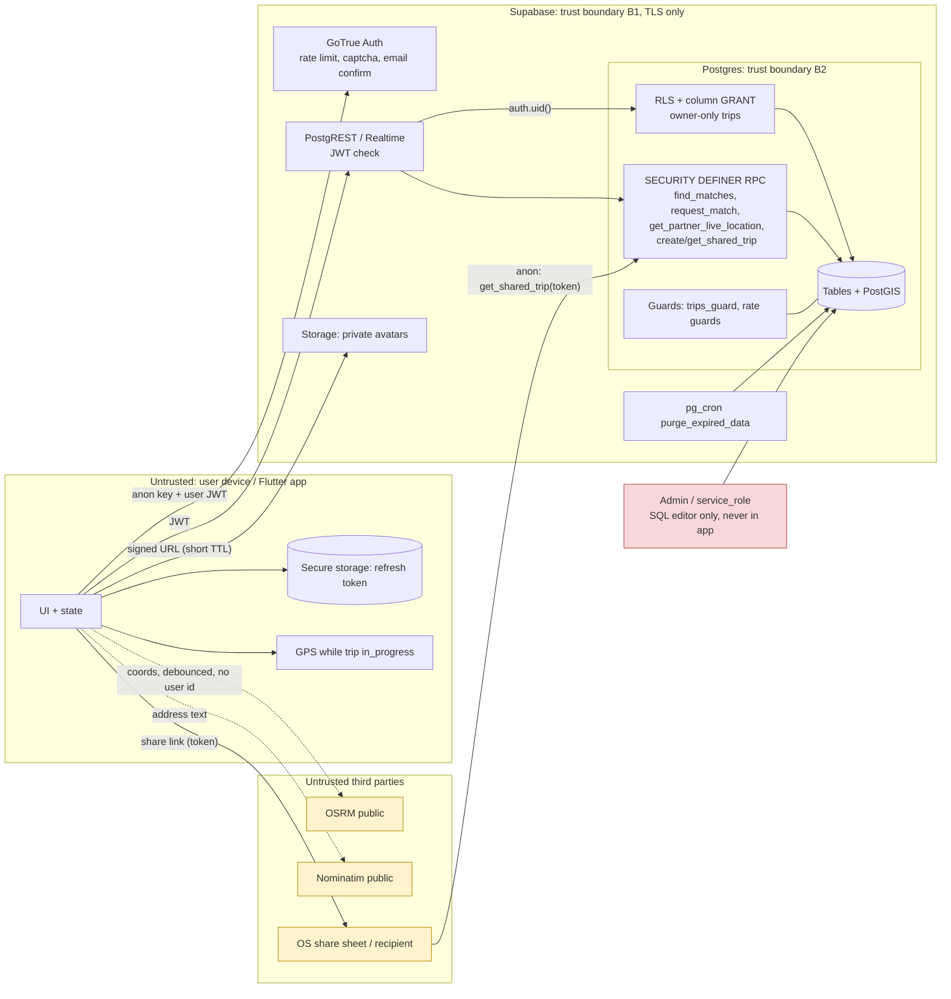

# Security Design & Audit: GOWITHME (กลับด้วยกันมั้ย) MVP 0.1

Scope: Flutter client + Supabase (Auth, Postgres/PostGIS, Realtime, Storage) + public OSRM/Nominatim.
Inputs: `docs/requirements.md`, `docs/design-db.md`, `supabase/migrations/0001_init.sql`.
Assumptions (no questions asked): migration has NOT yet been run on a real DB, so the patches below were applied in place to `0001_init.sql` (marked `-- SECURITY:`). They are untested against a live Postgres; run the verification checklist in section 8 before release.

---

## 1. Threat model

### Assets
| Asset | Sensitivity | Where |
|---|---|---|
| Exact home/destination and route | Critical (stalking, physical harm) | `trips.origin/dest/route` |
| Live position | Critical | `trip_locations`, `trips.last_location` |
| Share-link token | High (grants live view) | `trip_shares.token_hash` (raw only in client/share sheet) |
| Emergency-contact names/phones (third-party PII) | High | `emergency_contacts` |
| SOS events (time, position) | High | `sos_events` |
| Chat content, match graph (who rides with whom) | High | `chat_messages`, `matches` |
| Credentials/session (JWT, refresh token) | High | device secure storage, GoTrue |
| Consent log, verification badges | Medium (legal / trust) | `consents`, `verifications` |
| Reports/blocks (evidence) | Medium | `reports`, `blocks` |
| Secrets: anon key (public by design), service_role key, `phone.mock_code` | service_role = Critical | CI / Supabase dashboard |

### Trust boundaries and actors
- Actors: (A1) unauthenticated internet user with anon key (anon key is public in every APK/IPA); (A2) authenticated malicious user: stalker, harasser, scraper, Sybil (many accounts); (A3) matched partner turned hostile; (A4) share-link holder (forwarded link); (A5) insider/admin with `app_metadata.role=admin`; (A6) compromised dependency/CI; (A7) lost/rooted device; (A8) public geocoder/router operators (see the queries you send).
- Boundaries: B1 client <-> Supabase over TLS; B2 PostgREST/Realtime <-> Postgres (RLS + column grants + SECURITY DEFINER RPC); B3 client <-> OSRM/Nominatim (third party sees coordinates); B4 client <-> OS share sheet / SMS (leaves our control); B5 admin/service_role <-> DB.

### Trust Boundary Map


Checks required at each crossing: JWT verification (PostgREST), `auth.uid()` ownership in every policy/RPC, column-level GRANT, input CHECKs, rate limits (Auth built-in + DB triggers + Edge/WAF), and blur on every read that crosses to another user.

### STRIDE (per component)
| Component | S | T | R | I | D | E |
|---|---|---|---|---|---|---|
| Auth/signup | fake org email if confirm off (F-9); mass fake accounts | metadata (`policy_version`, `adult_confirmed`) client-asserted | no signup audit | user enumeration on signup/reset | signup/OTP spam | user_metadata is user-writable: never authorize on it (only `app_metadata`) |
| trips / trip_locations | forged position (spoof GPS) | client changes geometry after match (F-5) | no edit history | exact home leak via distance oracle (F-1) | location insert flood (F-8) | status jump blocked by trigger |
| find_matches / matches | fake trips as probes | snapshot columns writable? no (RPC only) | - | trilateration, pre-match leak of exact distances (F-1, F-2) | unbounded `p_limit` | only via RPC |
| chat | sender spoof blocked (`sender_id = uid`) | none (no UPDATE/DELETE) | no delete = evidence kept | history readable after block (by design) | message flood (F-8) | is_chat_open enforced in policy |
| share links | link forwarded (A4) | - | last_viewed_at only | token in URL/logs/referrer | anon RPC hammering | anon can only call `get_shared_trip` |
| SOS | - | client sets `client_created_at` | append-only | admin over-read | SOS flood | insert-own only |
| reports/blocks | false reports | report ties to foreign match (F-6) | evidence deleted with account (F-13) | reported user must not see reporter | report spam | admin lacks MFA gate (F-14) |
| Storage avatars | path spoof (F-7) | - | - | ex-partner keeps access (F-11) | quota fill | folder-per-user policy OK |
| Flutter app | rooted device | - | - | secrets/PII in logs, backups | - | service_role in client (forbidden) |

---

## 2. Security audit (OWASP Top 10 2021)

Risk: C=Critical H=High M=Medium L=Low. "Patched" = fixed in `0001_init.sql` in this pass.

| Component / endpoint | Access Control & Auth (A01/A07) | Injection (A03) | Crypto / Data protection (A02) | Config / Design (A04/A05) | Supply chain (A06/A08) | Logging (A09) | Notes |
|---|---|---|---|---|---|---|---|
| `trips` table + RLS | OK: owner-only select/insert/update, column grants, state-machine trigger. H: geometry editable while scheduled, probing (F-5) patched via edit cap | OK: typed columns, no dynamic SQL | Exact geometry never exposed to others | Per-day creation cap added (F-1 mitigation) | - | No audit of edits | soft-deleted trips can be un-deleted by owner (L) |
| `trip_locations` | OK: own, in_progress, consent | OK | Live position retained 7 days then purged | H: no rate limit (F-8) patched | - | - | Client can spoof GPS; cannot be prevented server-side (accept, L) |
| `find_matches` / `match_candidates` | OK: owner check; internal fn not granted | OK | **C: distance oracle leaks true origin (F-1)** patched (500 m buckets, score buckets, limit cap, probe caps) | Residual: eligibility itself is an oracle (see F-1) | - | - | Residual risk accepted with mitigations |
| `matches` (client-readable) | OK: participants only | OK | **H: exact `origin/dest_distance_m`, `score` in rows (F-2)** patched (bucketed at write) | - | - | - | meeting_point exact by design (both parties) |
| `request_match` / `respond_match` | OK: re-checks eligibility server-side; race-safe | OK | - | M: no cap on pending outgoing requests (F-10) | - | - | harassment by mass requests |
| `get_partner_live_location` | **H: viewer need not be travelling; exact position all the way to home (F-3)** patched | OK | Stops within 500 m of destination | - | - | - | |
| `get_trip_card` | OK | OK | Blurred | - | - | - | |
| `create_trip_share` / `get_shared_trip` (anon) | OK: 244-bit token, sha256 stored, TTL<=24h, revoke, no PII | OK | Raw token never stored | M: token in URL (log/referrer leak) (F-12); no per-IP throttle on anon RPC | - | `last_viewed_at` only | forwardable by nature: UI warning |
| `chat_messages` | OK: participants; insert requires `is_chat_open` (server-side) | OK (plain text; client must not render HTML/markdown links) | - | H: flood (F-8) patched | - | - | history remains readable after block/close |
| `blocks` / `reports` | **M: report could cite foreign `match_id` / unrelated user (F-6)** patched | OK | - | M: evidence lost on account deletion (F-13) | - | - | admin sees all reports |
| `sos_events` | OK: own/admin; trip must be own | OK | Precise location kept beyond 7 d (PDPA decision, F-15) | L: insert flood | - | - | - |
| `consents` | **M: `created_at`/`id` client-settable (F-4)** patched | OK | - | Consent only recorded if client sends `policy_version` (F-9b) | - | Append-only | |
| `verifications` / org badge | OK: no client write | OK (suffix match is subdomain-safe) | - | **H: org badge forgeable if email confirmation disabled (F-9)** | - | - | mock phone default ON (F-16) |
| `profiles` | OK: own update, columns limited | OK | - | L: `avatar_path` free text (F-7) patched | - | - | display_name has no content moderation |
| Storage `avatars` | OK: folder = uid | OK | Private bucket, mime+size limit | L: no per-user object count; orphan objects after deletion (F-14b) | - | - | |
| `export_my_data` / `request_account_deletion` | OK: uid-bound | OK | - | M: session/JWT remains valid after deletion request (F-14c) | - | - | |
| `purge_expired_data` / pg_cron | OK: service_role only | OK | - | - | - | No run log | add heartbeat (see 6) |
| Grants / function EXECUTE | OK: default-deny, per-function grants, definer with pinned search_path | - | - | OK | - | - | verified list in migration section 15 |
| Flutter client | see section 5 | | | | see section 7 | see section 6 | |

### Findings detail

**F-1 (Critical, mitigated) Trilateration of true origin via `find_matches` distance.** Blur is a grid snap, but `approx_distance_m` (rounded to 100 m) and `score` were computed from the TRUE points. An attacker creates trips at 3 chosen points (trips are free, editable while scheduled), reads the distance to the victim, and solves the victim's exact origin (home). Fix applied: distance in 500 m buckets, score in steps of 5, `p_limit` capped at 50, max 10 trips/24 h (`trip.max_per_day`), max 3 geometry edits per trip (`trip.max_geometry_edits`, new `trips.geo_edits` maintained by `trips_guard`). Residual: the eligibility filter itself (appears/does not appear within 2 km) is a coarse oracle. Further recommended controls: compute eligibility on blurred coordinates only (highest privacy, lower match quality), and alert on accounts with many short-lived trips (section 6). Accept residual risk for MVP with this documentation.

**F-2 (High, patched) `matches` rows expose exact distance/score.** Rows are readable by both participants (and Realtime) and contained `origin_distance_m`, `dest_distance_m` rounded to 1 m. Now bucketed to 500 m at insert. Alternative if the client does not need them: drop the columns from client visibility.

**F-3 (High, patched) `get_partner_live_location`.** (a) A matched user could watch the partner's live position without being on a trip. (b) The position was exact until the partner arrived home, defeating "partner never sees the true destination". Now requires the caller's own trip in_progress, and returns no row within `privacy.live_hide_near_dest_m` (500 m) of the partner's destination. Client must show "location hidden near destination" and not treat empty as error.

**F-4 (Medium, patched) Forged consent timestamps.** `grant insert` on the whole `consents` table let clients set `created_at`, breaking the audit log and `has_location_consent()` ordering (future-dated grant). Now column-level grant `(user_id, kind, granted, policy_version)`.

**F-5 (Medium, patched partially) Bait and switch.** Eligibility is checked at request time only; a user can later move origin/dest/route/depart_at of a scheduled trip that already has pending/accepted matches. Edit cap added (F-1). Still recommended: in `trips_guard`, when geometry/time changes and pending matches exist, auto-cancel them (or reject the edit if an accepted match exists). Not patched (US-9 "recompute matches" is a P1 product decision).

**F-6 (Medium, patched) Reports.** Insert policy accepted any `match_id` and any `reported_user_id`. Now if `match_id` is given the reporter must be a participant and the reported user the counter-party. Reports without `match_id` (general reports) remain allowed; add per-user report rate limit at the Edge/API layer.

**F-7 (Low, patched) `profiles.avatar_path`.** Added CHECK `avatar_path like '<uid>/%'` and no `..`, so a user cannot point at another user's object or traverse.

**F-8 (High, patched) Flood.** `trip_locations` (min 5 s between rows per trip; app sends every 15-30 s) and `chat_messages` (max 10 user messages per 10 s per sender per match) now have BEFORE INSERT guards raising `GWM_RATE_LIMITED`. Chat client should back off on that error. Free-tier storage is the DoS target, so this also protects quota.

**F-9 (High, config) Email confirmation must be ON in production.** `sync_user_verifications` grants the organization badge from `email_confirmed_at`. If "Confirm email" is disabled in Supabase Auth, anyone can register `x@somewhere.ac.th` and receive the badge. Requirement: production Auth setting "Enable email confirmations" = ON; add a pre-release gate that fails if signup returns a session without confirmation. F-9b: consent rows and `adult_confirmed_at` come from client metadata; a client calling GoTrue directly can skip both. Recommended (not patched, needs product sign-off): `trips_guard` insert should require a granted `privacy_policy` consent and `adult_confirmed_at is not null`, so the 18+ and PDPA gates are enforced server-side.

**F-10 (Medium, open) Request spam and re-request after decline.** No cap on pending outgoing requests per trip; after a decline the requester can create a new trip and ask the same person again (unique is per trip pair). Recommended: `match.max_pending_per_trip` (e.g. 5) in `request_match`; a user-level cooldown table or auto-offer "block" on decline; hide a user who declined/blocked you from your `match_candidates` at user level (not trip level).

**F-11 (Medium, open) Access after the trip.** `are_matched()` stays true for `accepted` matches forever (matches never move to a terminal status when trips complete), so past partners keep read access to profile, verifications and avatar. Recommended: add `match_status` value `completed` (set in `trips_after_status`) or make `are_matched` require an active trip on either side / ended within 24 h.

**F-12 (Medium, open) Share token exposure.** Token in URL path lands in web server logs, browser history and Referer. Recommended: link format `https://<host>/t#<token>` (fragment never sent to server; JS calls the RPC), `Referrer-Policy: no-referrer`, `Cache-Control: no-store`, no third-party scripts on the page. UI must state that anyone with the link can see live position until it expires/is revoked. Add an Edge Function or WAF rate limit per IP in front of anon `get_shared_trip` (it writes `last_viewed_at`).

**F-13 (Medium, open) Evidence loss.** `reports.reported_user_id` and `reporter_id` are `ON DELETE CASCADE`: a harasser who deletes the account erases reports against them (hard delete after 30 days), and messages cascade too. Recommended: `ON DELETE SET NULL` plus stored snapshot (display_name, last N messages) written into the report at creation, retained per a legal-reviewed period.

**F-14 (Medium, open) Deletion and admin hardening.**
- (a) `is_admin()` should also require `auth.jwt() ->> 'aal' = 'aal2'` (MFA) and every admin read of `reports/sos_events/profiles` should be logged (add `admin_audit_log`, append-only).
- (b) Avatar objects are not removed on account deletion (only `avatar_path` nulled): delete objects via Storage API in an Edge Function called by the purge job. Do not `DELETE FROM storage.objects` in SQL (leaves orphaned blobs).
- (c) `request_account_deletion` leaves the session valid: also revoke sessions/ban the user through the Auth admin API from an Edge Function (service_role stays server-side) and call it right after the RPC.

**F-15 (Low/Product) Retention gaps.** `sos_events.location` is never coarsened (requirement says only trip locations, 7 d). Decide a legal retention (suggest 90 days precise, then blur) and add to `purge_expired_data`. `export_my_data` omits `matches`, `blocks`, `reports` filed by the user, `trip_shares` metadata: add for PDPA completeness (P1).

**F-16 (High before launch) Phone mock.** `phone.mock_enabled` defaults `true` and `phone.mock_code` is `123456`: anyone can attach any phone number as verified-mock. Badges carry `is_mock` and `user_badges` hides them when disabled, but production must run `update public.app_config set value='false' where key='phone.mock_enabled';` and the client must render mock badges distinctly or not at all. Add to release checklist and CI (query app_config on the prod project).

---

## 3. Hardening controls (concrete)

### 3.1 AuthN/AuthZ
- Supabase Auth: email confirmations ON; password min length 8 -> set 10 in dashboard and enable "leaked password protection" (HIBP) if the plan allows; JWT expiry 3600 s (short-lived access token) with refresh-token rotation ON and reuse interval 10 s; captcha (Cloudflare Turnstile or hCaptcha) on sign-up/sign-in/reset; enable Auth rate limits (sign-in, sign-up, token refresh, OTP) at the lowest usable values; site URL and redirect allow-list restricted to the app deep link scheme (`gowithme://auth-callback`), no wildcards.
- Generic auth errors (US-3): map every sign-in failure to one Thai message; the sign-up "email exists" error is an enumeration vector: with confirmations ON GoTrue returns an obfuscated success for existing emails, keep it that way.
- Deny-by-default database: all tables RLS-on, per-column GRANTs, function EXECUTE revoked from PUBLIC/anon/authenticated and granted one by one (already in migration section 15). Never authorize on `user_metadata`. Admin only through `app_metadata.role`, set by service_role.
- Every `SECURITY DEFINER` function pins `search_path` and derives identity from `auth.uid()` never from a parameter (verified for all RPCs; keep this in code review).

### 3.2 Input validation
- Server: CHECK constraints (lengths, phone regex, coordinates via geography cast, route >= 2 points), enum types, `GWM_*` error codes. Add `ST_NPoints(route) <= 2000` CHECK to stop oversized route payloads (DoS); client simplifies via Douglas-Peucker before insert.
- Client: `body` trimmed and <= 1000, coordinates range-checked, Nominatim/OSRM responses treated as untrusted (length limits, no HTML). Chat is plain `Text` widget only: no `Html`/Markdown renderers, no auto-linkify without explicit tap + domain display.
- No dynamic SQL exists in the migration (only static `format` on a fixed table list). Keep it that way; all client access is PostgREST (parameterized) or RPC.

### 3.3 Transport
- HTTPS/WSS only: Supabase enforces TLS; in the app fail the build if `SUPABASE_URL` does not start with `https://` (except `--dart-define=ALLOW_INSECURE_LOCAL=true` in debug). Android `usesCleartextTraffic=false`, iOS ATS defaults untouched.
- OSRM/Nominatim over HTTPS only. Optional: certificate pinning is NOT recommended for Supabase (cert rotation risk); accept.
- Share-link web page (P1): HSTS `max-age=31536000; includeSubDomains`, CSP `default-src 'self'; script-src 'self'; connect-src https://<project>.supabase.co; frame-ancestors 'none'; img-src 'self' https://tile.openstreetmap.org`, `X-Content-Type-Options: nosniff`, `X-Frame-Options: DENY`, `Referrer-Policy: no-referrer`. CORS on the Supabase project is only used by that page: allow-list its origin, never `*` with credentials.

### 3.4 Location-privacy rules (backend-enforced)
1. Only the owner can `SELECT` exact `trips`/`trip_locations` (no partner/admin policy).
2. Other users get blur (grid snap 1 km) through definer RPC; distance/score bucketed (F-1/F-2).
3. Partner live location: accepted match + both in_progress + hidden within 500 m of the destination (F-3).
4. Trip-count and edit-count caps against probing; recommend anomaly alert (section 6).
5. Realtime publishes only `chat_messages` and `matches` (no trips/trip_locations). Keep it: never add `trips` to the publication.
6. Retention 7 d then coarsen; account deletion anonymizes immediately, hard delete at 30 d.
7. Minimum anonymity: in sparse areas a 1 km cell may identify one person. Recommended: in `find_matches` widen the blur cell (x3) when fewer than k=5 active trips share the cell, or show only the overlap % and hide dest entirely before match.

### 3.5 Abuse controls (stalking, harassment, chat)
- Block: immediate, bidirectional invisibility in matching (`match_candidates`), closes chat (`is_chat_open`), cancels open matches (trigger). Blocked user is never told (no notification, generic "unavailable").
- Report: available from chat and profile card (US-8/14); reported user never sees reporter. Add server-side snapshot (F-13) and rate limit reports (5/day/user via Edge Function or trigger).
- Sybil/ban evasion: email confirmation + captcha + Auth rate limits now; real SMS OTP later; admin "ban" via `auth.admin` (banned_until). Keep a hash of banned emails/phones to stop instant re-registration (store sha256 only).
- Meeting point safety: UI must warn to choose public places; consider rejecting a meeting point farther than 1 km from both trips' blurred origin (add `p_lat/p_lng` sanity check in `respond_match`/`set_meeting_point` when the product decides).
- Chat: no attachments/links preview (Out of scope already); optional server-side keyword/URL flagging later.

### 3.6 SOS and share tokens
- SOS: insert-only, own trip only, `client_created_at` accepted for the offline queue but `created_at` is server time (both stored, treat `created_at` as authoritative for ordering). The app must not depend on the network to show 191/1669. Contacts are notified only through the OS share sheet (no server-side SMS) so no secret/provider key exists.
- SOS payload sent to the emergency contact contains a link/coordinates: warn the user that the contact receives the exact position. Do not use the share token URL inside SOS text unless the trip share is intentionally created.
- Share token: 244-bit random (`gen_random_uuid()` x2 from the CSPRNG), stored as sha256, TTL <= 24 h, max 10 active per trip, revoked when the user taps stop, auto-expire when trip ends (grace shows final status only). Comparison is by hash lookup (no timing issue with 244-bit random). Never log the token; never put it in analytics.

---

## 4. Secrets and data protection plan

| Secret / data | Where it lives | Rule |
|---|---|---|
| `SUPABASE_URL`, `SUPABASE_ANON_KEY` | `--dart-define` (or `--dart-define-from-file=env/dev.json`, git-ignored) | Not secret (embedded in the binary) but not committed either (requirement). Anon key is safe ONLY because RLS/grants are deny-by-default. |
| `service_role` key / DB password / JWT secret | Supabase dashboard, CI secret store, Edge Function secrets | **Never** in the Flutter app, `.env` shipped in assets, README examples, or git. Only Edge Functions/CI jobs (purge fallback, ban/session revoke) may read it, from environment variables. |
| Access + refresh token | `supabase_flutter` persisted session -> configure a `LocalStorage` implementation backed by `flutter_secure_storage` (Keychain / EncryptedSharedPreferences) instead of the default SharedPreferences | Sign-out clears storage; `android:allowBackup="false"` (or exclude the secure-storage files) and iOS keychain `first_unlock_this_device` so tokens are not restored to another device via backup. |
| Share token (raw) | Only in memory + OS share sheet | Not persisted; the app shows active shares by `share_id` and expiry only. |
| `phone.mock_code` | `app_config` (is_public=false) | Set `mock_enabled=false` in prod (F-16). |
| Emergency contacts, SOS | DB (RLS own-only) | Supabase encrypts at rest (disk). For extra protection encrypt `emergency_contacts.phone` with Vault/pgsodium later (cost: cannot search, acceptable). Collect the contact's consent notice in UI ("tell your contact you listed them"). |
| Location on device | not persisted; GPS stream only while trip in_progress | No background tracking (requirement); stop stream on trip end/cancel/sign-out. |
| Crash/analytics | none in MVP | If added: scrub coordinates, tokens, emails, phone numbers, chat text (see 6). |

Repository hygiene: `.gitignore` must include `.env*`, `env/*.json`, `*.jks`, `key.properties`, `supabase/.env`, `.dart_tool`. Add a secret scanner (gitleaks) as pre-commit + CI step; flag JWTs whose `role` claim is `service_role`.

`--dart-define` example: `flutter run --dart-define-from-file=env/dev.json` where `env/dev.json` = `{"SUPABASE_URL":"https://xxxx.supabase.co","SUPABASE_ANON_KEY":"<anon>"}`. Startup code asserts the key's JWT payload `role == "anon"` and refuses to start otherwise (a decoded `service_role` key in a build is a release-blocker):
```dart
void assertAnonKey(String jwt) {
  final payload = jsonDecode(utf8.decode(base64Url.decode(base64Url.normalize(jwt.split('.')[1]))));
  if (payload['role'] != 'anon') throw StateError('SUPABASE_ANON_KEY must be the anon key');
}
```
Rotation: if a service_role key is ever suspected, rotate JWT secret in Supabase (invalidates all sessions and keys), update CI and Edge secrets, ship a new app build with the new anon key; keep an in-app "force update" flag in `app_config` (public) for this.

PDPA plan (Thailand PDPA B.E. 2562):
- Lawful basis: consent for location and policy/terms (recorded in `consents`, now tamper-resistant); location consent revocable (`record_consent('location', false, v)`) and enforced in the `trip_locations` policy.
- Data minimization: no email/phone in `profiles`; live tracking only in trips; 7-day precision retention; blur for other users.
- Data subject rights: access/export (`export_my_data`, extend per F-15), deletion (RPC + hard delete 30 d + Storage cleanup F-14b), consent withdrawal.
- Third parties: emergency contacts' personal data (need a UI notice); Nominatim/OSRM receive coordinates/addresses and the client IP: disclose in the privacy policy, send no user identifiers, set generic User-Agent per their policy without user id; Supabase region (choose Singapore) = cross-border transfer disclosure; OSM tiles reveal viewed area to the tile server.
- Breach readiness: PDPA requires notifying the PDPC within 72 hours of becoming aware of a breach; keep the incident runbook (section 6) and a contact in the policy. The controller name/contact and policy text need legal review before launch (as stated in requirements).
- Children: 18+ declaration, enforce server-side (F-9b).

---

## 5. Flutter client security checklist
- Build flags: `flutter build apk --release --obfuscate --split-debug-info=build/symbols`; store symbols privately. Obfuscation is speed bump, not protection: no secret may rely on it.
- `debugPrint`/`print` removed or wrapped by `Log` that is a no-op in release (`kReleaseMode`); lint `avoid_print`. Never log request/response bodies, `Authorization` headers, `Session`, coordinates, phone numbers, chat text, share tokens.
- Do not enable `supabase_flutter` debug logging (`debug: false`) in release.
- Deep links: validate host/scheme/path for auth callback and share links; never trust query params as identity; ignore unknown intents.
- Android: `allowBackup=false`, `usesCleartextTraffic=false`, `FLAG_SECURE` on chat/SOS/trip screens (blocks screenshots/recents preview) as an option, request only `ACCESS_FINE_LOCATION` foreground (no `ACCESS_BACKGROUND_LOCATION`). iOS: `NSLocationWhenInUseUsageDescription` in Thai, no `Always`.
- Root/jailbreak detection: not required for MVP (documented decision) since authorization is server-side.
- Client must never rely on hidden UI for authorization (chat gate, blur) - already enforced by RLS/RPC; tests in section 8.
- Handle `GWM_*` codes: show mapped Thai text; never show raw PostgREST error JSON (contains constraint/column names).
- Geocoder/router: send only address text or coordinates; debounce >= 1 s and cache; no user id; timeouts; treat outage as non-fatal.
- Clipboard: no copy of share token automatically; the share text is created only on user action.

## 6. Logging, monitoring and incident readiness
- Server logs (Supabase logs): the migration raises only `GWM_*` codes (no PII in messages). Do not add `RAISE NOTICE` with user data. Postgres statement logging of parameters stays off.
- Audit events to add (table `audit_log`, insert-only, no client grants, written by definer functions/triggers): sign-in anomalies come from Auth logs; app-level: block created, report created, SOS created, share created/revoked, match accepted, account deletion requested/completed, admin read of reports/SOS. Store ids and timestamps only, never coordinates or message text. Append-only via revoked UPDATE/DELETE and periodic export to an external store (Supabase log drain on paid plan, or scheduled dump) to make it effectively immutable.
- Alerts (Supabase log queries / Edge cron, notify by email): >20 failed sign-ins from one IP in 10 min; one user creating >=8 trips in 24 h or `GWM_TRIP_EDIT_LIMIT`/`GWM_TRIP_RATE_LIMIT` hits (probing); >5 reports against the same user in 24 h; `GWM_RATE_LIMITED` bursts; unusual `get_shared_trip` volume; any use of a service_role JWT from an unexpected IP; `purge_expired_data` not run within 30 min (write a heartbeat row).
- Incident plan (minimum): (1) contain: revoke share links (`update trip_shares set revoked_at=now()`), disable phone mock, toggle a maintenance flag; (2) rotate JWT secret/service_role/DB password if key exposure suspected; (3) preserve logs; (4) assess personal-data scope; (5) notify PDPC within 72 h and affected users if high risk; (6) blameless postmortem and add a regression test for the root cause.
- Location-abuse response: admin can disable an account (`banned_until`), invalidate its shares and cancel its trips through a documented SQL/Edge procedure run as service_role, logged in `audit_log`.

## 7. Supply chain and CI
- Flutter: pin versions (`pubspec.lock` committed), `dart pub outdated` and `flutter pub deps` in CI; Dependabot (`pub` ecosystem, weekly) or Renovate; prefer few, well-known packages (supabase_flutter, flutter_map, geolocator, flutter_secure_storage). `flutter analyze` with `avoid_print`, `unawaited_futures`.
- SCA: OSV-Scanner or `osv-scanner --lockfile pubspec.lock` in CI (Snyk optional); gitleaks; fail the build on high severity.
- Migration review: CI job applies migrations on a throwaway local `supabase start`, runs the RLS test script (section 8), and runs `supabase db lint` plus the Supabase Security/Performance Advisors (`get_advisors`) for "RLS disabled", "function search_path mutable", "exposed SECURITY DEFINER".
- Release integrity: sign builds with CI-held keystore/certs (secrets from the CI vault), reproducible tag -> build; do not download code at runtime; ZAP baseline scan against the share-link web page and any Edge Function endpoints; OWASP MASVS L1 checklist before store submission.
- Edge Functions (if added): verify JWT (`verify_jwt = true`), input schema validation (zod), per-user rate limit, no service_role usage unless required.

## 8. Verification checklist (RLS / privacy tests, run on a local DB with 2-3 test users)
1. B selects `trips` of A: 0 rows. Anon selects any table: permission denied.
2. `find_matches` output has no true coordinates; distances are multiples of 500; two calls return identical values.
3. Probe test: B creates 4 trips in 24 h at different points and edits geometry 4 times: 4th edit raises `GWM_TRIP_EDIT_LIMIT`; 11th trip raises `GWM_TRIP_RATE_LIMIT` (test with config lowered).
4. Insert into `chat_messages` for a non-accepted match, for a match with a closed trip, and after a block: all fail. 11 messages in 10 s: 11th raises `GWM_RATE_LIMITED`.
5. `get_partner_live_location`: returns 0 rows if the caller's trip is not in_progress; 0 rows when partner is within 500 m of dest; rows only for accepted matches.
6. `insert into consents (..., created_at)` is denied; `insert into reports` with someone else's `match_id` fails; `update profiles set avatar_path='<other uid>/x'` fails.
7. `get_shared_trip` with wrong/expired/revoked token returns 0 rows; returns no origin/email/phone; location null when trip not in_progress.
8. Column grants: `update trips set last_location=...`/`started_at=...` denied; `update trips set status='completed'` from scheduled raises transition error.
9. `select cfg('phone.mock_code')` as authenticated is denied; `select value from app_config where key='phone.mock_enabled'` returns 0 rows.
10. Production config gate: email confirmation ON, `phone.mock_enabled=false`, service_role key absent from the app binary (`strings` / gitleaks), Realtime publication contains only `chat_messages`, `matches`.

## 9. Changes applied to `supabase/migrations/0001_init.sql`
| # | Change | Reason |
|---|---|---|
| 1 | `find_matches`: `p_limit` clamped 1..50; distance 500 m buckets; score buckets of 5 | F-1 trilateration/scraping |
| 2 | `request_match`: bucketed snapshot values stored in client-readable `matches` | F-2 |
| 3 | `get_partner_live_location`: caller trip must be in_progress; hidden within `privacy.live_hide_near_dest_m` of destination | F-3 |
| 4 | `consents`: column-level INSERT grant | F-4 |
| 5 | `trips.geo_edits` + `trips_guard` edit cap (`trip.max_geometry_edits`) and daily creation cap (`trip.max_per_day`) | F-1/F-5 |
| 6 | Triggers `trip_locations_rate_guard`, `chat_messages_rate_guard` | F-8 |
| 7 | `reports_insert_own`: match/counter-party check | F-6 |
| 8 | `profiles_avatar_path_own_folder` CHECK | F-7 |
| 9 | New `app_config` rows: `trip.max_per_day`, `trip.max_geometry_edits`, `privacy.live_hide_near_dest_m` (all non-public) | tunables |

`docs/design-db.md` sections 4-6 should be updated to mention these (not edited in this pass). Not yet run against Postgres: verify with section 8.

## 10. Design decisions
| Decision | Tradeoff | Rationale |
|---|---|---|
| Bucket distance/score instead of removing them | Coarser UX (500 m steps) | Keeps US-6 "ห่าง ~X กม." while defeating trilateration; removal would hurt usability |
| Cap trips/day and geometry edits | Legit users who change plans often hit limits (10/day, 3 edits) | Probing needs many points; limits are config-tunable |
| Hide partner live position within 500 m of destination | Partner cannot watch arrival at the door | Live tracking near end-of-trip reveals home; arrival is confirmed by "ถึงแล้ว" message |
| Require viewer to be in_progress to see partner live position | Waiting partner cannot see the approaching rider | Stops silent stalking; meeting point covers pre-trip coordination |
| DB-level rate guards in addition to API limits | Extra query per insert | Free tier has no WAF; cheap indexed lookups; protects quota |
| Keep anon key in app, enforce all access in RLS/RPC | Whole security rests on correct policies and tests | Only viable model for Supabase mobile; hence the test script and advisors in CI |
| Share link via URL fragment + no-referrer | Needs a small JS page | Tokens never hit server logs/Referer |
| Defer real SMS OTP, keep mock behind config | Weak phone assurance | Cost constraint; mock is flagged and must be disabled (F-16) |
| Do not add certificate pinning | Higher MITM risk on compromised device CA | Pinning against Supabase risks outage on cert rotation; TLS + short tokens sufficient for MVP |

## 11. Tooling hints
- Secret management: local dev `--dart-define-from-file` (git-ignored); CI (GitHub Actions secrets / GitLab CI variables); Edge Function secrets `supabase secrets set KEY=...`; if moving off Supabase: HashiCorp Vault or AWS Secrets Manager with short-lived credentials and rotation without redeploying the app (the app only holds the anon key).
- SCA / secrets: Dependabot or Renovate for `pub`; OSV-Scanner or Snyk on `pubspec.lock`; gitleaks/trufflehog in pre-commit and CI.
- DAST/SAST: OWASP ZAP baseline against the share-link page and Edge Functions; `dart analyze` + custom lint for `print`; MobSF or MASVS checklist for the APK/IPA; pgTAP for the RLS tests in section 8 (`supabase test db`).
- Supabase-specific: Security Advisor and Performance Advisor, Auth rate-limit settings, Log Explorer queries for the alerts in section 6, Vault extension for column encryption if needed.
