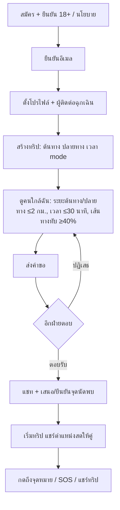
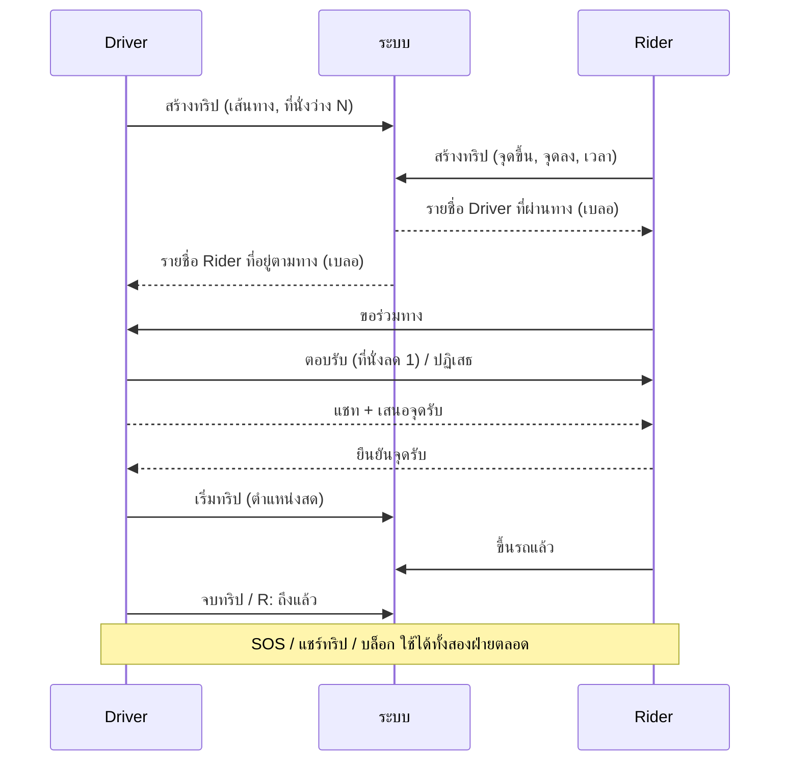

# Flow การใช้งานตาม Role — กลับด้วยกันมั้ย

> สถานะ: ส่วน A = สิ่งที่แอปทำได้จริงตอนนี้ (MVP 0.1) / ส่วน B = ข้อเสนอ role คนขับ–คนนั่ง (ยังไม่มีในโค้ดและ requirements)

## A. ปัจจุบัน: ไม่มี role แยก — ทุกคนเป็น "ผู้ใช้" เท่ากัน (peer)

ทริปมี `mode` 1 อย่าง: เดิน / ขนส่งสาธารณะ / รถส่วนตัว (car) / แท็กซี่
จับคู่ได้เฉพาะ **mode เดียวกัน** (`match.mode_compat`) เช่น car↔car
หมายความว่า car↔car คือ "คนขับสองคน" ไม่ใช่คนขับ+คนนั่ง และไม่มีการนับที่นั่ง

## B. ข้อเสนอ: Role คนขับ (Driver) และคนนั่ง (Rider)

### Driver (คนขับที่หาคนนั่งกลับทางเดียวกัน)
| ขั้นตอน | ทำได้ |
|---|---|
| ตั้งค่า | เลือก role = คนขับ, ระบุจำนวนที่นั่งว่าง (1–3), (ถ้าต้องการ) ยืนยันตัวตนเพิ่มเติม: บัตร/ใบขับขี่/ทะเบียนรถ |
| สร้างทริป | ต้นทาง ปลายทาง เวลาออก เส้นทางที่ขับ (OSRM) |
| ดูคนนั่ง | รายชื่อ Rider ที่เส้นทางอยู่ตามทางของตน (ตำแหน่งเบลอ) |
| จัดการคำขอ | รับ/ปฏิเสธคำขอนั่ง จนที่นั่งเต็ม (เต็มแล้วทริปไม่โผล่ในผลค้นหา) |
| นัดพบ | เสนอจุดรับ (ต้องอยู่บนเส้นทางหรือเบี่ยงเล็กน้อย) |
| ระหว่างทาง | เริ่มทริป แชร์ตำแหน่งสด, กด "รับผู้โดยสารแล้ว" ต่อคน, จบทริป |
| ความปลอดภัย | SOS, แชร์ทริป, บล็อก/รายงานผู้โดยสาร |

### Rider (คนนั่งที่หาคนขับกลับทางเดียวกัน)
| ขั้นตอน | ทำได้ |
|---|---|
| ตั้งค่า | เลือก role = คนนั่ง (ไม่ต้องระบุที่นั่ง) |
| สร้างทริป | ต้นทาง (จุดที่ขึ้น) ปลายทาง (จุดที่ลง) เวลาที่ไปได้ |
| ดูคนขับ | เห็นเฉพาะ Driver ที่มีที่นั่งว่างและเส้นทางผ่านจุดขึ้น/ลง |
| ขอร่วมทาง | ส่งคำขอถึง Driver (ได้ทีละหลายคน แต่ตอบรับได้ 1 คน) |
| นัดพบ | รับจุดนัดพบที่ Driver เสนอ หรือเสนอจุดใหม่ |
| ระหว่างทาง | ดูตำแหน่งสดของรถ, กด "ขึ้นรถแล้ว" และ "ถึงแล้ว" |
| ความปลอดภัย | SOS, แชร์ทริป (พร้อมข้อมูลรถ/ทะเบียน), บล็อก/รายงานคนขับ |

### Flow รวม

### กติกาจับคู่ที่เสนอ
- Rider↔Driver เท่านั้น (Rider↔Rider และ Driver↔Driver ไม่แสดงกัน)
- Driver จับคู่ที่ accepted ได้ไม่เกินจำนวนที่นั่งว่าง; Rider ได้ 1 คนขับต่อทริป
- เกณฑ์ระยะ/เวลา/เส้นทางทับ ใช้ค่าเดิมใน `app_config`
- เพิ่ม role ต่อทริป (ไม่ใช่ต่อบัญชี) — คนเดียวเป็น Driver เช้า Rider เย็นได้

### ต้องตัดสินใจก่อนทำ (ส่ง PM/BA)
1. คนขับต้องยืนยันใบขับขี่/ทะเบียนรถหรือไม่ (ผลต่อความปลอดภัยและกฎหมาย)
2. แบ่งค่าใช้จ่าย/ค่าน้ำมัน: ไม่มีเงินในแอป (แนะนำ) หรือแสดงค่าประมาณ
3. ข้อกฎหมายรถรับจ้าง: ต้องห้ามการเก็บค่าโดยสารเชิงพาณิชย์ในแอป (ให้ legal ตรวจ)
4. ยังคงโหมดเดิน/ขนส่งสาธารณะแบบ peer ไว้คู่กับโหมดรถหรือไม่

### ขอบเขตงานที่ต้องเพิ่ม (ประมาณ)
- DB: `trips.role`, `trips.seats_total`, ปรับ `match_candidates` (Driver↔Rider + นับที่นั่ง), migration ใหม่
- Flutter: เลือก role ตอนสร้างทริป, แสดงที่นั่ง, ปุ่มรับ/ขึ้นรถ, ข้อมูลรถ
- ทดสอบ SQL และ UI ใหม่ + อัปเดต requirements (US-5, US-6, US-7)
