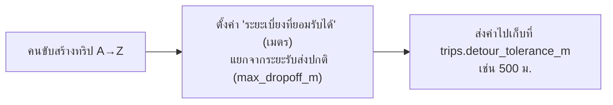
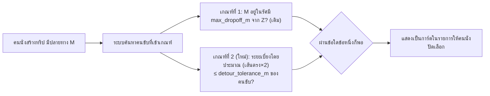
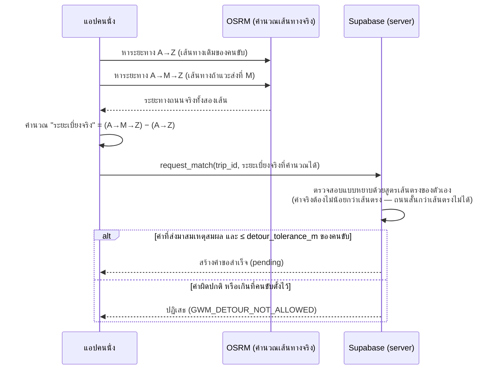
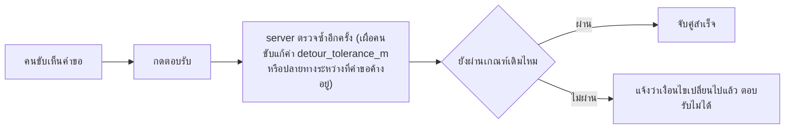

# Flow: US-50 กฎเบี่ยงระหว่างทาง (Route Detour Tolerance) — ตรวจความเข้าใจก่อนลงมือ

## ตัวละคร
- **คนขับ (Driver):** ขับจาก A (ต้นทาง) ไป Z (ปลายทางบ้านคนขับ)
- **คนนั่ง (Rider):** อยากลงที่ M (ปลายทางของคนนั่ง ซึ่งอาจอยู่ไกลจากบ้านคนขับ Z มาก แต่ถ้าคนขับแค่แวะจอดส่งแล้วไปต่อ ก็ยังไหว)

## ขั้นที่ 1 — คนขับตั้งค่า (ตอนสร้างทริป)

- ค่านี้แปลว่า: "ฉันยอมขับเพิ่มได้ไม่เกิน 500 ม. (ไป-กลับรวมกัน) เพื่อแวะส่งใครสักคนที่ไม่ได้อยู่ทางบ้านฉันพอดี"
- ล็อกแก้ไม่ได้เมื่อมีคำขอค้างหรือจับคู่แล้ว (เหมือนค่าอื่นๆ)

## ขั้นที่ 2 — คนนั่งเปิดหน้าค้นหา (การ์ดปัดเลือก) — **ใช้ค่าประมาณ**

- **จุดสำคัญ:** ขั้นนี้ "เร็วแต่หยาบ" เพราะต้องแสดงผลทันทีกับคนขับหลายคนพร้อมกัน จะยิง OSRM เรียกระยะถนนจริงทีละคู่ไม่ไหว (ช้า + โดนจำกัดโควตาบริการฟรี)
- ผลที่ได้ = **รายชื่อผู้สมัคร** ยังไม่ใช่คำตอบสุดท้ายว่า match จริงได้ไหม

## ขั้นที่ 3 — คนนั่งเลือกคนขับคนหนึ่งแล้วกด "ขอร่วมทาง" — **ใช้ค่าจริง**

- **เหตุผลที่ server ไม่เชื่อค่าจากแอปเฉยๆ:** กันคนนั่งโกงว่า "เบี่ยงแค่นิดเดียว" ทั้งที่จริงไกลมาก
- **เหตุผลที่ server ไม่คำนวณเองทั้งหมด:** server เรียก OSRM แบบ synchronous ระหว่างประมวลผลคำขอไม่ได้สะดวก (ข้อจำกัดทางเทคนิคของ Postgres/Supabase)
- **จุดตรวจสอบของ server (ป้องกันโกง):** ระยะเบี่ยงจริงต้อง **มากกว่าหรือเท่ากับ** ค่าประมาณเส้นตรงที่ server คำนวณเองได้เสมอ (เพราะถนนจริงคดโค้ง ยาวกว่าเส้นตรงเสมอ ไม่มีทางสั้นกว่า) ถ้าแอปส่งค่าที่ **น้อยกว่า** เส้นตรงมา = ผิดปกติชัดเจน ปฏิเสธทันที

## ขั้นที่ 4 — คนขับตอบรับ

## สรุปสั้นๆ
| ขั้นตอน | ใช้ค่าอะไร | ทำไม |
|---|---|---|
| ค้นหา/แสดงรายการ | เส้นตรง×2 (ประมาณ) | เร็ว ไม่ยิง OSRM รัวๆ |
| ส่งคำขอจริง | ระยะถนนจริงจาก OSRM (คำนวณที่แอป) | แม่นยำ ตรงกับที่คุณกังวล |
| server ตรวจตอนรับคำขอ | เทียบกับเส้นตรงของตัวเองเป็นเกณฑ์ขั้นต่ำ | กันแอปโกงค่า ไม่เชื่อ client เปล่าๆ |
| คนขับตอบรับ | ตรวจซ้ำเงื่อนไขทั้งหมดอีกรอบ | กันเงื่อนไขเปลี่ยนระหว่างรอ |
